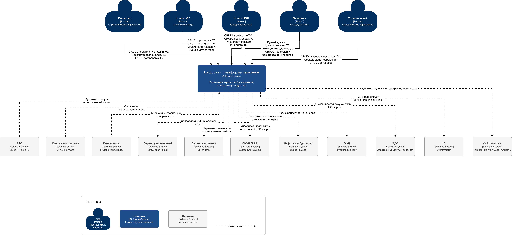
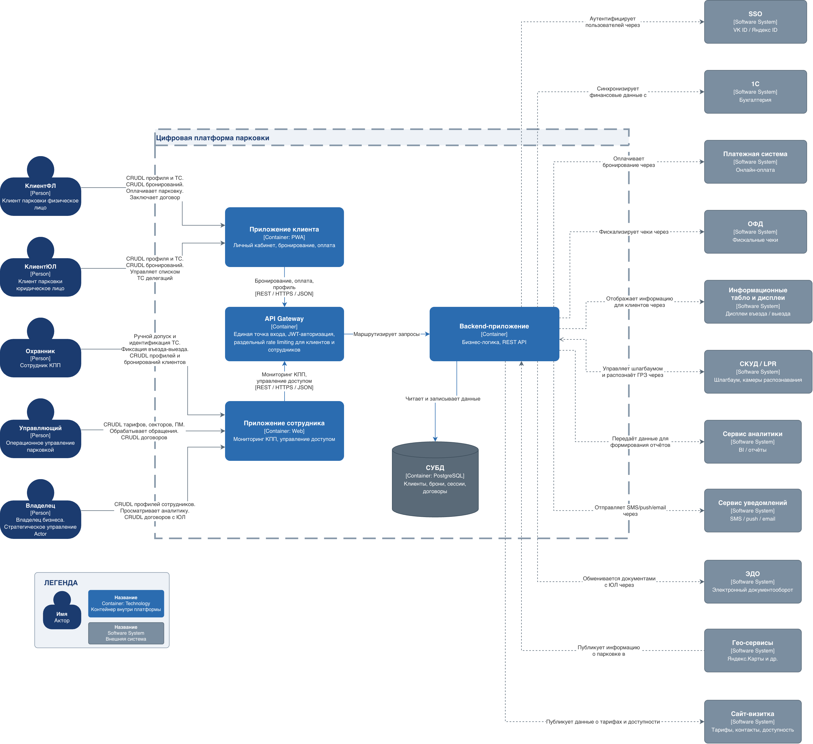
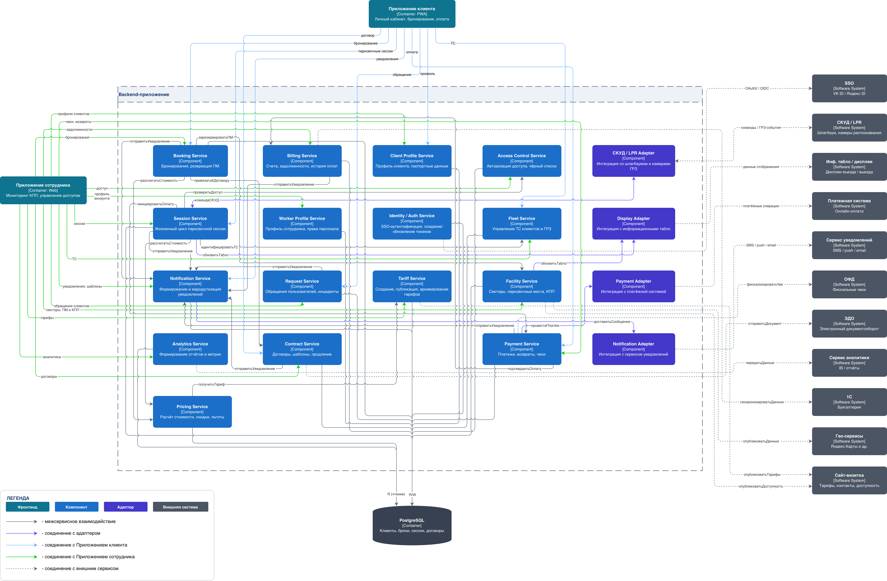

# C4-диаграммы цифровой платформы парковки

Каноничный комплект C4-диаграмм для платформы управления частной парковкой на 600 машиномест в Санкт-Петербурге. Включает три уровня: System Context (L1), Container (L2) и Component (L3). Источник — draw.io ([parking-c4.drawio](assets/parking-c4.drawio)).

## Оглавление

- [Назначение](#назначение)
- [Контекст и источник](#контекст-и-источник)
- [Уровень 1 — System Context](#уровень-1--system-context)
- [Уровень 2 — Container](#уровень-2--container)
- [Уровень 3 — Component](#уровень-3--component)
- [Выводы и решения](#выводы-и-решения)
- [Связанные документы](#связанные-документы)

## Назначение

Описать архитектуру цифровой платформы парковки в нотации [C4](https://c4model.com/) на трех уровнях детализации:

- **L1 (System Context)** — границы системы, ее пользователи и внешние системы;
- **L2 (Container)** — исполняемые контейнеры внутри платформы и их интеграции;
- **L3 (Component)** — внутренняя декомпозиция Backend-приложения на сервисы и адаптеры.

Документ служит точкой входа для архитектурных обсуждений, ADR, ревью интеграций и технической части Demo Days.

## Контекст и источник

- Этап проекта: Этап 3. Проектирование архитектуры
- Тип артефакта: C4 Model (Level 1 + Level 2 + Level 3)
- Источник: [draw.io исходник](assets/parking-c4.drawio), три страницы — `L1 - System Context`, `L2 - Containers`, `L3 - Components`
- Статус: сдано
- Архитектурная база: [ADR-001: Онлайн-оценка прав доступа](../adr/adr-001-online-access-rights-evaluation.md), [ADR-002: Бронирование vs Сессия](../adr/adr-002-booking-vs-session.md), [ADR-003: Модульный монолит](../adr/adr-003-modular-monolith.md), [DDD bounded contexts](../ddd/ddd-bounded-contexts.md)

---

## Уровень 1 — System Context

### Диаграмма (L1)

### Текстовое описание (L1)

Цифровая платформа парковки выступает центральной системой, которая объединяет частных и корпоративных клиентов с операционным персоналом парковки и обеспечивает полный цикл работы: бронирование машиноместа, контроль доступа на КПП, тарификацию, оплату, договоры с юридическими лицами, уведомления и отчетность.

С платформой работают пять групп пользователей. Внешние клиенты (физические и юридические лица) ведут профили, бронируют места и оплачивают парковку. Внутренний персонал (охранник КПП, управляющий, владелец) управляет операциями, тарифами, договорами и анализирует работу парковки. Платформа интегрирована с 11 внешними системами, которые покрывают идентификацию, прием платежей, фискализацию, контроль доступа, отображение информации, уведомления, документооборот, бухгалтерию, аналитику, публикацию данных в гео-сервисах и на сайте-визитке.

### Ключевые элементы (L1)

**Целевая система:**

- **Цифровая платформа парковки** `[Software System]` — управление парковкой, бронирование, оплата, контроль доступа.

**Пользователи `[Person]`:**

- **Владелец** — стратегическое управление: смотрит аналитику, ведет CRUDL профилей сотрудников и договоров с ЮЛ.
- **Клиент ФЛ** — физическое лицо: ведет CRUDL профиля и ТС, бронирует парковку, оплачивает, заключает договор.
- **Клиент ЮЛ** — юридическое лицо: ведет CRUDL профиля и ТС, бронирований, управляет списком ТС делегаций.
- **Охранник** — сотрудник КПП: ручной допуск и идентификация ТС, фиксация въезда-выезда, CRUDL профилей и бронирований клиентов.
- **Управляющий** — операционное управление: CRUDL тарифов, секторов, ПМ, обработка обращений, CRUDL договоров.

**Внешние системы `[Software System]`:**

- **SSO** — VK ID / Яндекс ID, аутентификация пользователей.
- **Платежная система** — онлайн-оплата.
- **Гео-сервисы** — Яндекс.Карты и др., публикация информации о парковке.
- **Сервис уведомлений** — SMS / push / email.
- **Сервис аналитики** — BI / отчеты.
- **СКУД / LPR** — шлагбаум, камеры распознавания ГРЗ.
- **Инф. табло / дисплеи** — въезд / выезд, информирование клиентов.
- **ОФД** — фискальные чеки (54-ФЗ).
- **ЭДО** — электронный документооборот с ЮЛ.
- **1С** — бухгалтерия, синхронизация финансовых данных.
- **Сайт-визитка** — тарифы, контакты, доступность.

### Логика артефакта (L1)

Уровень контекста отвечает на вопрос «кто и через что взаимодействует с платформой как с черным ящиком». Логика диаграммы:

- В центре — цифровая платформа парковки. Все стрелки направлены к ней или от нее, прямых связей между актерами и внешними системами на этом уровне нет.
- Сверху — пять актеров. Каждый дает на платформу свой набор операций (CRUDL над своим срезом данных, оплата, обращения, аналитика и т.д.).
- Снизу — внешние системы, к которым платформа обращается напрямую. Подписи стрелок описывают семантику интеграции, а не транспорт (REST / SOAP / OAuth — это уровень L2 и L3).
- Внешние системы делятся на две группы по природе интеграции: **на территории объекта** (СКУД / LPR, инфо-табло) — физические устройства и vendor-specific протоколы; **сторонние сервисы** (SSO, Платежная система, ОФД, ЭДО, 1С, Сервис уведомлений, Сервис аналитики, Гео-сервисы, Сайт-визитка) — внешние API за пределами периметра проекта.

---

## Уровень 2 — Container

### Диаграмма (L2)

### Текстовое описание (L2)

На уровне контейнеров платформа разворачивается в пять исполняемых единиц. Двое фронтендов — Приложение клиента (PWA) и Приложение сотрудника (Web) — обслуживают разные аудитории и их сценарии. Все запросы от обоих фронтендов проходят через единый API Gateway, который держит JWT-авторизацию и применяет раздельный rate limiting к клиентским и служебным трафикам. За API Gateway работает Backend-приложение — основной носитель бизнес-логики и REST API; именно оно владеет всеми внешними интеграциями и единой СУБД.

Хранилище — одна реляционная БД (PostgreSQL), в которой лежат клиенты, брони, парковочные сессии и договоры. Согласно [ADR-003: Модульный монолит](../adr/adr-003-modular-monolith.md) Backend остается единым развертываемым артефактом, а внутренние модули раскрываются на L3, а не выносятся в отдельные контейнеры.

### Ключевые элементы (L2)

**Граница системы:**

- **Цифровая платформа парковки** — пунктирная рамка, объединяющая внутренние контейнеры.

**Контейнеры внутри границы системы:**

| Контейнер                 | Технология            | Назначение                                                                                                                    |
| ------------------------- | --------------------- | ----------------------------------------------------------------------------------------------------------------------------- |
| **Приложение клиента**    | Container: PWA        | Личный кабинет: бронирование, оплата, профиль, история, ТС, договоры                                                          |
| **Приложение сотрудника** | Container: Web        | Мониторинг КПП, управление доступом, тарифами, обращениями, отчетами; единый интерфейс для охранника, управляющего, владельца |
| **API Gateway**           | Container             | Единая точка входа, JWT-авторизация, раздельный rate limiting для клиентов и сотрудников, маршрутизация запросов              |
| **Backend-приложение**    | Container             | Бизнес-логика, REST API, владение всеми внешними интеграциями                                                                 |
| **СУБД**                  | Container: PostgreSQL | Единая реляционная БД: клиенты, брони, сессии, договоры                                                                       |

**Внешние системы:** те же 11 систем, что и на L1 — SSO, Платежная система, Гео-сервисы, Сервис уведомлений, Сервис аналитики, СКУД / LPR, Инф. табло / дисплеи, ОФД, ЭДО, 1С, Сайт-визитка.

### Логика артефакта (L2)

- Пользовательский трафик разделен по фронтендам: **клиенты** (ФЛ и ЮЛ) работают с PWA, **сотрудники** (охранник, управляющий, владелец) — с веб-приложением сотрудника. Это снимает с фронтенда задачу разводить роли и упрощает RBAC на уровне отдельных приложений.
- **API Gateway вынесен отдельным контейнером** перед Backend, чтобы централизовать JWT-проверку, ограничить шумные клиентские интеграции и отделить лимиты клиентского трафика от служебного. Внутрь Gateway бизнес-логика не уезжает: он только проверяет токен, применяет лимиты и маршрутизирует.
- **Backend-приложение** — единственный контейнер, который работает с СУБД и внешними системами. Все интеграции (СКУД / LPR, Платежная система, ОФД, ЭДО, 1С, Сервис уведомлений, Сервис аналитики, Гео-сервисы, Сайт-визитка, инф. табло, SSO) идут только через него; адаптеры к этим системам раскрываются на L3.
- **СУБД** изолирована от фронтендов и Gateway: к ней ходит только Backend. Это держит контракт «БД — деталь реализации Backend» и не позволяет другим контейнерам прорастать в схему.

---

## Уровень 3 — Component

### Диаграмма (L3)

### Текстовое описание (L3)

Backend-приложение раскладывается на 20 компонентов. Шестнадцать из них — доменные и инфраструктурные сервисы (`Booking Service`, `Billing Service`, `Client Profile Service`, `Access Control Service`, `Session Service`, `Worker Profile Service`, `Identity / Auth Service`, `Fleet Service`, `Notification Service`, `Request Service`, `Tariff Service`, `Facility Service`, `Analytics Service`, `Contract Service`, `Payment Service`, `Pricing Service`), четыре — внешние адаптеры (`СКУД / LPR Adapter`, `Display Adapter`, `Payment Adapter`, `Notification Adapter`).

Сервисы держат бизнес-правила и данные конкретного домена и общаются между собой через явные операции (`зарезервироватьПМ`, `рассчитатьСтоимость`, `проверитьДоступ`, `провестиПлатеж`, `отправитьУведомление` и т.д.). Адаптеры выделены отдельным цветом и слоем — они изолируют детали внешних протоколов (СКУД, инф. табло, платежная система, сервис уведомлений) и предоставляют сервисам единый внутренний контракт. Все компоненты пишут в общую PostgreSQL.

Фронтенды-контейнеры (Приложение клиента и Приложение сотрудника) обращаются к нужным сервисам по семантике своих сценариев: PWA — к бронированию, оплате, профилю, ТС и уведомлениям; Web сотрудника — к доступу, сессиям, тарифам, обращениям, договорам, аналитике.

### Ключевые элементы (L3)

**Доменные и инфраструктурные сервисы (Components):**

| Компонент                   | Ответственность                                   |
| --------------------------- | ------------------------------------------------- |
| **Booking Service**         | Бронирования, резервация парковочных мест         |
| **Billing Service**         | Счета, задолженности, история оплат               |
| **Client Profile Service**  | Профиль клиента, паспортные данные                |
| **Access Control Service**  | Авторизация доступа, черный список                |
| **Session Service**         | Жизненный цикл парковочной сессии                 |
| **Worker Profile Service**  | Профиль сотрудника, права персонала               |
| **Identity / Auth Service** | SSO-аутентификация, создание и обновление токенов |
| **Fleet Service**           | Управление ТС клиентов и ГРЗ                      |
| **Notification Service**    | Формирование и маршрутизация уведомлений          |
| **Request Service**         | Обращения пользователей, инциденты                |
| **Tariff Service**          | Создание, публикация, архивирование тарифов       |
| **Facility Service**        | Секторы, парковочные места, КПП                   |
| **Analytics Service**       | Формирование отчетов и метрик                     |
| **Contract Service**        | Договоры, шаблоны, продление                      |
| **Payment Service**         | Платежи, возвраты, чеки                           |
| **Pricing Service**         | Расчет стоимости, скидки, льготы                  |

**Адаптеры внешних систем (Adapters):**

| Адаптер                  | Внешняя система      | Назначение                                            |
| ------------------------ | -------------------- | ----------------------------------------------------- |
| **СКУД / LPR Adapter**   | СКУД / LPR           | Интеграция со шлагбаумом и камерами распознавания ГРЗ |
| **Display Adapter**      | Инф. табло / дисплеи | Интеграция с информационными табло на въезде / выезде |
| **Payment Adapter**      | Платежная система    | Интеграция с провайдером онлайн-оплаты                |
| **Notification Adapter** | Сервис уведомлений   | Интеграция с провайдером SMS / push / email           |

**Хранилище:**

- **PostgreSQL** `[Container]` — единая БД (R/W из всех сервисов). На диаграмме показана общая стрелка чтения и записи.

**Легенда связей:**

- межсервисное взаимодействие — темно-серая стрелка;
- соединение сервиса с адаптером — фиолетовая стрелка;
- соединение с Приложением клиента — голубая стрелка;
- соединение с Приложением сотрудника — зеленая стрелка;
- соединение с внешним сервисом — пунктирная серая стрелка.

### Логика артефакта (L3)

Ключевые маршруты между компонентами:

- **Бронирование и оплата (PWA → Backend → внешние системы):** Приложение клиента вызывает `Booking Service` (`зарезервироватьПМ`), тот обращается к `Pricing Service` (`рассчитатьСтоимость`) и через `Payment Service` инициирует оплату. `Payment Service` использует `Payment Adapter` для общения с Платежной системой и фискализирует чеки через адаптер ОФД, после успешной оплаты `Notification Service` отправляет подтверждение через `Notification Adapter`.
- **Контроль доступа на КПП (СКУД → Backend → СКУД):** `СКУД / LPR Adapter` принимает события распознавания ГРЗ и обращается к `Access Control Service` (`проверитьДоступ`). Тот сверяется с `Booking Service`, `Session Service`, `Fleet Service`, `Contract Service` и `Billing Service` (`зарезервированоПМ`, `естьАктивнаяСессия`, `естьДолг`) и через адаптер передает решение о допуске обратно в СКУД. Параллельно `Display Adapter` обновляет инф. табло.
- **Идентификация пользователя:** `Identity / Auth Service` — единая точка работы с SSO (VK ID / Яндекс ID): регистрация, выпуск и обновление токенов; остальные сервисы получают аутентифицированного клиента через API Gateway.
- **Договоры с ЮЛ и бухгалтерия:** `Contract Service` владеет жизненным циклом договоров и обменом документами с ЭДО; `Billing Service` и `Payment Service` поставляют финансовые данные в 1С.
- **Аналитика и отчетность:** `Analytics Service` агрегирует данные из остальных сервисов и публикует метрики в Сервис аналитики (BI / отчеты), которыми пользуется владелец через Приложение сотрудника.
- **Адаптерный слой** изолирует все vendor-specific протоколы. Сервисы говорят с адаптерами на доменном языке (`провестиПлатеж`, `командаСКУД`, `обновитьТабло`, `доставитьСообщение`); адаптеры переводят это в конкретный протокол внешней системы.

---

## Выводы и решения

- **API Gateway вынесен отдельным контейнером** на L2. Это закрепляет ответственность за централизованную проверку JWT и раздельный rate limiting клиентского и служебного трафика без нагрузки на Backend.
- **Backend остается модульным монолитом** ([ADR-003](../adr/adr-003-modular-monolith.md)). На L3 видна декомпозиция на 20 компонентов, при этом разворачивается все одним артефактом — это сохраняет ACID-границы по сценариям, требующим нескольких сервисов в одной транзакции (контроль доступа, открытие сессии).
- **Внешние интеграции изолированы адаптерами** (`СКУД / LPR Adapter`, `Display Adapter`, `Payment Adapter`, `Notification Adapter`). Доменные сервисы не знают деталей протоколов и могут переключаться между провайдерами без правок бизнес-логики.
- **Один фронтенд для всего внутреннего персонала** (Приложение сотрудника). Различия по ролям охранника, управляющего и владельца уведены в RBAC, а не в отдельные приложения, что снимает дублирование UI-логики.
- **Гео-сервисы и Сайт-визитка — одностороннее публикационное API.** Платформа публикует данные о парковке (тарифы, доступность, контакты) во внешние каналы; обратного оперативного потока нет. Это упрощает контракт интеграции и снимает требования к согласованности в реальном времени.
- **`Analytics Service` готовит данные для внешнего `Сервиса аналитики`.** Внутренний сервис формирует витрины и метрики, внешний выступает презентационным слоем — фронтендом, дашбордами и отчетами для владельца и управляющего. Это закрепляет разделение ответственности: бизнес-логика агрегации — внутри платформы, визуализация — снаружи.

## Связанные документы

- [Индекс C4 материалов](readme.md) — точка входа в раздел C4.
- [ADR-001: Онлайн-оценка прав доступа](../adr/adr-001-online-access-rights-evaluation.md) — мотивирует синхронный путь `СКУД / LPR Adapter → Access Control Service → СКУД / LPR` на L3.
- [ADR-002: Бронирование vs Сессия](../adr/adr-002-booking-vs-session.md) — закрепляет связку `Booking Service` ↔ `Session Service`.
- [ADR-003: Модульный монолит](../adr/adr-003-modular-monolith.md) — фиксирует, что Backend на L2 — один развертываемый артефакт.
- [DDD bounded contexts](../ddd/ddd-bounded-contexts.md) — раскрывают доменные границы за компонентами L3.
- [Чартер проекта](../../artifacts/project-charter.md) — бизнес-контекст и границы.
- [Контекстная диаграмма](../../artifacts/context-diagram.md) — бизнес-уровень: тот же набор актеров и внешних систем на языке заказчика.
