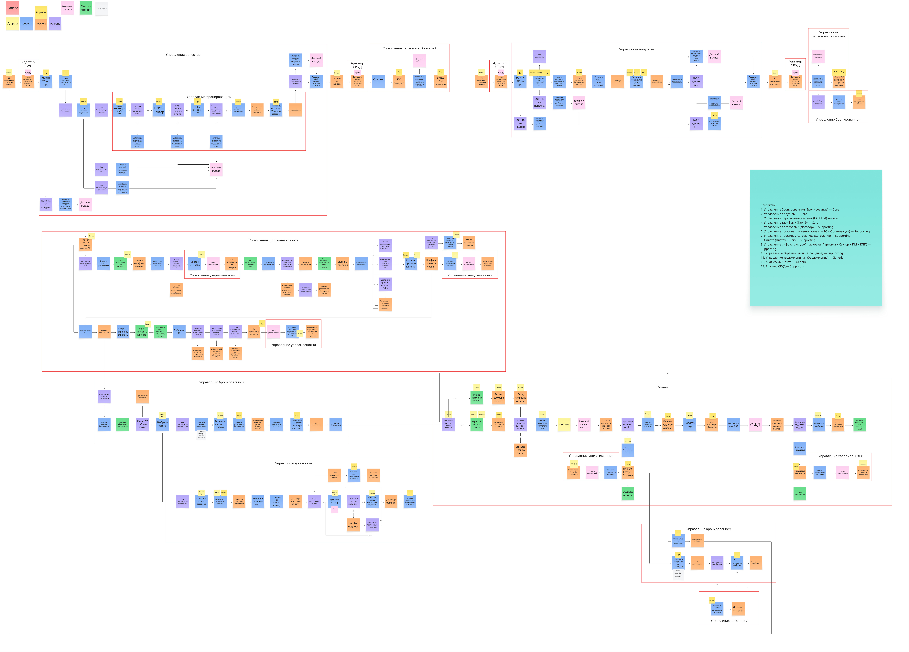

# ES TO-BE SD: Контексты

## Оглавление

- [Назначение](#назначение)
- [Контекст и источник](#контекст-и-источник)
- [Диаграмма](#диаграмма)
- [Текстовое описание](#текстовое-описание)
- [Ключевые элементы](#ключевые-элементы)
- [Логика артефакта](#логика-артефакта)
- [Выводы и решения](#выводы-и-решения)
- [Ограничения и открытые вопросы](#ограничения-и-открытые-вопросы)
- [Связанные документы](#связанные-документы)

## Назначение

Артефакт группирует TO-BE сценарии по доменным контекстам и показывает, какие цепочки событий и команд относятся к каждому из них. В проекте этот документ относится к Этапу 4, архитектуре информационной системы: через него фиксируются границы будущих модулей и взаимодействий, из которых затем выводятся C4-диаграммы системы, включая L1, L2 и, для модульного монолита, L3.

## Контекст и источник

- Этап проекта: Этап 4. Архитектура информационной системы
- Тип артефакта: Event Storming / контекстная декомпозиция
- Источник: импортированная актуальная TO-BE диаграмма, рабочая доска декомпозиции контекстов
- Статус: рабочая каноничная текстовая версия по актуальной диаграмме, используемая как вход в архитектуру информационной системы

## Диаграмма

## Текстовое описание

Диаграмма раскладывает общую TO-BE модель на несколько смысловых блоков. На доске отдельно выделены клиентские контексты, контур доступа, контур бронирования и договоров, контур оплаты и связанные служебные зоны. Внутри каждого блока зафиксированы собственные команды, события, правила и внешние взаимодействия, но между блоками проведены переходы, показывающие, как результат одного контекста становится входом для другого.

Такой способ представления помогает увидеть границы ответственности. Управление клиентом и автомобилями отвечает за подготовку и актуальность данных. Контекст доступа использует эти данные для принятия решения на КПП. Контекст бронирования и договора формирует основания для допуска и использования ресурса. Контекст оплаты закрывает денежную часть сценария и меняет состояние задолженности. В результате диаграмма служит промежуточным мостом между Event Storming и будущими bounded contexts, модулями, интеграционными контрактами и C4-представлением системы.

## Ключевые элементы

- Отдельные блоки с границами контекстов
- Переходы между контекстами через события и команды
- Контексты клиента и списка ТС
- Контексты бронирования, договора, доступа и оплаты
- Внешние системы, влияющие на доменные цепочки
- Рабочие заметки по границам ответственности

## Логика артефакта

Главная идея диаграммы в том, что целевое решение нельзя описывать как один монолитный процесс без внутренних границ. Даже если для пользователя это один сценарий парковки, внутри платформы существуют разные области ответственности с разными инвариантами и ритмом изменений. Для клиента критичны профиль и ТС; для допуска критично быстрое решение на КПП; для оплаты важны статусы платежа и фискализация; для договора и бронирования важны жизненные циклы оснований доступа. Контекстная диаграмма делает эти границы явными.

Этот артефакт особенно полезен перед архитектурной детализацией. Он позволяет проверить, что будущие модули, таблицы, API и очереди событий не будут спроектированы "поверх картинки", а будут следовать доменным границам. В этом смысле диаграмма контекстов подготавливает материал для DDD-артефактов и ADR, а также помогает связывать требования по ролям и сценариям с конкретными модулями системы.

Для архитектурного слоя это один из исходных артефактов для C4. Сначала из него выделяются границы системы и внешние участники для C4 Level 1, затем устойчивые внутренние контуры преобразуются в контейнеры и ключевые связи для C4 Level 2. Для модульного монолита на следующем шаге те же контексты и модули раскладываются на внутренние компоненты приложения, что дает основу и для C4 Level 3. Поэтому `es-tobe-sd-contexts.md` стоит рассматривать как доменно-архитектурный предшественник C4, а не только как рабочую ES-доску.

## Выводы и решения

- TO-BE логика уже естественно группируется в несколько контекстов, а не в один поток без границ.
- Переходы между контекстами должны быть реализованы через явные события, статусы и контракты.
- Диаграмма полезна как опора для дальнейшей DDD- и архитектурной проработки.
- Из диаграммы вытекают C4-артефакты: system context, container view и, для модульного монолита, component view.

## Ограничения и открытые вопросы

- На текущем изображении присутствуют рабочие заметки, которые стоит дополнительно сверить перед фиксацией окончательных bounded contexts.
- Границы между административными функциями и операционным контуром доступа могут потребовать отдельной детализации в архитектурных документах.

## Связанные документы

- [../../artifacts/es-to-be/es-tobe-sd-team-board.md](../../artifacts/es-to-be/es-tobe-sd-team-board.md)
- [ddd-bounded-contexts.md](ddd-bounded-contexts.md)
- [../adr/adr-003-modular-monolith.md](../adr/adr-003-modular-monolith.md)
- [../c4/c4-l1-system-context.md](../c4/c4-l1-system-context.md)
- [../c4/c4-l2-container.md](../c4/c4-l2-container.md)
- [../c4/c4-parking-platform.md](../c4/c4-parking-platform.md)
- [../../artifacts/context-diagram.md](../../artifacts/context-diagram.md)
