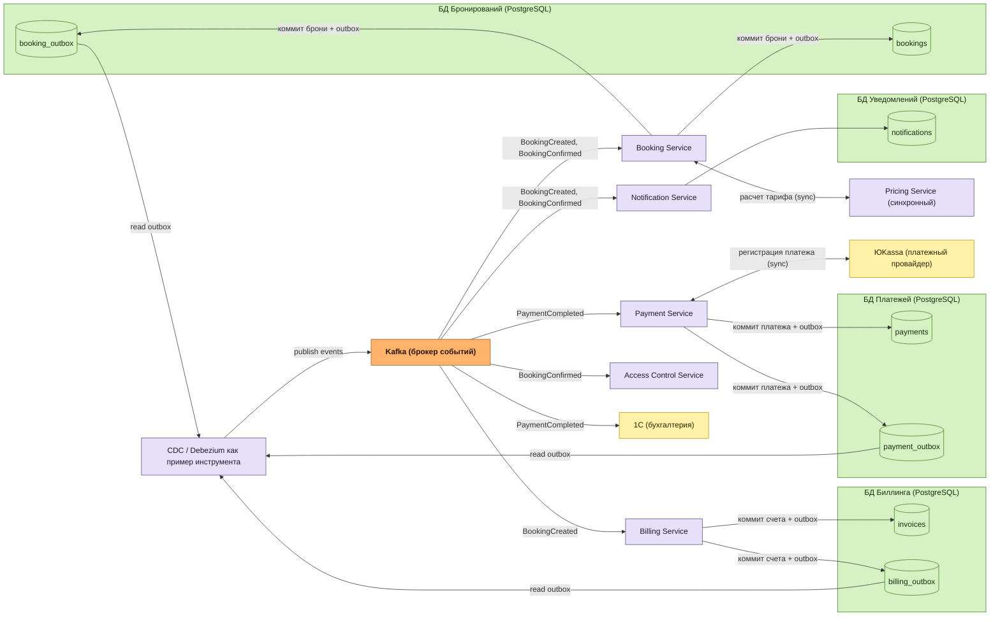
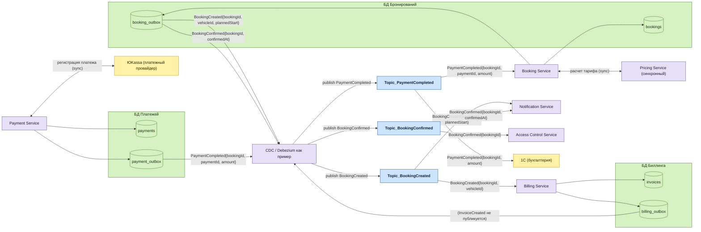

# DFD конвейера потоков данных Kafka — онлайн-бронирование (учебный TO-BE)

## Оглавление

- [Назначение](#назначение)
- [Контекст и источник](#контекст-и-источник)
- [Расхождения с ADR-003](#расхождения-с-adr-003)
- [Учебное упрощение по UC-10.2](#учебное-упрощение-по-uc-102)
- [DFD K-L1 — обзор конвейера](#dfd-k-l1--обзор-конвейера)
  - [Диаграмма K-L1](#диаграмма-k-l1)
  - [Словарь потоков K-L1](#словарь-потоков-k-l1)
- [DFD K-L2 — детализация по топикам](#dfd-k-l2--детализация-по-топикам)
  - [Диаграмма K-L2](#диаграмма-k-l2)
  - [Словарь потоков K-L2](#словарь-потоков-k-l2)
- [Текстовое описание сценария](#текстовое-описание-сценария)
- [Балансировка с UC-12.2 и UC-10.2](#балансировка-с-uc-122-и-uc-102)
- [Примечание про схемы PostgreSQL и outbox](#примечание-про-схемы-postgresql-и-outbox)
- [Связанные документы](#связанные-документы)

## Назначение

Артефакт показывает учебный TO-BE поток данных через Kafka для сквозной цепочки «создать бронь → выставить счет → оплатить → подтвердить → уведомить». Декомпозиция дана на двух уровнях по формату телемед-референса курса:

- **K-L1** — обзорная диаграмма с одним блоком Kafka в центре (фокус на producer'ах, consumer'ах, БД и внешних системах);
- **K-L2** — детализация с явными топиками (фокус на потоках событий между конкретными топиками и их подписчиками).

Префикс `K-` намеренно отличается от производственного `L1` в [DFD Level 1](../../artifacts/dfd-l1.md), чтобы оба артефакта легко отличались в навигации и трассировке.

## Контекст и источник

- Этап проекта: ДЗ курса по теме брокеров сообщений (учебный TO-BE).
- Тип артефакта: DFD конвейера потоков данных Kafka (двухуровневый).
- Бизнес-сценарий: склейка [UC-12.2 «Создать бронирование автоматически на въезде»](../../artifacts/use-case/uc-12-2-create-booking-auto-entry.md) и [UC-10.2 «Оплатить онлайн (краткосрочная аренда)»](../../artifacts/use-case/uc-10-2-pay-online-short-term-rental.md) + уведомление клиента.
- Источник формата: JPG-референсы в [plans/kafka/](../../../plans/kafka/) (телемед-пример, уровни 1 и 2).
- Имена компонентов соответствуют [C4 L3](../c4/c4-diagrams.md): `Booking Service`, `Billing Service`, `Payment Service`, `Pricing Service`, `Notification Service`, `Access Control Service`.
- Связанное архитектурное решение: [ADR-007 «Kafka event bus для онлайн-бронирования»](../adr/adr-007-kafka-event-bus-online-booking.md).
- Каноничное архитектурное решение, поверх которого вводится учебный TO-BE: [ADR-003 «Модульный монолит»](../adr/adr-003-modular-monolith.md).
- Статус: **учебный TO-BE** — не подменяет ADR-003 и `docs/specs/`, оформлен только в архитектурном слое.

## Расхождения с ADR-003

Учебный TO-BE сознательно расходится с действующими инвариантами ADR-003 в трех точках. Расхождения зафиксированы здесь и продублированы в Status ADR-007:

1. **Инв. 4 (transactional outbox)** — паттерн сохранен: `Booking`, `Billing` и `Payment` коммитят бизнес-данные и запись в outbox-таблицу одной локальной транзакцией PostgreSQL. Меняется конечное звено: hand-off из outbox в Kafka выполняет CDC-процесс (Debezium как пример инструмента), а не `Notification Worker`. Это закрывает dual-write и сохраняет at-least-once.
2. **Инв. 5 (изоляция по схемам в одной БД)** — на DFD логически отдельные «БД Бронирований / Биллинга / Уведомлений» нарисованы для визуальной унификации с телемед-референсом. Физически — одна PostgreSQL со схемами `booking_*`, `billing_*`, `notification_*` (см. [примечание про схемы](#примечание-про-схемы-postgresql-и-outbox)).
3. **Notification Worker** — переопределен. По ADR-003 это отдельный процесс без своего хранилища, читающий табличную outbox-очередь. В учебном TO-BE `Notification Service` становится Kafka-consumer'ом со своей schema'ой `notification_*` для шаблонов и истории доставки.

## Учебное упрощение по UC-10.2

В исходнике UC-10.2 предусловие — «существует активная парковочная сессия». В учебном TO-BE UC-10.2 запускается **не от существующей ПС, а от свежесозданной брони UC-12.2**. Это явное дидактическое упрощение, чтобы сквозная цепочка осталась короткой и сопоставимой с телемед-референсом. Каноничное предусловие UC-10.2 в `docs/artifacts/use-case/` не меняется.

## DFD K-L1 — обзор конвейера

На этом уровне Kafka показана одним оранжевым блоком в центре. Видны все producer'ы, consumer'ы, БД (с outbox-таблицами) и внешние системы. CDC-процесс показан явно — это отдельный узел между outbox-таблицами и Kafka. `Pricing Service` синхронной стрелкой связан с `Booking Service` и в Kafka не публикует (антипаттерн «функция как топик» исключен).

### Диаграмма K-L1

### Словарь потоков K-L1

| Поток                      | Смысл                                                                      | Пример полезной нагрузки                                               |
| -------------------------- | -------------------------------------------------------------------------- | ---------------------------------------------------------------------- |
| коммит брони + outbox      | Атомарная запись бизнес-таблицы и outbox в одной транзакции PostgreSQL     | INSERT bookings(id, vehicle_id, sector_id, ...); INSERT booking_outbox |
| коммит счета + outbox      | То же для биллинга                                                         | INSERT invoices(id, booking_id, amount); INSERT billing_outbox         |
| коммит платежа + outbox    | То же для платежа                                                          | INSERT payments(id, invoice_id, status); INSERT payment_outbox         |
| расчет тарифа (sync)       | Синхронный внутрипроцессный вызов, не событие                              | calc(zoneTypeId, vehicleType, periodMin) -> amountKop                  |
| read outbox                | CDC-процесс читает изменения outbox-таблиц                                 | LSN-курсор по WAL PostgreSQL                                           |
| publish events             | CDC публикует события в соответствующие топики Kafka (детализация на K-L2) | См. K-L2                                                               |
| BookingCreated             | Событие создания брони (из K-L2 — `Topic_BookingCreated`)                  | { eventId, bookingId, vehicleId, plannedStart }                        |
| PaymentCompleted           | Событие успешной оплаты (из K-L2 — `Topic_PaymentCompleted`)               | { eventId, bookingId, paymentId, amount, currency }                    |
| BookingConfirmed           | Событие подтверждения брони (из K-L2 — `Topic_BookingConfirmed`)           | { eventId, bookingId, confirmedAt }                                    |
| регистрация платежа (sync) | Синхронный REST-вызов `Payment Service` к ЮKassa, не через Kafka           | POST /payments {amount, invoice_id, callback_url}                      |

## DFD K-L2 — детализация по топикам

На этом уровне центральный блок Kafka раскрыт в три синих топика. Видно, какой топик пишет какой producer и какие consumer'ы получают какое событие. `Topic_InvoiceCreated` намеренно отсутствует — у него был бы единственный consumer (Payment), это RPC, обернутый в Kafka, антипаттерн «функция как топик».

### Диаграмма K-L2

### Словарь потоков K-L2

| Поток / событие                                              | Смысл                                                                              | Пример полезной нагрузки                                                   |
| ------------------------------------------------------------ | ---------------------------------------------------------------------------------- | -------------------------------------------------------------------------- |
| BookingCreated                                               | Бронирование создано, биллинг и уведомления должны отреагировать                   | { eventId, bookingId, vehicleId, sectorId, plannedStart, tariffId }        |
| PaymentCompleted                                             | Оплата успешно завершена у ЮKassa, бронь можно подтверждать, бухгалтерия фиксирует | { eventId, bookingId, paymentId, amount, currency, paidAt, transactionId } |
| BookingConfirmed                                             | Бронь окончательно подтверждена, право проезда и уведомление актуализируются       | { eventId, bookingId, confirmedAt, validUntil }                            |
| InvoiceCreated (не публикуется)                              | Намеренно не превращается в топик — единственный consumer был бы Payment, это RPC  | —                                                                          |
| publish BookingCreated / PaymentCompleted / BookingConfirmed | CDC берет запись outbox и публикует в Kafka c ключом `bookingId`                   | См. ключ партиционирования в `kafka-requirements.md`                       |
| расчет тарифа (sync)                                         | Внутрипроцессный синхронный вызов Booking → Pricing, в Kafka не публикуется        | calc(zoneTypeId, vehicleType, periodMin) -> amountKop                      |
| регистрация платежа (sync)                                   | Синхронный REST-вызов `Payment Service` к ЮKassa, не через Kafka                   | POST /payments { amount, invoice_id, callback_url }                        |

## Текстовое описание сценария

Сквозная цепочка — 10 шагов от создания брони до уведомления клиента:

1. **Booking Service** получает запрос на бронирование (триггер UC-12.2: автозапись на въезде; в учебном TO-BE — также «забронировать ПМ заранее» в ЛК) и синхронно вызывает **Pricing Service**, чтобы рассчитать сумму к оплате. Pricing работает в одном процессе с Booking, в Kafka не публикует.
2. **Booking Service** в одной локальной транзакции PostgreSQL коммитит запись в `bookings` и запись `BookingCreated` в `booking_outbox`.
3. **CDC** (Debezium как пример) читает `booking_outbox` и публикует событие в **Topic_BookingCreated** с ключом `bookingId`.
4. **Billing Service** подписан на `Topic_BookingCreated`, создает счет в `invoices` (одна транзакция с записью в `billing_outbox`).
5. **Notification Service** также подписан на `Topic_BookingCreated`, отправляет клиенту уведомление «бронь принята к оплате».
6. **Payment Service** инициирует оплату: синхронным REST-вызовом регистрирует платеж в **ЮKassa**, получает callback или подтверждение, в одной транзакции коммитит запись в `payments` и `PaymentCompleted` в `payment_outbox`.
7. **CDC** публикует событие в **Topic_PaymentCompleted** с ключом `bookingId`.
8. **Booking Service** подписан на `Topic_PaymentCompleted`, переводит бронь в статус `Confirmed` и в одной транзакции коммитит `BookingConfirmed` в `booking_outbox`. **1С** также подписана на `Topic_PaymentCompleted` для бухгалтерского учета (фан-аут).
9. **CDC** публикует событие в **Topic_BookingConfirmed** с ключом `bookingId`.
10. **Notification Service** отправляет клиенту уведомление «бронь подтверждена», параллельно **Access Control Service** актуализирует право проезда и квоту бронирования по ТС клиента.

## Балансировка с UC-12.2 и UC-10.2

| Шаг сценария | События Kafka                                          | Шаги UC-12.2                                        | Шаги UC-10.2                                                                           |
| ------------ | ------------------------------------------------------ | --------------------------------------------------- | -------------------------------------------------------------------------------------- |
| 1            | —                                                      | Шаги 1–4 основного потока (поиск тарифа, ПМ, бронь) | Предусловие учебного TO-BE: бронь существует                                           |
| 2            | запись в booking_outbox                                | Шаг 4 (создание бронирования)                       | —                                                                                      |
| 3            | publish Topic_BookingCreated                           | —                                                   | —                                                                                      |
| 4            | consume Topic_BookingCreated → Billing                 | —                                                   | Шаг 1 (создание [платеж] трансформирован в выставление счета через Billing)            |
| 5            | consume Topic_BookingCreated → Notification            | —                                                   | Шаг 14 (уведомление; в учебном TO-BE расщеплен на «принята к оплате» и «подтверждена») |
| 6            | запись в payment_outbox                                | —                                                   | Шаги 3–7 (регистрация в Платежной системе, обновление статуса)                         |
| 7            | publish Topic_PaymentCompleted                         | —                                                   | —                                                                                      |
| 8            | consume Topic_PaymentCompleted → Booking + 1С          | Шаг 5 (изменение ПМ «зарезервировано»)              | Шаги 8 (статус «Оплачено») + дополнение на 1С (бухгалтерия)                            |
| 9            | publish Topic_BookingConfirmed                         | —                                                   | —                                                                                      |
| 10           | consume Topic_BookingConfirmed → Notification + Access | Шаг 6 (возврат в UC-12.1)                           | Шаг 14 (повторное уведомление о подтверждении)                                         |

Шаги UC-10.2 9–13 (фискализация чека через ОФД) **в учебном TO-BE опущены** — они out of scope, чтобы не усложнять конвейер; обоснование — в Status ADR-007.

## Примечание про схемы PostgreSQL и outbox

На обеих диаграммах нарисованы логически отдельные «БД Бронирований / Биллинга / Платежей / Уведомлений» — это визуальная унификация с телемед-референсом, не физическое разделение. По [ADR-003 инв. 5](../adr/adr-003-modular-monolith.md) основной процесс работает с одной PostgreSQL, изолированной по схемам:

- `booking_*` — таблицы `bookings`, `booking_status_history`, `booking_outbox`;
- `billing_*` — таблицы `invoices`, `receipts`, `billing_outbox`;
- `payment_*` (внутри схемы биллинга или отдельной) — таблицы `payments`, `refunds`, `payment_outbox`;
- `notification_*` — таблицы `notifications`, `notification_templates` (новая schema, переопределяющая `Notification Worker` из ADR-003).

Outbox-таблица в каждой схеме физически рядом с бизнес-таблицами. Это сохраняет ключевое свойство ADR-003 инв. 4: запись бизнес-данных и outbox-события в одной локальной транзакции, без распределенных транзакций. Hand-off в Kafka выполняет CDC по WAL PostgreSQL — это и есть единственное расхождение с инв. 4 (был `Notification Worker`, стал CDC + Kafka).

## Связанные документы

- [ADR-007 «Kafka event bus для онлайн-бронирования»](../adr/adr-007-kafka-event-bus-online-booking.md) — обоснование выбора Kafka и решения по антипаттернам (`Pricing Service` синхронный, `Topic_InvoiceCreated` не делаем, dual-write через outbox + CDC).
- [Требования к Kafka](kafka-requirements.md) — две таблицы (технические параметры топиков и семантика доставки) для `Topic_BookingCreated`, `Topic_PaymentCompleted`, `Topic_BookingConfirmed`.
- [UC-12.2 «Создать бронирование автоматически на въезде»](../../artifacts/use-case/uc-12-2-create-booking-auto-entry.md) — первая половина сквозного бизнес-сценария.
- [UC-10.2 «Оплатить онлайн (краткосрочная аренда)»](../../artifacts/use-case/uc-10-2-pay-online-short-term-rental.md) — вторая половина сквозного бизнес-сценария (с учебным упрощением по предусловию).
- [ADR-003 «Модульный монолит»](../adr/adr-003-modular-monolith.md) — каноничное архитектурное решение, поверх которого вводится учебный TO-BE; источник инвариантов 4 (outbox) и 5 (схемы) и определения `Notification Worker`.
- [DFD Level 1 проекта](../../artifacts/dfd-l1.md) — производственная декомпозиция платформы; этот артефакт ее не подменяет, префикс `K-` намеренно отличается.
