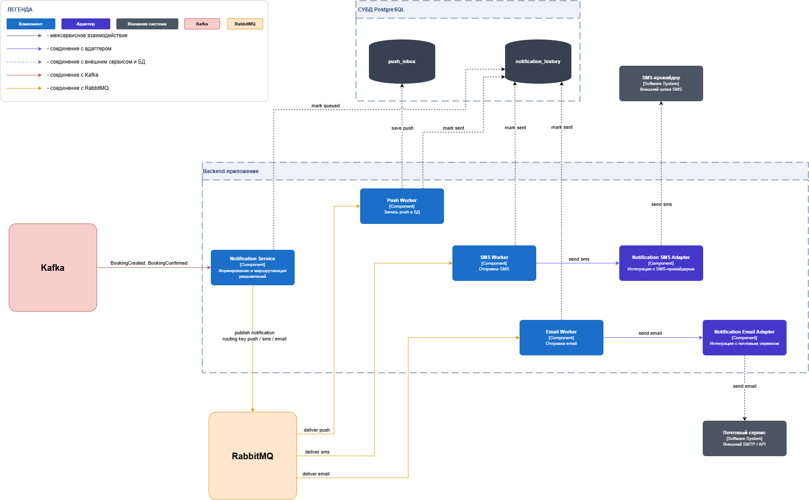
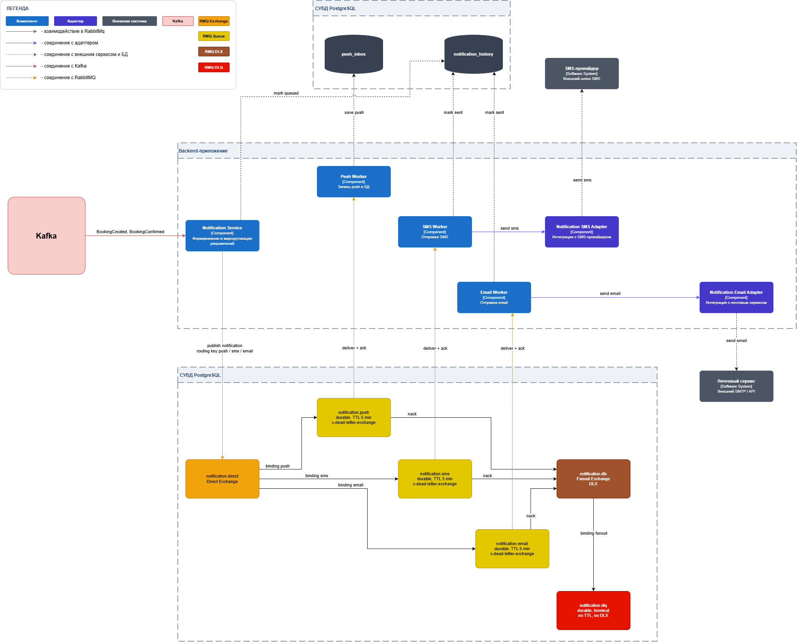

# DFD конвейера потоков данных RabbitMQ — рассылка уведомлений (учебный TO-BE)

## Оглавление

- [Назначение](#назначение)
- [Контекст и источник](#контекст-и-источник)
- [DFD R-L1 — обзор конвейера](#dfd-r-l1--обзор-конвейера)
  - [Диаграмма R-L1](#диаграмма-r-l1)
  - [Словарь потоков R-L1](#словарь-потоков-r-l1)
- [DFD R-L2 — детализация RabbitMQ](#dfd-r-l2--детализация-rabbitmq)
  - [Диаграмма R-L2](#диаграмма-r-l2)
  - [Словарь потоков R-L2](#словарь-потоков-r-l2)
- [Текстовое описание сценария](#текстовое-описание-сценария)
- [Балансировка «событие Kafka → команда RMQ → канал доставки»](#балансировка-событие-kafka--команда-rmq--канал-доставки)
- [Примечание про схему notification\_\* и таблицу push_inbox](#примечание-про-схему-notification_-и-таблицу-push_inbox)
- [Связанные документы](#связанные-документы)

## Назначение

Артефакт показывает учебный TO-BE поток команд через RabbitMQ для рассылки уведомлений в bounded context Notification. RMQ оформлен как work queue команд внутри одного контекста — продолжение Kafka-конвейера из ADR-007. Единственный publisher в RMQ — `Notification Service`, который слушает Kafka-топики `Topic_BookingCreated` и `Topic_BookingConfirmed` и публикует команды на доставку в три канала (SMS / email / push). Декомпозиция дана на двух уровнях — симметрично Kafka-документу:

- **R-L1** — обзорная диаграмма с RabbitMQ одним оранжевым блоком в центре (фокус на источнике Kafka, Notification Service как publisher, трех воркерах, двух адаптерах, БД и внешних провайдерах);
- **R-L2** — детализация с явными exchanges и queues (`notification.direct` с тремя routing keys и тремя очередями + `notification.dlx` с одной терминальной DLQ `notification.dlq`).

Префикс `R-` симметричен `K-` из Kafka-документа. Артефакт опирается на [ADR-007 «Kafka event bus для онлайн-бронирования»](../adr/adr-007-kafka-event-bus-online-booking.md) (источник Kafka-триггеров) и [ADR-008 «RabbitMQ для рассылки уведомлений»](../adr/adr-008-rabbitmq-notification-dispatch.md) (топология exchanges/queues, дисциплина acknowledgements, дедупликация).

## Контекст и источник

- Этап проекта: ДЗ курса по теме брокеров сообщений (учебный TO-BE).
- Тип артефакта: DFD конвейера потоков данных RMQ (двухуровневый), формат — draw.io с PNG-экспортом ([assets/r-l1.png](assets/r-l1.png), [assets/r-l2.png](assets/r-l2.png)) в едином стиле с K-L1/K-L2. Исходник — [assets/rbq.drawio](assets/rbq.drawio).
- Bounded context: Notification.
- Триггеры из Kafka (publisher — Booking, см. ADR-007): `Topic_BookingCreated` (бронь принята к оплате) и `Topic_BookingConfirmed` (бронь подтверждена). На R-L1 и R-L2 Kafka изображен одним блоком с обобщающей подписью «BookingCreated, BookingConfirmed» — конкретные топики раскрыты в [DFD K-L1 / K-L2](message-flow-kafka-online-booking.md), R-документ их не дублирует. `Topic_PaymentCompleted` Notification напрямую не слушает.
- Единственный publisher в RMQ — `Notification Service` (он же Kafka-consumer). Воркеры (SMS / Email / Push) — единственные consumer'ы своих очередей.
- Имена компонентов в основном соответствуют [C4 L3](../c4/c4-diagrams.md) (`Notification Service`). Локальное расхождение для читаемости DFD: `Notification Adapter` из C4 L3 показан здесь двумя модулями — `Notification SMS Adapter` и `Notification Email Adapter`. На уровне C4 L3 и DFD L1 умбрелла-имя `Notification Adapter` сохраняется; разделение здесь — визуальное уточнение, а не введение новых компонентов в архитектурную модель.
- Палитра и легенда — по образцу [K-L1.jpg](assets/k-l1.jpg) и [K-L2.jpg](assets/k-l2.jpg): синий — компонент, фиолетовый — адаптер, серый — внешняя система, оранжевый — RabbitMQ, розовый — Kafka. Цвета стрелок: синий — межсервисное взаимодействие, фиолетовый — соединение с адаптером, черный пунктир — соединение с внешней системой и БД, красный — соединение с Kafka, желтый — соединение с RabbitMQ. CDC в R-документе нет — `Notification Service` потребляет Kafka напрямую, без outbox.
- Каноничное архитектурное решение, поверх которого вводится учебный TO-BE: [ADR-003 «Модульный монолит»](../adr/adr-003-modular-monolith.md). Расхождение с ADR-003 — одно: новая таблица `notification.push_inbox` в существующей schema `notification_*` (см. [примечание](#примечание-про-схему-notification_-и-таблицу-push_inbox)).

## DFD R-L1 — обзор конвейера

На этом уровне RabbitMQ показан одним оранжевым блоком, Kafka — одним розовым блоком слева. На диаграмме видны: `Notification Service` как единственный publisher в RMQ; три воркера канала (`Push Worker`, `SMS Worker`, `Email Worker`) в зоне Backend-приложения; два адаптера — `Notification SMS Adapter` и `Notification Email Adapter` — между соответствующими воркерами и внешними системами; внешние провайдеры (`SMS-провайдер`, `Почтовый сервис`); БД Уведомлений (СУБД PostgreSQL) с двумя релевантными для потоков таблицами — `notification_history` и `push_inbox`. Таблица `notification_templates` из схемы `notification_*` на диаграмме не показана — она не участвует в потоках уровня L1 и описана в [примечании про схему](#примечание-про-схему-notification_-и-таблицу-push_inbox). Push Worker во внешний провайдер не ходит — пишет напрямую в `notification.push_inbox`, откуда PWA забирает уведомления через существующий REST API.

Подписи стрелок на диаграмме: `BookingCreated, BookingConfirmed` (Kafka → Notification Service); `mark queued` (Notification Service → БД, этап 1 дедупликации); `publish notification routing key push / sms / email` (Notification Service → RabbitMQ); `deliver push`, `deliver sms`, `deliver email` (RabbitMQ → соответствующий воркер); `save push` (Push Worker → `push_inbox`); `mark sent` (SMS / Email Worker → `notification_history`, этап 2 дедупликации); `send sms` и `send email` (воркер → адаптер → внешний провайдер).

### Диаграмма R-L1

Источник: [assets/rbq.drawio](assets/rbq.drawio).

### Словарь потоков R-L1

| Поток                                                                    | Подпись на диаграмме                              | Что течет                                                                                                                                                       | Формат                                                                                                                                                                     |
| ------------------------------------------------------------------------ | ------------------------------------------------- | --------------------------------------------------------------------------------------------------------------------------------------------------------------- | -------------------------------------------------------------------------------------------------------------------------------------------------------------------------- |
| `Kafka → Notification Service`                                           | `BookingCreated, BookingConfirmed`                | Триггеры из топиков `Topic_BookingCreated` (SMS, email) и `Topic_BookingConfirmed` (SMS, email, push). На L1 показаны одной обобщающей стрелкой                 | `Topic_BookingCreated`: `{ eventId, bookingId, vehicleId, sectorId, plannedStart, tariffId }`; `Topic_BookingConfirmed`: `{ eventId, bookingId, confirmedAt, validUntil }` |
| `Notification Service → notification_history` (этап 1 дедупликации)      | `mark queued`                                     | INSERT строки об уведомлении со статусом `queued` до публикации в RMQ                                                                                           | `INSERT INTO notification.notification_history (notification_id, channel, status, ...) VALUES (..., 'queued', ...) ON CONFLICT (notification_id) DO NOTHING`               |
| `Notification Service → RabbitMQ`                                        | `publish notification routing key push/sms/email` | Публикация команды на отправку в `notification.direct` с routing key канала. По одному `basic.publish` на каждое сочетание «событие × канал» из матрицы каналов | `basic.publish(exchange='notification.direct', routing_key=<sms\|email\|push>, body={ notificationId, channel, recipient, templateId, payload })`                          |
| `RabbitMQ → Push Worker / SMS Worker / Email Worker`                     | `deliver push` / `deliver sms` / `deliver email`  | Доставка команды из соответствующей очереди с manual ack                                                                                                        | `deliver { notificationId, channel, recipient, templateId, payload }`                                                                                                      |
| `SMS Worker / Email Worker → notification_history` (этап 2 дедупликации) | `mark sent`                                       | UPDATE history перед `provider.send`                                                                                                                            | `UPDATE notification_history SET status='sent', sent_at=now() WHERE notification_id=$1 AND status IN ('queued','failed') RETURNING id`                                     |
| `Push Worker → push_inbox`                                               | `save push`                                       | Запись push-уведомления в БД, откуда PWA забирает через REST API. Внешний провайдер не используется                                                             | `INSERT INTO notification.push_inbox (notification_id, user_id, payload, created_at) VALUES (...)`                                                                         |
| `SMS Worker → Notification SMS Adapter → SMS-провайдер`                  | `send sms`                                        | Синхронный вызов отправки SMS через адаптер во внешний шлюз                                                                                                     | `POST /sms { recipient, text, callback_url } -> { delivery_id }`                                                                                                           |
| `Email Worker → Notification Email Adapter → Почтовый сервис`            | `send email`                                      | Синхронный вызов отправки email через адаптер во внешний SMTP / API                                                                                             | `POST /mail { recipient, subject, body, callback_url } -> { delivery_id }`                                                                                                 |

## DFD R-L2 — детализация RabbitMQ

На этом уровне центральный блок RabbitMQ раскрыт в нижней зоне диаграммы. Видны: Direct Exchange `notification.direct` (оранжевый) с тремя routing keys (`sms`, `email`, `push`); три основные очереди — `notification.sms`, `notification.email`, `notification.push` (желтые, подписи `durable, TTL 5 мин, x-dead-letter-exchange`); Fanout Exchange `notification.dlx` (темно-оранжевый, подпись DLX); одна терминальная очередь `notification.dlq` (красная, подпись `durable, terminal, no TTL, no x-dead-letter-exchange`). Окружение — то же, что на R-L1: Kafka одним блоком, `Notification Service`, три воркера, два адаптера (`Notification SMS Adapter`, `Notification Email Adapter`), внешние провайдеры и БД с таблицами `notification_history` и `push_inbox`.

Подписи стрелок на диаграмме: `publish rk=sms`, `publish rk=email`, `publish rk=push` (Notification Service → `notification.direct`); `binding sms`, `binding email`, `binding push` (`notification.direct` → соответствующая очередь); `deliver + ack` (очередь → воркер); `nack(requeue=false)` (очередь → `notification.dlx`, на основании параметра `x-dead-letter-exchange: notification.dlx`); `binding fanout (без rk)` (`notification.dlx` → `notification.dlq`); подписи дедупликации, доставки и записи push те же, что на R-L1.

### Диаграмма R-L2

Источник: [assets/rbq.drawio](assets/rbq.drawio).

### Словарь потоков R-L2

| Поток                                                                | Подпись на диаграмме                                      | Что течет                                                                                                                    | Формат                                                                                                                                                                     |
| -------------------------------------------------------------------- | --------------------------------------------------------- | ---------------------------------------------------------------------------------------------------------------------------- | -------------------------------------------------------------------------------------------------------------------------------------------------------------------------- |
| `Kafka → Notification Service`                                       | `BookingCreated, BookingConfirmed`                        | Объединенная стрелка двух Kafka-триггеров: `Topic_BookingCreated` (SMS, email) и `Topic_BookingConfirmed` (SMS, email, push) | `Topic_BookingCreated`: `{ eventId, bookingId, vehicleId, sectorId, plannedStart, tariffId }`; `Topic_BookingConfirmed`: `{ eventId, bookingId, confirmedAt, validUntil }` |
| `Notification Service → notification_history` (этап 1)               | `mark queued`                                             | INSERT строки `queued` до публикации в RMQ                                                                                   | `INSERT ... ON CONFLICT (notification_id) DO NOTHING`                                                                                                                      |
| `Notification Service → notification.direct` (rk=sms / email / push) | `publish rk=sms` / `publish rk=email` / `publish rk=push` | Команда на отправку. По одной публикации на сочетание «событие × канал»                                                      | `basic.publish(exchange='notification.direct', routing_key=<sms\|email\|push>, body={ notificationId, channel, recipient, templateId, payload })`                          |
| `notification.direct → notification.sms`                             | `binding sms`                                             | Маршрутизация по точному совпадению routing key                                                                              | binding key `sms`                                                                                                                                                          |
| `notification.direct → notification.email`                           | `binding email`                                           | Маршрутизация по точному совпадению routing key                                                                              | binding key `email`                                                                                                                                                        |
| `notification.direct → notification.push`                            | `binding push`                                            | Маршрутизация по точному совпадению routing key                                                                              | binding key `push`                                                                                                                                                         |
| `notification.sms / .email / .push → Worker`                         | `deliver + ack`                                           | Доставка команды воркеру с manual ack после успешной отправки                                                                | `basic.deliver` + `basic.ack(delivery_tag)`                                                                                                                                |
| `notification.sms / .email / .push → notification.dlx`               | `nack(requeue=false)`                                     | Сбойное сообщение возвращается воркером с `requeue=false`; broker через `x-dead-letter-exchange` направляет его в DLX        | `basic.nack(delivery_tag, requeue=false)`                                                                                                                                  |
| `notification.dlx → notification.dlq`                                | `binding fanout (без rk)`                                 | Биндинг Fanout без routing key — все nack'нутые сообщения копируются в одну терминальную DLQ                                 | binding без routing key                                                                                                                                                    |
| `SMS / Email Worker → notification_history` (этап 2)                 | `mark sent`                                               | UPDATE history перед `provider.send`                                                                                         | `UPDATE notification_history SET status='sent' WHERE notification_id=$1 AND status IN ('queued','failed') RETURNING id`                                                    |
| `Push Worker → push_inbox`                                           | `save push`                                               | Внутренний канал P1: запись в БД, PWA читает через REST API                                                                  | `INSERT INTO notification.push_inbox (...)`                                                                                                                                |
| `SMS Worker → Notification SMS Adapter → SMS-провайдер`              | `send sms`                                                | Синхронный вызов внешнего SMS-шлюза                                                                                          | `POST /sms`                                                                                                                                                                |
| `Email Worker → Notification Email Adapter → Почтовый сервис`        | `send email`                                              | Синхронный вызов внешнего SMTP / API                                                                                         | `POST /mail`                                                                                                                                                               |

## Текстовое описание сценария

Сквозной сценарий доставки одного канала (на примере SMS на `Topic_BookingCreated`) — 8 шагов:

1. **Booking Service** публикует `BookingCreated` в Kafka (см. ADR-007). `Notification Service` подписан на `Topic_BookingCreated` и `Topic_BookingConfirmed`.
2. **Notification Service** consumes сообщение из Kafka. По матрице каналов на этот тип события создается команда на отправку SMS — вычисляется `notificationId = uuid_v5(eventId, channel)` (детерминированно, для возможных ретраев Kafka).
3. **Этап 1 дедупликации**: `Notification Service` делает `INSERT INTO notification.notification_history (notification_id, channel, status, ...) VALUES (..., 'queued', ...) ON CONFLICT (notification_id) DO NOTHING`. Если `0 rows` — это ретрай Kafka, в RMQ не публикуем, сразу commit offset.
4. `Notification Service` публикует команду в `notification.direct` с routing key, соответствующим каналу из матрицы (`sms`, `email` или `push`). После получения publisher confirm от broker'а Kafka offset commit'ится.
5. **Broker** маршрутизирует сообщение по binding key в одну из основных очередей (`notification.sms`, `notification.email`, `notification.push`).
6. Соответствующий **Worker** получает сообщение через `basic.deliver` (manual ack).
7. **Этап 2 дедупликации**: воркер делает `UPDATE notification_history SET status='sent', sent_at=now() WHERE notification_id=$1 AND status IN ('queued','failed') RETURNING id`. Если `0 rows` — дубль из RMQ, `ack` без отправки. Если строка обновлена — воркер вызывает соответствующий адаптер (`Notification SMS Adapter` для SMS, `Notification Email Adapter` для email) или пишет в `notification.push_inbox` (для Push) и шлет broker'у `basic.ack(delivery_tag)`.
8. **На ошибке** (провайдер недоступен, исключение в воркере, истечение TTL очереди в 5 мин): воркер шлет `basic.nack(delivery_tag, requeue=false)`. Broker по параметру `x-dead-letter-exchange: notification.dlx` направляет сообщение в DLX, который через Fanout-binding без routing key копирует его в терминальную `notification.dlq` для ручного разбора.

## Балансировка «событие Kafka → команда RMQ → канал доставки»

| Kafka topic              | routing key | exchange              | queue                | worker       | назначение доставки                                                                                              |
| ------------------------ | ----------- | --------------------- | -------------------- | ------------ | ---------------------------------------------------------------------------------------------------------------- |
| `Topic_BookingCreated`   | `sms`       | `notification.direct` | `notification.sms`   | SMS Worker   | Внешний SMS-провайдер через `Notification SMS Adapter` (OTP подтверждения телефона + напоминание оплатить бронь) |
| `Topic_BookingCreated`   | `email`     | `notification.direct` | `notification.email` | Email Worker | Внешний почтовый сервис через `Notification Email Adapter` (детали брони + ссылка на оплату)                     |
| `Topic_BookingConfirmed` | `sms`       | `notification.direct` | `notification.sms`   | SMS Worker   | Внешний SMS-провайдер через `Notification SMS Adapter` (короткое подтверждение «бронь подтверждена»)             |
| `Topic_BookingConfirmed` | `email`     | `notification.direct` | `notification.email` | Email Worker | Внешний почтовый сервис через `Notification Email Adapter` (квитанция и детали оплаченной брони)                 |
| `Topic_BookingConfirmed` | `push`      | `notification.direct` | `notification.push`  | Push Worker  | Запись в `notification.push_inbox` (PWA забирает через существующий REST API)                                    |

Итого пять публикаций в `notification.direct` на бизнес-цикл бронирования: две на `BookingCreated` (без push, пока пользователь может еще не быть в PWA до подтверждения оплаты) и три на `BookingConfirmed`.

`notificationId = uuid_v5(eventId, channel)` — детерминированный, по одному id на каждую строку матрицы для конкретного `eventId`. Это закрывает at-least-once Kafka на стороне consumer'а (двухэтапная дедупликация на входе Notification Service и на воркере перед `provider.send`) — outbox для RMQ-публикаций не вводим.

## Примечание про схему notification\_\* и таблицу push_inbox

В рамках учебного TO-BE используется единственное расхождение с [ADR-003 «Модульный монолит»](../adr/adr-003-modular-monolith.md): схема `notification_*` обогащается одной новой таблицей `push_inbox` для P1-канала push-уведомлений. Таблицы схемы:

- `notification_templates` — шаблоны сообщений по каналам (SMS / email / push). Уже предусмотрена ADR-007 в учебном переопределении `Notification Worker`.
- `notification_history` — история доставки уведомлений с уникальным индексом по `notification_id`. Используется в обоих этапах дедупликации: INSERT `queued` до публикации в RMQ, UPDATE `sent` / `failed` на воркере перед `provider.send`. Уже предусмотрена ADR-007.
- `push_inbox` — **новая таблица** для P1-канала push: Push Worker делает INSERT, PWA забирает запись через существующий backend REST API. Никакого realtime-gateway, WebSocket, FCM или APNs в текущем учебном scope нет — это сознательное упрощение, чтобы не расширять scope DFD на отдельный архитектурный блок без выгоды для темы RMQ.

Расхождение не нарушает инвариантов ADR-003: schema-изоляция сохранена (новая таблица — внутри `notification_*`), физическая БД — одна PostgreSQL, никаких распределенных транзакций. Outbox для RMQ-публикаций не вводим: `Notification Service` публикует в RMQ напрямую после успешной обработки Kafka-сообщения (publisher confirms + commit Kafka offset только после confirm от broker'а), at-least-once Kafka + детерминированный `notificationId` + двухэтапная дедупликация дают exactly-once-effect на провайдере — эквивалент гарантии outbox+inbox для этого узла.

## Связанные документы

- [ADR-008 «RabbitMQ для рассылки уведомлений»](../adr/adr-008-rabbitmq-notification-dispatch.md) — обоснование выбора топологии (Direct + Fanout DLX), решения по антипаттернам (RMQ не event log, обязательный DLX, отдельная очередь на канал, единственный publisher в RMQ — Notification Service, manual ack), Push P1 через БД, отсутствие outbox.
- [ADR-007 «Kafka event bus для онлайн-бронирования»](../adr/adr-007-kafka-event-bus-online-booking.md) — источник Kafka-триггеров `Topic_BookingCreated` и `Topic_BookingConfirmed`, на которых RMQ-конвейер строится как продолжение.
- [DFD K-L1 / K-L2 — Kafka-конвейер онлайн-бронирования](message-flow-kafka-online-booking.md) — Kafka-сторона цепочки, формат и палитра, по которым делаются R-L1 / R-L2.
- [Требования к RabbitMQ](rabbitmq-requirements.md) — таблица «обменник × очередь × параметры × привязка» с конкретными значениями `x-*` аргументов.
- [ADR-003 «Модульный монолит»](../adr/adr-003-modular-monolith.md) — каноничное решение, относительно которого фиксируется единственное расхождение (новая таблица `push_inbox`).
- [DFD Level 1 проекта](../../artifacts/dfd-l1.md) — производственная декомпозиция платформы; этот артефакт ее не подменяет, префикс `R-` намеренно отличается.
