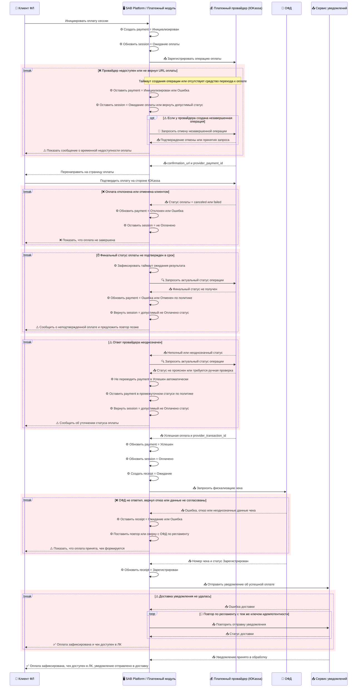

# Sequence Diagram — UC-10.2 Оплатить онлайн (краткосрочная аренда)

Этот артефакт визуализирует интеграционную последовательность для сценария [UC-10.2 Оплатить онлайн (краткосрочная аренда)](../../artifacts/use-case/uc-10-2-pay-online-short-term-rental.md) на основе [требований к интеграции](../../specs/integration/integration-requirements.md) и [маппинга обмена данными с ЮKassa](yookassa-data-mapping.md).

В диаграмму включены межсистемные взаимодействия и ключевые статусы сущностей `payment`, `session` и `receipt`. Ранние внутренние сбои `1a` и `2a` намеренно оставлены только в тексте use case, чтобы sequence diagram оставалась читаемой и фокусировалась на внешних интеграциях.

## Диаграмма Mermaid

## Связанные документы

- [UC-10.2 Оплатить онлайн (краткосрочная аренда)](../../artifacts/use-case/uc-10-2-pay-online-short-term-rental.md) — бизнес-сценарий, который эта диаграмма детализирует на уровне интеграционных взаимодействий.
- [Требования к интеграции](../../specs/integration/integration-requirements.md) — фиксируют требования класса `INT-*`, покрываемые последовательностью онлайн-оплаты.
- [Маппинг обмена данными с ЮKassa](yookassa-data-mapping.md) — задает provider-specific поля и статусы для сценария онлайн-оплаты.
