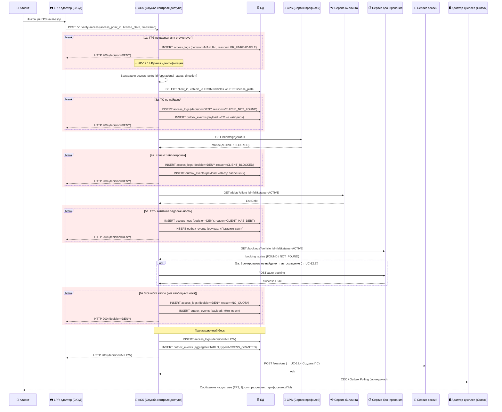

# Sequence Diagram — UC-12.1 Пройти автоматическую идентификацию на въезде

Этот артефакт визуализирует интеграционную последовательность для сценария [UC-12.1 Пройти автоматическую идентификацию на въезде](../../artifacts/use-case/uc-12-1-pass-auto-identification-entry.md).

Диаграмма показывает цепочку проверок от фиксации ГРЗ до решения `ALLOW/DENY`: распознавание номера, поиск ТС и клиента, проверка статуса и задолженностей, поиск бронирования (с автосозданием при отсутствии), транзакционная запись решения и асинхронное уведомление через дисплей. Каждый reject-случай оформлен как `break`-блок.

## Диаграмма Mermaid

## Связанные документы

- [UC-12.1 Пройти автоматическую идентификацию на въезде](../../artifacts/use-case/uc-12-1-pass-auto-identification-entry.md) — бизнес-сценарий, который эта диаграмма детализирует на уровне интеграционных взаимодействий.
- [UC-12.2 Создать бронирование автоматически на въезде](../../artifacts/use-case/uc-12-2-create-booking-auto-entry.md) — вызывается из диаграммы при отсутствии активного бронирования.
- [UC-12.4 Создать ПС](../../artifacts/use-case/uc-12-4-create-parking-session.md) — финальный переход после успешного решения ALLOW.
- [Регламент взаимодействия ИС](is-interaction-regulation.md) — описывает блок «Контроль доступа (СКУД)» на уровне направлений обмена.
