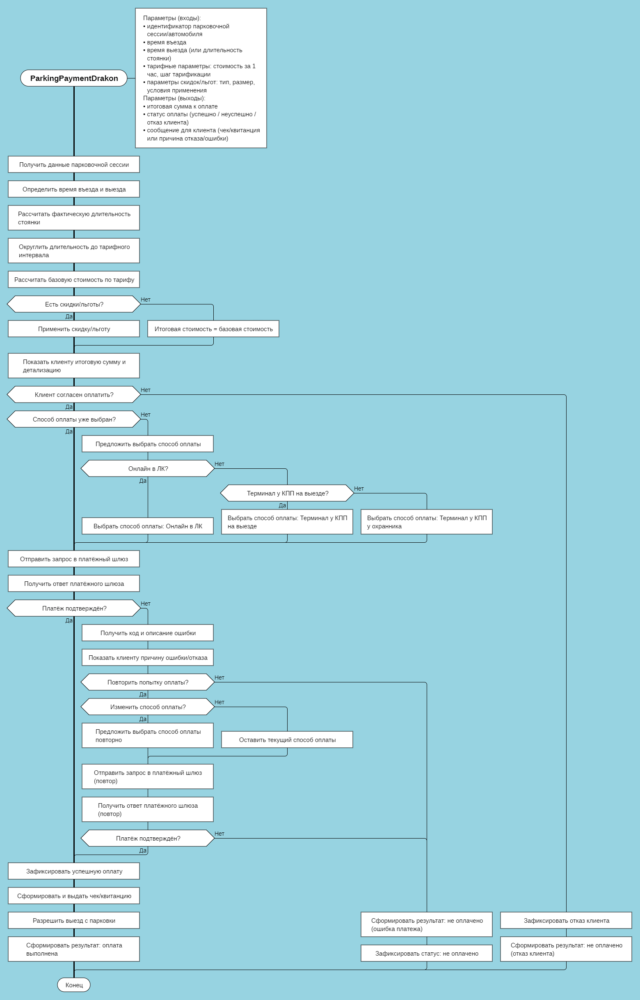
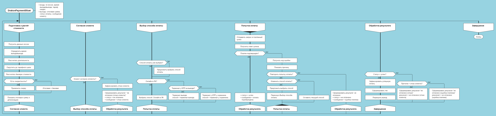

# DRAKON-алгоритм оплаты парковки

## Оглавление

- [Назначение](#назначение)
- [Контекст и источник](#контекст-и-источник)
- [Диаграмма](#диаграмма)
- [Текстовое описание](#текстовое-описание)
- [Ключевые элементы](#ключевые-элементы)
- [Логика артефакта](#логика-артефакта)
- [Детализация содержания](#детализация-содержания)
- [Выводы и решения](#выводы-и-решения)
- [Ограничения и открытые вопросы](#ограничения-и-открытые-вопросы)
- [Связанные документы](#связанные-документы)

## Назначение

Артефакт формализует алгоритм оплаты парковочной сессии в нотации DRAKON.

Он нужен как учебное и вспомогательное представление логики расчета стоимости, выбора способа оплаты, обработки отказа клиента и повторных попыток платежа.

## Контекст и источник

- Этап проекта: Этап 4. Основы алгоритмизации
- Тип артефакта: DRAKON / алгоритм оплаты парковки
- Источник: импортированный материал Build In, нормализованный в каноничный Markdown-артефакт
- Статус: учебный алгоритмический артефакт

## Диаграмма

### DRAKON-примитив

### DRAKON-силуэт

## Текстовое описание

Алгоритм описывает поведение системы в момент завершения парковочной сессии и перехода к оплате. Он начинается с получения данных сессии и расчета стоимости, затем проводит клиента через согласие на оплату, выбор канала оплаты и одну или две попытки платежа. В финале алгоритм либо фиксирует успешную оплату и разрешает выезд, либо завершает сценарий со статусом неоплаченной сессии.

## Ключевые элементы

- Получение данных парковочной сессии
- Расчет длительности и округление по тарифному шагу
- Расчет базовой суммы и применение скидок
- Согласие клиента на оплату
- Выбор способа оплаты
- Первая и повторная попытка платежа
- Фиксация результата, чек и разрешение выезда

## Логика артефакта

Алгоритм разбит на две формы представления:

- DRAKON-примитив показывает пошаговый линейный поток с условиями и ветвлениями.
- DRAKON-силуэт группирует ту же логику по подпрограммам: расчет стоимости, согласие клиента, выбор способа оплаты, попытка оплаты, обработка результата и завершение.

Обе версии описывают один и тот же сценарий: система рассчитывает сумму, предлагает клиенту оплату, выполняет платеж, при необходимости дает возможность повторной попытки и завершает сценарий с одним из итоговых статусов.

## Детализация содержания

### Входы

- `sessionId`
- `entryTime`
- `exitTime` или `duration`
- `tariffPerHour`
- `tariffStepMinutes`
- `discountRules`
- `paymentMethod` (может быть заранее не выбран)

### Выходы

- `totalAmount`
- `paymentStatus` со значениями `SUCCESS`, `FAILED`, `CLIENT_REFUSED`
- `clientMessage`

### Основной сценарий

1. Система получает данные парковочной сессии.
2. Определяется время въезда и выезда, затем рассчитывается длительность.
3. Длительность округляется вверх по тарифному шагу.
4. Рассчитывается базовая стоимость.
5. При наличии применимых скидок итоговая сумма уменьшается по правилам скидок.
6. Клиенту показываются итоговая сумма и детализация расчета.
7. Если клиент отказывается платить, система фиксирует отказ и завершает сценарий.
8. Если способ оплаты не выбран заранее, клиент выбирает один из доступных каналов.
9. Система отправляет платежный запрос.
10. При успешной оплате система фиксирует транзакцию, формирует чек и разрешает выезд.
11. При ошибке платежа клиент может отказаться от повторной попытки или попробовать снова, в том числе с изменением способа оплаты.
12. После второй попытки система завершает сценарий либо успехом, либо статусом неоплаченной сессии.

### Подпрограммы в силуэте

- Подготовка и расчет стоимости
- Согласие клиента
- Выбор способа оплаты
- Попытка оплаты
- Обработка результата
- Завершение

## Выводы и решения

- Артефакт помогает перевести платежную логику из narrative-описания в формальный пошаговый алгоритм.
- Он полезен для обсуждения веток отказа, ошибок платежа и повторной попытки оплаты.
- В таком виде материал можно использовать как промежуточную опору перед детализацией FR, UC или сценариев интеграции с платежным шлюзом.

## Ограничения и открытые вопросы

- Артефакт носит учебный характер и не заменяет полноценные функциональные требования или интеграционные контракты.
- В текущей версии не детализированы таймауты, идемпотентность, возвраты, фискализация и технические коды ошибок внешнего шлюза.
- При дальнейшем развитии проекта логику оплаты нужно синхронизировать с use case, FR и интеграционными сценариями.

## Связанные документы

- [Индекс алгоритмических артефактов](readme.md) — показывает место схемы в каталоге алгоритмических материалов.
- [UC-12.7 Завершение бронирования при авто-выезде](../use-case/uc-12-7-complete-booking-auto-exit.md) — использует логику оплаты при завершении бронирования.
- [UC-12.9 Завершение парковочной сессии](../use-case/uc-12-9-complete-parking-session.md) — связывает алгоритм оплаты с закрытием парковочной сессии.
- [ES TO-BE BP: Оплата](../es-to-be/es-tobe-bp-payment.md) — задает целевой бизнес-процесс оплаты, формализованный в DRAKON-схеме.
- [Индекс функциональных требований](../../specs/functional-requirements/readme.md) — ведет к требованиям, которые поддерживает алгоритм.
