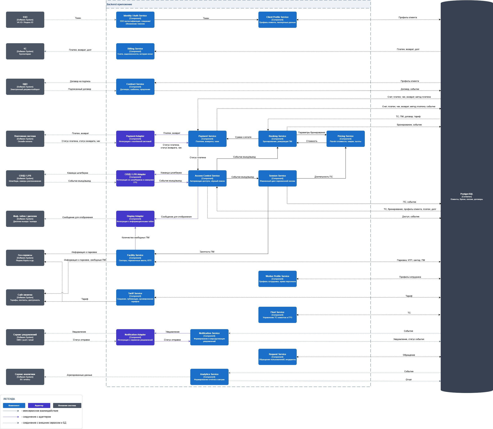

# DFD Level 1 — Декомпозиция платформы парковки

## Оглавление

- [Назначение](#назначение)
- [Контекст и источник](#контекст-и-источник)
- [Диаграмма](#диаграмма)
- [Текстовое описание](#текстовое-описание)
- [Ключевые элементы](#ключевые-элементы)
- [Логика основных сценариев](#логика-основных-сценариев)
- [Словарь потоков данных](#словарь-потоков-данных)
- [Трассировка и балансировка](#трассировка-и-балансировка)
- [Выводы и решения](#выводы-и-решения)
- [Связанные документы](#связанные-документы)

## Назначение

DFD Level 1 декомпозирует центральный процесс «Цифровая платформа парковки» (DFD L0) на 20 внутренних компонентов Backend-приложения, единое хранилище PostgreSQL и 10 внешних систем. Артефакт отвечает на вопрос «как именно данные движутся между процессами, хранилищем и внешними системами» и служит промежуточным слоем между контекстной диаграммой и C4 L3. Акторы (ФЛ, ЮЛ, охранник, управляющий, владелец) сознательно исключены — они показаны на DFD L0; на L1 фокус на серверной стороне. Логическое разделение таблиц по агрегатам сохранено в [ERD](../architecture/database/erd/erd-normalized-er-model.md), а на DFD L1 оно показано как единая БД — это согласуется с физической раскладкой [ADR-003](../architecture/adr/adr-003-modular-monolith.md) (одна PostgreSQL для основного процесса).

## Контекст и источник

- Этап проекта: Этап 5. Интеграции
- Тип артефакта: DFD Level 1 (декомпозиция)
- Источник истины: [docs/artifacts/assets/dfd-l1.jpg](assets/dfd-l1.jpg) — экспорт из draw.io ([исходник `.drawio`](assets/dfd-l1.drawio)). При расхождении со словарем потоков и трассировочными таблицами в этом документе побеждает JPG.
- Сопутствующие источники:
  - [C4 L3 — Component](../architecture/c4/c4-diagrams.md) — 20 компонентов и 10 внешних систем (1:1)
  - [ERD нормализованная модель](../architecture/database/erd/erd-normalized-er-model.md) — таблицы внутри единой БД, сгруппированные по агрегатам
  - [ADR-003: Модульный монолит](../architecture/adr/adr-003-modular-monolith.md) — единая PostgreSQL для основного процесса (инвариант 5)
  - [ADR-005: Стратегия чтения данных Access Control](../architecture/adr/adr-005-access-control-direct-db-read.md) — прямое чтение чужих агрегатов через именованные SQL view
  - [ADR-006: Расчет доступности ПМ при бронировании](../architecture/adr/adr-006-facility-availability-read.md) — Booking сам считает «свободно на интервал»: свой `bookings` плюс инвентарь Facility через `v_booking_inventory`
  - [Контекстная диаграмма (DFD L0)](context-diagram.md) — внешние потоки для балансировки (акторы остаются на L0)
- Статус: рабочая версия

## Диаграмма

Источник — [draw.io (`dfd-l1.drawio`)](assets/dfd-l1.drawio); при правке исходника обязательно обновлять JPG-экспорт в `assets/`.

## Текстовое описание

Диаграмма показывает, как данные движутся внутри Backend-приложения парковки между 20 компонентами, единым хранилищем `PostgreSQL [Container]` и 10 внешними системами. Акторы (ФЛ, ЮЛ, охранник КПП, управляющий, владелец) на L1 не показаны: их взаимодействие с системой зафиксировано на DFD L0 и в реестре use case. На L1 пользовательские потоки (бронирование, регистрация, обращения, настройка тарифов) приходят в сервисы извне через API/UI без явной внешней сущности.

Три класса узлов различаются цветом: **синий** — внутренние компоненты (доменные сервисы Backend), **фиолетовый** — адаптеры внешних систем (Payment Adapter, СКУД / LPR Adapter, Display Adapter, Notification Adapter), **темно-серый** — внешние системы. Все стрелки именованы существительными и представляют потоки данных; управляющие потоки не показаны.

Стиль линий по легенде в JPG:

- Сплошная черная стрелка — межсервисное взаимодействие (компонент ↔ компонент).
- Сплошная фиолетовая стрелка — соединение компонента с собственным адаптером.
- Пунктирная стрелка — соединение с внешней системой или с БД.

Хранилище показано как один узел `PostgreSQL [Container]` с описанием «Клиенты, брони, сессии, договоры», а не как 11 отдельных D1–D11: физически это одна PostgreSQL ([ADR-003 инв. 5](../architecture/adr/adr-003-modular-monolith.md)), и разделение на агрегаты — атрибут логической модели данных в [ERD](../architecture/database/erd/erd-normalized-er-model.md), а не отдельные хранилища потоков на L1. Принципы владения сохраняются: каждый агрегат в БД пишется только своим владельцем-сервисом; чтения чужих агрегатов допускаются (см. [ADR-005](../architecture/adr/adr-005-access-control-direct-db-read.md)).

Каждый компонент 1:1 соответствует элементу C4 L3 (см. [таблицу A](#a-компонент--c4-l3-компонент-11-20-строк)). Адаптеры (Payment Adapter, СКУД / LPR Adapter, Display Adapter, Notification Adapter) изолируют детали протоколов внешних систем.

## Ключевые элементы

### Компоненты Backend-приложения (20)

| ID  | Имя                     | Назначение (по подписи в JPG)                   | Bounded context |
| --- | ----------------------- | ----------------------------------------------- | --------------- |
| P1  | Booking Service         | Бронирования, резервация ПМ                     | Booking         |
| P2  | Billing Service         | Счета, задолженности, история оплат             | Billing         |
| P3  | Client Profile Service  | Профиль клиента, паспортные данные              | Identity        |
| P4  | Access Control Service  | Авторизация доступа, черный список              | Access Control  |
| P5  | Session Service         | Жизненный цикл парковочной сессии               | Booking         |
| P6  | Worker Profile Service  | Профиль сотрудника, права персонала             | Identity        |
| P7  | Identity / Auth Service | SSO-аутентификация, создание/обновление токенов | Identity        |
| P8  | Fleet Service           | Управление ТС клиентов и ГРЗ                    | Booking         |
| P9  | Notification Service    | Формирование и маршрутизация уведомлений        | Notifications   |
| P10 | Request Service         | Обращения пользователей, инциденты              | Support         |
| P11 | Tariff Service          | Создание, публикация, архивирование тарифов     | Billing         |
| P12 | Facility Service        | Секторы, парковочные места, КПП                 | Access Control  |
| P13 | Analytics Service       | Формирование отчетов и метрик                   | Analytics       |
| P14 | Contract Service        | Договоры, шаблоны, продление                    | Contracts       |
| P15 | Payment Service         | Платежи, возвраты, чеки                         | Billing         |
| P16 | Pricing Service         | Расчет стоимости, скидки, льготы                | Billing         |
| P17 | СКУД / LPR Adapter      | Интеграция со шлагбаумом и камерами ГРЗ         | Access Control  |
| P18 | Display Adapter         | Интеграция с информационными табло              | Access Control  |
| P19 | Payment Adapter         | Интеграция с платежной системой                 | Billing         |
| P20 | Notification Adapter    | Интеграция с сервисом уведомлений               | Notifications   |

### Хранилище

На DFD L1 хранилище одно — `PostgreSQL [Container]` (подпись «Клиенты, брони, сессии, договоры»). Разбиение на агрегаты сохраняется на логическом уровне (ERD) и определяет владельца на запись для каждой группы таблиц. Сводка владения и состава таблиц:

| Агрегат                 | Владелец-сервис (W) | Ключевые ERD-таблицы                                             |
| ----------------------- | ------------------- | ---------------------------------------------------------------- |
| Доступ                  | P4                  | access_logs, access_points                                       |
| Бронирование            | P1                  | bookings, booking_status_history                                 |
| Парковочная сессия      | P5                  | parking_sessions                                                 |
| Тариф                   | P11                 | tariffs, tariff_types, tariff_rates, zone_type_tariffs           |
| Платеж                  | P15 / P2            | payments, invoices, payment_methods, receipts, refunds, debts    |
| Договор                 | P14                 | contracts, contract_templates, contract_status_history           |
| Клиент                  | P3 / P8             | clients, client_accounts, vehicles, vehicle_types, passport_data |
| Сотрудник               | P6                  | employees, employee_roles, employee_accounts                     |
| Инфраструктура парковки | P12                 | parkings, sectors, parking_places, parking_schedules             |
| Уведомление             | P9                  | notifications, notification_templates, outbox_events             |
| Обращение               | P10                 | appeals                                                          |

> **Чтение чужих агрегатов** разрешено только через именованные SQL view; запись в чужие таблицы запрещена. Контракт чтения для горячего пути allow/deny на КПП зафиксирован в [ADR-005](../architecture/adr/adr-005-access-control-direct-db-read.md), для расчета доступности при бронировании — в [ADR-006](../architecture/adr/adr-006-facility-availability-read.md).

### Внешние системы (10)

| ID  | Имя                  | Подпись в JPG                  |
| --- | -------------------- | ------------------------------ |
| E6  | SSO                  | VK ID / Яндекс ID              |
| E7  | Платежная система    | Онлайн-оплата                  |
| E8  | Сервис уведомлений   | SMS / push / email             |
| E9  | Сервис аналитики     | BI / отчеты                    |
| E10 | СКУД / LPR           | Шлагбаум, камеры распознавания |
| E11 | Инф. табло / дисплеи | Дисплеи въезда / выезда        |
| E12 | ЭДО                  | Электронный документооборот    |
| E13 | 1С                   | Бухгалтерия                    |
| E14 | Гео-сервисы          | Яндекс.Карты и др.             |
| E15 | Сайт-визитка         | Тарифы, контакты, доступность  |

> Нумерация E6–E15 сохранена для совместимости с C4 L3 и журналом трассировки. ID E1–E5 (акторы) свободны и не реиспользуются.

## Логика основных сценариев

### 1. Бронирование и оплата

P7 (Identity / Auth Service) проверяет учетные данные через SSO (E6) и получает токен (`E6 → P7`); токен передается в P3 (Client Profile Service) для контекста сессии. P1 (Booking Service) получает параметры брони от пользователя, читает из БД справочники для валидации (`ТС, ПМ, договор, тариф`) и передает параметры в P16 (Pricing Service: «Параметры бронирования» / «Стоимость»). P1 сам считает доступность на нужный интервал по [ADR-006](../architecture/adr/adr-006-facility-availability-read.md): соединяет свой агрегат `bookings` с инвентарем мест P12 (`parking_places`, `sectors`, `zone_types`, `zone_type_vehicle_types`, `operational_statuses`), который читает через именованный read-only SQL view `v_booking_inventory` (паттерн consumer-owned view, симметричен ADR-005). После подтверждения P1 пишет бронь в свой агрегат (`Бронирование, событие` → DB) — этот write и есть резервирование; отдельная команда P12 не нужна, поле «Зарезервировано» в `parking_places` не материализуется ([ERD `parking_places`](../architecture/database/erd/erd-normalized-er-model.md#parking_places)). P12 для P18 (табло) и E15 (сайт-визитка) продолжает отдавать «свободно сейчас» на собственных данных (`is_occupied + operational_status`) — это другая по семантике задача, и она `bookings` не требует.

P1 передает «Сумма к оплате» в P15 (Payment Service). P15 формирует платежное поручение и отправляет его через P19 (Payment Adapter) во внешнюю Платежную систему (E7: «Платеж, возврат» / «Статус платежа, статус возврата, чек»). P15 сохраняет результат в БД (`Счет, платеж, чек, возврат, метод платежа, событие`) и возвращает `Статус платежа` в P4 (для горячего пути на КПП — UC-12.6 ветка 3а). Авто-уведомления и lifecycle брони после оплаты опираются на доменные события: P1, P15, P5, P14, P2 пишут события в `outbox_events` в одной транзакции с записью своего агрегата ([ADR-003](../architecture/adr/adr-003-modular-monolith.md) инв. 4), а P9 (Notification Service) вычитывает их и формирует задание для P20 (Notification Adapter), который отправляет SMS / push / email через E8. Эта механика реализована на уровне таблиц БД и в JPG не отрисована отдельными стрелками — она инкапсулирована в потоки `Бронирование, событие`, `Счет, платеж, чек, возврат, метод платежа, событие`, `ПС, событие`, `Договор, событие`, `Уведомление, статус события`, `Событие`.

### 2. Контроль доступа на КПП

E10 (СКУД / LPR) передает событие въезда/выезда в P17 (СКУД / LPR Adapter: «Команда шлагбаума» / «Событие въезд/выезд»), а тот — в P4 (Access Control Service). По [ADR-005](../architecture/adr/adr-005-access-control-direct-db-read.md) P4 за один SQL-запрос читает из общей БД политику доступа: `ТС, бронирование, профиль клиента, платеж, долг`. Для краткосрочного бронирования на выезде дельта к оплате — функция от текущей длительности активной парковочной сессии (UC-12.6 ветка 3а): P4 синхронно получает от P15 «Статус платежа» и опирается на P5 (Session Service), которому делегирована длительность активной ПС. P5 передает «Длительность ПС» в P16 (Pricing Service) и получает стоимость, P5 же шлет в P12 «Занятость ПМ» при открытии и закрытии сессии (UC-12.4 / UC-12.8) и пишет ПС в БД (`ПС, событие`).

P4 на въезде дает команду P5 открыть парковочную сессию (`Событие въезд/выезд`), пишет в свой агрегат `Доступ, событие` и возвращает решение в P17 (`Команда шлагбаума`); на табло — через P18 (`Сообщение для отображения`). P5, в свою очередь, шлет «Событие въезд/выезд» в P1, чтобы Booking перевел бронь в соответствующий статус. Ручные решения охранника КПП поступают в P4 через UI рабочего места и на L1 не показаны как отдельный поток.

### 3. Договор и биллинг

P14 (Contract Service) формирует договор по входящим данным и шаблонам, при необходимости читает из БД профиль клиента (`Профиль клиента`), пишет в БД (`Договор, событие`) и отправляет договор на подпись контрагенту через ЭДО (E12: «Договор на подпись» / «Подписанный договор»). P2 (Billing Service) выступает единой точкой интеграции с 1С (E13: «Платеж, возврат, долг»): агрегирует данные оплат, парковочных сессий, клиентов и финансовых данных договоров, формирует одну сводную выгрузку в 1С и принимает мастер-данные (справочники, реквизиты, акты сверки) одной стрелкой. Это сохраняет single-point-of-integration и согласуется с C4 L3.

### 4. Аналитика и отчетность

P13 (Analytics Service) читает из БД сырые данные по агрегатам (`Событие`) и записывает витрины (`Отчет`), а наружу публикует «Агрегированные данные» в Сервис аналитики (E9). P11 (Tariff Service) пишет тариф в БД (`Тариф`) и публикует «Тариф» на Сайт-визитку (E15). P12 (Facility Service) пишет инфраструктуру парковки в БД (`Парковка, КПП, сектор, ПМ`) и передает «Информация о парковке» в Гео-сервисы (E14) и «Информация о парковке, свободные ПМ» — на Сайт-визитку (E15) для отображения в реальном времени.

## Словарь потоков данных

Только потоки, видимые на JPG. Подписи стрелок приведены дословно. Префиксы ID:

- `F##` — внешние потоки (компонент ↔ внешняя система).
- `A##` — фиолетовые потоки «компонент ↔ собственный адаптер».
- `S##` — черные потоки «компонент ↔ компонент».
- `D##` — пунктирные потоки «компонент ↔ PostgreSQL».

### F. Внешние системы ↔ компоненты

| ID  | Источник              | Приемник              | Подпись на JPG                       |
| --- | --------------------- | --------------------- | ------------------------------------ |
| F01 | E6 SSO                | P7                    | Токен                                |
| F02 | P2                    | E13 1С                | Платеж, возврат, долг                |
| F03 | P14                   | E12 ЭДО               | Договор на подпись                   |
| F04 | E12 ЭДО               | P14                   | Подписанный договор                  |
| F05 | P19                   | E7 Платежная система  | Платеж, возврат                      |
| F06 | E7 Платежная система  | P19                   | Статус платежа, статус возврата, чек |
| F07 | P17                   | E10 СКУД / LPR        | Команда шлагбаума                    |
| F08 | E10 СКУД / LPR        | P17                   | Событие въезд/выезд                  |
| F09 | P18                   | E11 Инф. табло        | Сообщение для отображения            |
| F10 | P12                   | E14 Гео-сервисы       | Информация о парковке                |
| F11 | P12                   | E15 Сайт-визитка      | Информация о парковке, свободные ПМ  |
| F12 | P11                   | E15 Сайт-визитка      | Тариф                                |
| F13 | P20                   | E8 Сервис уведомлений | Уведомление                          |
| F14 | E8 Сервис уведомлений | P20                   | Статус отправки                      |
| F15 | P13                   | E9 Сервис аналитики   | Агрегированные данные                |

### A. Компоненты ↔ адаптеры (фиолетовые связи)

| ID  | Источник | Приемник | Подпись на JPG                       |
| --- | -------- | -------- | ------------------------------------ |
| A01 | P15      | P19      | Платеж, возврат                      |
| A02 | P19      | P15      | Статус платежа, статус возврата, чек |
| A03 | P4       | P17      | Команда шлагбаума                    |
| A04 | P17      | P4       | Событие въезд/выезд                  |
| A05 | P4       | P18      | Сообщение для отображения            |
| A06 | P12      | P18      | Количество свободных ПМ              |
| A07 | P9       | P20      | Уведомление                          |
| A08 | P20      | P9       | Статус отправки                      |

### S. Межсервисные потоки

| ID  | Источник | Приемник | Подпись на JPG         |
| --- | -------- | -------- | ---------------------- |
| S01 | P7       | P3       | Токен                  |
| S02 | P1       | P16      | Параметры бронирования |
| S03 | P16      | P1       | Стоимость              |
| S04 | P1       | P15      | Сумма к оплате         |
| S05 | P15      | P4       | Статус платежа         |
| S06 | P4       | P5       | Событие въезд/выезд    |
| S07 | P5       | P1       | Событие въезд/выезд    |
| S08 | P5       | P16      | Длительность ПС        |
| S09 | P5       | P12      | Занятость ПМ           |

### D. Компоненты ↔ PostgreSQL

| ID  | Сторона компонента  | Подпись на JPG                                     | Семантика                                        |
| --- | ------------------- | -------------------------------------------------- | ------------------------------------------------ |
| D01 | P3 Client Profile   | Профиль клиента                                    | W: профиль клиента и паспортные данные           |
| D02 | P2 Billing          | Платеж, возврат, долг                              | W: счета, задолженности                          |
| D03 | P14 Contract        | Профиль клиента                                    | R: чтение клиентских данных                      |
| D04 | P14 Contract        | Договор, событие                                   | W: договоры + outbox-событие                     |
| D05 | P19 Payment Adapter | Счет, платеж, чек, возврат, метод платежа          | W: транзакции платежного провайдера              |
| D06 | P15 Payment Service | Счет, платеж, чек, возврат, метод платежа, событие | W: платежи и outbox-событие                      |
| D07 | P1 Booking          | ТС, ПМ, договор, тариф                             | R: справочники для валидации брони               |
| D08 | P1 Booking          | Бронирование, событие                              | W: брони и outbox-событие                        |
| D09 | P5 Session          | ПС, событие                                        | W: парковочные сессии и outbox-событие           |
| D10 | P4 Access Control   | ТС, бронирование, профиль клиента, платеж, долг    | R: политика доступа через `v_access_*` (ADR-005) |
| D11 | P4 Access Control   | Доступ, событие                                    | W: `access_logs` + outbox-событие                |
| D12 | P12 Facility        | Парковка, КПП, сектор, ПМ                          | W: инфраструктура парковки                       |
| D13 | P6 Worker Profile   | Профиль сотрудника                                 | W: профили сотрудников                           |
| D14 | P11 Tariff          | Тариф                                              | W: тарифы                                        |
| D15 | P8 Fleet            | ТС                                                 | W: ТС клиентов и ГРЗ                             |
| D16 | P9 Notification     | Уведомление, статус события                        | W: уведомления и история доставки                |
| D17 | P9 Notification     | Событие                                            | R: чтение outbox-событий                         |
| D18 | P10 Request         | Обращение                                          | W: обращения пользователей                       |
| D19 | P13 Analytics       | Событие                                            | R: чтение событий для витрин                     |
| D20 | P13 Analytics       | Отчет                                              | W: витрины в схеме `report`                      |

## Трассировка и балансировка

### A. Компонент → C4 L3 компонент (1:1, 20 строк)

| Компонент DFD L1            | C4 L3 компонент         |
| --------------------------- | ----------------------- |
| P1. Booking Service         | Booking Service         |
| P2. Billing Service         | Billing Service         |
| P3. Client Profile Service  | Client Profile Service  |
| P4. Access Control Service  | Access Control Service  |
| P5. Session Service         | Session Service         |
| P6. Worker Profile Service  | Worker Profile Service  |
| P7. Identity / Auth Service | Identity / Auth Service |
| P8. Fleet Service           | Fleet Service           |
| P9. Notification Service    | Notification Service    |
| P10. Request Service        | Request Service         |
| P11. Tariff Service         | Tariff Service          |
| P12. Facility Service       | Facility Service        |
| P13. Analytics Service      | Analytics Service       |
| P14. Contract Service       | Contract Service        |
| P15. Payment Service        | Payment Service         |
| P16. Pricing Service        | Pricing Service         |
| P17. СКУД / LPR Adapter     | СКУД / LPR Adapter      |
| P18. Display Adapter        | Display Adapter         |
| P19. Payment Adapter        | Payment Adapter         |
| P20. Notification Adapter   | Notification Adapter    |

### B. Хранилище DB → ERD-таблицы по агрегатам

На L1 хранилище одно — `PostgreSQL [Container]`. Логические агрегаты и владельцы записи:

| Агрегат                 | Владелец-сервис (W)               | ERD-таблицы                                                                                                                                                                                 |
| ----------------------- | --------------------------------- | ------------------------------------------------------------------------------------------------------------------------------------------------------------------------------------------- |
| Доступ                  | P4                                | access_logs, access_points                                                                                                                                                                  |
| Бронирование            | P1                                | bookings, booking_status_history                                                                                                                                                            |
| Парковочная сессия      | P5                                | parking_sessions                                                                                                                                                                            |
| Тариф                   | P11                               | tariffs, tariff_types, tariff_rates, zone_type_tariffs                                                                                                                                      |
| Платеж                  | P15 (W) / P2 (W: invoices, debts) | payments, invoices, payment_methods, receipts, refunds, debts                                                                                                                               |
| Договор                 | P14                               | contracts, contract_templates, contract_status_history, agreement_types, agreements                                                                                                         |
| Клиент                  | P3 / P8 (vehicles)                | clients, client_accounts, vehicles, vehicle_types, organizations, organization_bank_accounts, passport_data, benefit_documents, benefit_categories, notification_settings, payment_settings |
| Сотрудник               | P6                                | employees, employee_roles, employee_accounts                                                                                                                                                |
| Инфраструктура парковки | P12                               | parkings, parking_types, parking_schedules, sectors, zone_types, zone_type_vehicle_types, parking_places, operational_statuses                                                              |
| Уведомление             | P9                                | notifications, notification_templates, outbox_events                                                                                                                                        |
| Обращение               | P10                               | appeals                                                                                                                                                                                     |

> **Right to write.** В пределах одной БД каждая таблица пишется только своим владельцем-сервисом. Чтения чужих агрегатов — только через именованные SQL view (`v_access_*` для P4 — [ADR-005](../architecture/adr/adr-005-access-control-direct-db-read.md); `v_booking_inventory` для P1 — [ADR-006](../architecture/adr/adr-006-facility-availability-read.md)). P13 Analytics Service выполняет сквозное чтение всех таблиц в режиме read-only для построения витрин в схеме `report`.

### C. Балансировка с L0: delta-таблица

| Поток L0 (внешняя сущность)     | Представлен на L1 как                                | Комментарий                                                                                                                                                                                                                                              |
| ------------------------------- | ---------------------------------------------------- | -------------------------------------------------------------------------------------------------------------------------------------------------------------------------------------------------------------------------------------------------------- |
| **ФЛ ↔ System**                 | Принимающие компоненты: P7, P3, P8, P1, P15, P9, P10 | Акторы исключены из L1 (см. ниже); пользовательские потоки приходят в эти сервисы через UI/API                                                                                                                                                           |
| **ЮЛ ↔ System**                 | Принимающие компоненты: P7, P3, P8, P1, P14, P10     | То же; договорные потоки идут в P14, остальные совпадают с ФЛ                                                                                                                                                                                            |
| **Охранник КПП ↔ System**       | P4 (ручные решения), P6 (профиль сотрудника)         | Поступают через рабочее место охранника; на L1 не показаны как внешний поток                                                                                                                                                                             |
| **Управляющий ↔ System**        | P11 (тарифы), P12 (секторы), P14, P13                | Управление идет через админ-панель; на L1 не показаны как внешний поток                                                                                                                                                                                  |
| **Владелец ↔ System**           | P13 (аналитика)                                      | Запросы отчетности через админ-панель; на L1 не показаны                                                                                                                                                                                                 |
| Платежная система ↔ System      | F05–F06 (P19) + A01–A02 (P15 ↔ P19)                  | Покрыт через Payment Adapter                                                                                                                                                                                                                             |
| **Платежный терминал ↔ System** | —                                                    | **Расхождение**: на L0 — отдельная сущность; на L1 объединен с E7 Платежная система (через Payment Adapter)                                                                                                                                              |
| **ОФД ↔ System**                | —                                                    | **Расхождение**: ОФД удален из L1; фискализацию чеков берет ЮKassa (Платежная система / P19)                                                                                                                                                             |
| Сервис уведомлений ↔ System     | F13–F14 (P20) + A07–A08 (P9 ↔ P20)                   | Покрыт через Notification Adapter                                                                                                                                                                                                                        |
| SSO ↔ System                    | F01 (E6 → P7) + S01 (P7 → P3)                        | Покрыт                                                                                                                                                                                                                                                   |
| СКУД / LPR ↔ System             | F07–F08 (P17) + A03–A04 (P4 ↔ P17)                   | Покрыт                                                                                                                                                                                                                                                   |
| Инф. табло / дисплеи ← System   | F09 (P18 → E11)                                      | Покрыт; на L0 было 3 сущности (табло КПП, дисплей въезда, дисплей выезда) — на L1 объединены в E11                                                                                                                                                       |
| ЭДО ↔ System                    | F03 (P14 → E12), F04 (E12 → P14)                     | Покрыт                                                                                                                                                                                                                                                   |
| 1С ↔ System                     | F02 (P2 ↔ E13)                                       | Покрыт через P2-фасад: 4 типа выгрузок L0 (оплаты, договоры, сессии, клиенты) и 3 типа входящих (справочники, реквизиты, сверка) свернуты в одну стрелку с подписью «Платеж, возврат, долг». Прямых потоков из P3, P5, P15 в 1С нет; согласовано с C4 L3 |
| Сервис аналитики ← System       | F15 (P13 → E9)                                       | Покрыт                                                                                                                                                                                                                                                   |
| Гео-сервисы ← System            | F10 (P12 → E14)                                      | Покрыт; тарифы для гео-сервисов на JPG не отрисованы (на стороне P11 публикуется только сайт-визитка). Если потребуется отдельный канал — добавить на L2                                                                                                 |
| Сайт-визитка ← System           | F11 (P12 → E15), F12 (P11 → E15)                     | Покрыт двумя стрелками: P12 публикует «Информация о парковке, свободные ПМ»; P11 публикует «Тариф»                                                                                                                                                       |

**Решение по акторам:** ФЛ, ЮЛ, охранник КПП, управляющий, владелец сознательно исключены из DFD L1. Обоснование: они показаны на DFD L0 (контекстная диаграмма) и в реестре use case; добавление их на L1 удваивает информацию и перегружает диаграмму при отсутствии явного UI/Gateway-процесса. Если потребуется отдельная диаграмма серверной стороны с явным API Gateway — будет введена на L2.

**Новые потоки L1, отсутствующие на L0 (межсервисные):**

На L0 платформа показана как черный ящик. Следующие потоки появляются впервые на L1 как внутренние:

| Новый поток L1                                                | Пояснение                                                                                                                                                                                |
| ------------------------------------------------------------- | ---------------------------------------------------------------------------------------------------------------------------------------------------------------------------------------- |
| S01 P7 → P3 (Токен)                                           | Передача токена SSO в Client Profile Service для контекста сессии                                                                                                                        |
| S02 / S03 P1 ↔ P16 (Параметры бронирования / Стоимость)       | Декомпозиция: расчет стоимости выделен в отдельный компонент                                                                                                                             |
| S04 P1 → P15 (Сумма к оплате)                                 | Booking инициирует оплату, передавая итоговую сумму в Payment Service                                                                                                                    |
| S05 P15 → P4 (Статус платежа)                                 | Payment Service сообщает Access Control о статусе оплаты для горячего пути allow/deny                                                                                                    |
| S06 P4 → P5 (Событие въезд/выезд)                             | На въезде Access Control дает Session команду открыть ПС; на выезде — закрыть                                                                                                            |
| S07 P5 → P1 (Событие въезд/выезд)                             | Session уведомляет Booking о фактическом исполнении брони                                                                                                                                |
| S08 P5 → P16 (Длительность ПС)                                | Длительностью активной ПС владеет P5, поэтому Pricing вызывается из Session, а не из Access (UC-12.6 ветка 3а)                                                                           |
| S09 P5 → P12 (Занятость ПМ)                                   | Session шлет владельцу инфраструктуры команду на изменение `is_occupied` (UC-12.4 / UC-12.8)                                                                                             |
| A05 P4 → P18 (Сообщение для отображения)                      | Access Control шлет статус допуска на табло через адаптер                                                                                                                                |
| A06 P12 → P18 (Количество свободных ПМ)                       | Facility публикует «свободно сейчас» на табло КПП                                                                                                                                        |
| D07 DB → P1 (ТС, ПМ, договор, тариф)                          | Прямое read-only чтение справочников через view (`v_booking_inventory` и др.) для расчета доступности на интервал — [ADR-006](../architecture/adr/adr-006-facility-availability-read.md) |
| D10 DB → P4 (ТС, бронирование, профиль клиента, платеж, долг) | Прямое read-only чтение чужих агрегатов через `v_access_*` для горячего пути allow/deny — [ADR-005](../architecture/adr/adr-005-access-control-direct-db-read.md)                        |

## Выводы и решения

- Все 20 компонентов C4 L3 получили 1:1 отображение на DFD L1; нумерация сквозная (P1–P20).
- Хранилище показано как один узел `PostgreSQL [Container]` — это согласуется с физической раскладкой [ADR-003](../architecture/adr/adr-003-modular-monolith.md) (одна СУБД для основного процесса). Логические агрегаты сохраняются в [ERD](../architecture/database/erd/erd-normalized-er-model.md) и определяют владельца на запись.
- Принцип владения данными: каждая таблица пишется только своим владельцем-сервисом. Чтения чужих агрегатов допускаются только через именованные SQL view; для горячего пути allow/deny на КПП стратегия зафиксирована в [ADR-005](../architecture/adr/adr-005-access-control-direct-db-read.md), для расчета доступности при бронировании — в [ADR-006](../architecture/adr/adr-006-facility-availability-read.md).
- Контроль доступа P4 показан как агрегатор политики: он читает чужие агрегаты (бронь, сессия, ТС, статус, долг, договор) одной стрелкой `DB → P4` (D10) через view (ADR-005) и пишет аудит решения в свой агрегат `access_logs` (D11). Pricing на выезде P4 не дергает напрямую: для краткосрочного бронирования (UC-12.6 ветка 3а) расчет требуемой суммы делегирован владельцу активной ПС — P5 синхронно вызывает P16 (S08) и через S05/A03 закрывает шлагбаум.
- Владение ПМ (`parking_places`) сохранено за Facility Service. Бронь не материализуется в `parking_places` — она хранится в `bookings` как агрегат P1 (см. [ERD `parking_places`](../architecture/database/erd/erd-normalized-er-model.md#parking_places)). P5 при открытии/закрытии сессии шлет P12 команду на изменение `is_occupied` (S09); P1 на резервирование команд не шлет — write брони в свой агрегат и есть резервирование. Расчет «свободно на интервал» делает сам P1: соединяет свой `bookings` с инвентарем P12 через именованный view `v_booking_inventory` по [ADR-006](../architecture/adr/adr-006-facility-availability-read.md). «Свободно сейчас» для табло (A06) и сайта-визитки (F11) остается у P12 на собственных данных.
- Авто-уведомления и lifecycle-обновления реализованы единообразно через transactional outbox: P1, P15, P5, P14, P2 пишут событие в `outbox_events` в одной транзакции с записью своего агрегата ([ADR-003](../architecture/adr/adr-003-modular-monolith.md) инв. 4); consumer'ы — P9 (для уведомлений) и P1 (для перевода брони в `Confirmed`/`Cancelled` по событиям P15). На уровне L1 эта механика инкапсулирована в подписях стрелок «…, событие» (D04, D06, D08, D09, D11, D17); сами шины «outbox → consumer» — деталь L2.
- Адаптеры (P17–P20, фиолетовые) изолируют детали внешних протоколов: доменные сервисы общаются с ними на языке предметной области.
- Акторы (ФЛ, ЮЛ, охранник, управляющий, владелец) исключены из L1: они показаны на DFD L0 и в use case, повторное отображение перегружает диаграмму. Решение зафиксировано в балансировочной таблице.
- ОФД удален из L1: фискализацию берет Платежная система (ЮKassa). Расхождение с L0 зафиксировано в delta-таблице.
- Тарифы для Гео-сервисов (E14) на JPG не отрисованы; на L1 публикация ограничена Сайт-визиткой (F12). Если потребуется внешний канал тарифов в гео-сервисы — добавить отдельной стрелкой и отразить в трассировке.
- L0 не правился; все расхождения зафиксированы в разделе «Балансировка с L0».

## Ограничения и открытые вопросы

- Диаграмма не раскрывает форматы данных, SLA и транспортные протоколы (REST, WebSocket, очередь) — это уровень L2 и integration-диаграмм.
- Outbox-шины (consumers P9 и P1) и точные read-view (`v_access_*`, `v_booking_inventory`) на L1 не отрисованы как отдельные стрелки — они инкапсулированы в подписи «…, событие» и в стрелки «DB → компонент». Полная развертка — на L2.

## Связанные документы

- [Контекстная диаграмма (DFD L0)](context-diagram.md) — верхний уровень, с которым балансируется L1.
- [C4-диаграммы платформы парковки (L1/L2/L3)](../architecture/c4/c4-diagrams.md) — источник 20 компонентов и 10 внешних систем.
- [ERD нормализованная модель](../architecture/database/erd/erd-normalized-er-model.md) — таблицы внутри единой БД, сгруппированные по агрегатам.
- [ADR-003: Модульный монолит](../architecture/adr/adr-003-modular-monolith.md) — закрепляет единую PostgreSQL как одно хранилище основного процесса (инвариант 5).
- [ADR-005: Стратегия чтения данных Access Control](../architecture/adr/adr-005-access-control-direct-db-read.md) — обосновывает прямое read-only чтение чужих агрегатов P4 через именованные SQL view.
- [ADR-006: Расчет доступности ПМ при бронировании](../architecture/adr/adr-006-facility-availability-read.md) — расчет «свободно на интервал» делает P1: соединяет свой `bookings` с инвентарем P12 через `v_booking_inventory` (паттерн consumer-owned view, симметричен ADR-005); команда P1 → P12 «резервирование» удалена как противоречащая ERD; «свободно сейчас» для P18 и E15 остается у P12 на собственных данных.
- [Реестр use case](use-case/use-case-registry.md) — пользовательские сценарии, которые реализуют показанные потоки.
- [Sequence Diagram UC-10.2 (онлайн-оплата)](../architecture/integration/sequence-uc-10-2-pay-online-short-term-rental.md) — детализация сценария оплаты S04 / A01–A02 / F05–F06.
