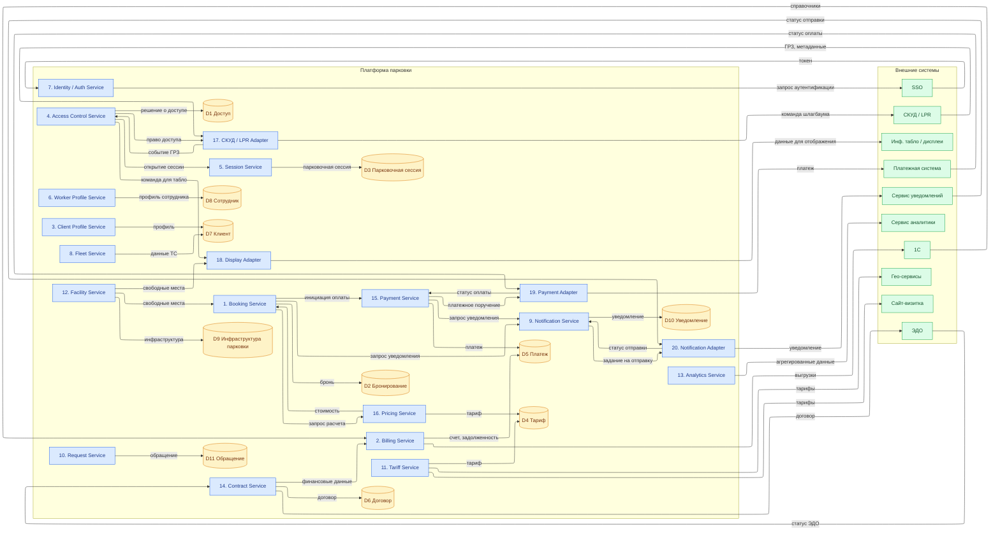

# DFD Level 1 — Декомпозиция платформы парковки

## Оглавление

- [Назначение](#назначение)
- [Контекст и источник](#контекст-и-источник)
- [Диаграмма](#диаграмма)
- [Текстовое описание](#текстовое-описание)
- [Ключевые элементы](#ключевые-элементы)
- [Логика основных сценариев](#логика-основных-сценариев)
- [Словарь потоков данных](#словарь-потоков-данных)
- [Трассировка и балансировка](#трассировка-и-балансировка)
- [Выводы и решения](#выводы-и-решения)
- [Связанные документы](#связанные-документы)

## Назначение

DFD Level 1 декомпозирует центральный процесс «Цифровая платформа парковки» (DFD L0) на 20 внутренних процессов, показывает 11 логических хранилищ данных и 10 внешних систем. Артефакт отвечает на вопрос «как именно данные движутся между процессами, хранилищами и внешними системами» и служит промежуточным слоем между контекстной диаграммой и C4 L3. Акторы (ФЛ, ЮЛ, охранник, управляющий, владелец) сознательно исключены — они показаны на DFD L0; на L1 фокус на серверной стороне.

## Контекст и источник

- Этап проекта: Этап 5. Интеграции
- Тип артефакта: DFD Level 1 (декомпозиция)
- Источники:
  - [C4 L3 — Component](../architecture/c4/c4-diagrams.md) — 20 процессов и 10 внешних систем (1:1)
  - [ERD нормализованная модель](../architecture/database/erd/erd-normalized-er-model.md) — 11 логических хранилищ по агрегатам
  - [Контекстная диаграмма (DFD L0)](context-diagram.md) — внешние потоки для балансировки (акторы остаются на L0)
- Статус: рабочая версия

## Диаграмма

## Текстовое описание

Диаграмма показывает, как данные движутся внутри платформы парковки между 20 компонентами Backend-приложения (C4 L3), 11 логическими хранилищами (агрегаты ERD) и 10 внешними системами. Акторы (ФЛ, ЮЛ, охранник КПП, управляющий, владелец) на L1 не показаны: их взаимодействие с системой зафиксировано на DFD L0 и в use case. На L1 пользовательские потоки (бронирование, регистрация, обращения, настройка тарифов) приходят в сервисы извне через API/UI без явной внешней сущности.

Три класса узлов различаются цветом: **синий** — внутренние процессы (сервисы и адаптеры Backend), **желтый** — логические хранилища данных (агрегаты PostgreSQL), **зеленый** — внешние системы. Все стрелки именованы существительными и представляют потоки данных; управляющие потоки не показаны.

Каждый процесс 1:1 соответствует компоненту C4 L3. Процессы 17–20 — адаптеры внешних систем; они изолируют детали протоколов СКУД, информационных табло, платежного провайдера и сервиса уведомлений.

## Ключевые элементы

### Процессы (20)

| ID  | Имя                        | Bounded context |
| --- | -------------------------- | --------------- |
| P1  | 1. Booking Service         | Booking         |
| P2  | 2. Billing Service         | Billing         |
| P3  | 3. Client Profile Service  | Identity        |
| P4  | 4. Access Control Service  | Access Control  |
| P5  | 5. Session Service         | Booking         |
| P6  | 6. Worker Profile Service  | Identity        |
| P7  | 7. Identity / Auth Service | Identity        |
| P8  | 8. Fleet Service           | Booking         |
| P9  | 9. Notification Service    | Notifications   |
| P10 | 10. Request Service        | Support         |
| P11 | 11. Tariff Service         | Billing         |
| P12 | 12. Facility Service       | Access Control  |
| P13 | 13. Analytics Service      | Analytics       |
| P14 | 14. Contract Service       | Contracts       |
| P15 | 15. Payment Service        | Billing         |
| P16 | 16. Pricing Service        | Billing         |
| P17 | 17. СКУД / LPR Adapter     | Access Control  |
| P18 | 18. Display Adapter        | Access Control  |
| P19 | 19. Payment Adapter        | Billing         |
| P20 | 20. Notification Adapter   | Notifications   |

### Хранилища (D1–D11)

| ID  | Имя                     | Ключевые ERD-таблицы                                             |
| --- | ----------------------- | ---------------------------------------------------------------- |
| D1  | Доступ                  | access_logs, access_points                                       |
| D2  | Бронирование            | bookings, booking_status_history                                 |
| D3  | Парковочная сессия      | parking_sessions                                                 |
| D4  | Тариф                   | tariffs, tariff_types, tariff_rates, zone_type_tariffs           |
| D5  | Платеж                  | payments, invoices, payment_methods, receipts, refunds, debts    |
| D6  | Договор                 | contracts, contract_templates, contract_status_history           |
| D7  | Клиент                  | clients, client_accounts, vehicles, vehicle_types, passport_data |
| D8  | Сотрудник               | employees, employee_roles, employee_accounts                     |
| D9  | Инфраструктура парковки | parkings, sectors, parking_places, parking_schedules             |
| D10 | Уведомление             | notifications, notification_templates, outbox_events             |
| D11 | Обращение               | appeals                                                          |

### Внешние системы (10)

| ID  | Имя                  |
| --- | -------------------- |
| E6  | SSO                  |
| E7  | Платежная система    |
| E8  | Сервис уведомлений   |
| E9  | Сервис аналитики     |
| E10 | СКУД / LPR           |
| E11 | Инф. табло / дисплеи |
| E12 | ЭДО                  |
| E13 | 1С                   |
| E14 | Гео-сервисы          |
| E15 | Сайт-визитка         |

> Нумерация E6–E15 сохранена для совместимости с C4 L3 и журналом трассировки. ID E1–E5 (акторы) свободны и не реиспользуются.

## Логика основных сценариев

### 1. Бронирование и оплата

P7 (Identity / Auth Service) делегирует аутентификацию в SSO (E6) и возвращает токен. P1 (Booking Service) принимает параметры брони, запрашивает расчет стоимости у P16 — тот читает тариф из D4 и возвращает сумму. P1 сохраняет бронь в D2 и инициирует оплату в P15. P15 передает платежное поручение через P19 в Платежную систему (E7), получает статус, сохраняет платеж в D5. P15 и P1 запрашивают уведомление у P9, тот передает задание P20, который отправляет SMS/push/email через E8.

### 2. Контроль доступа на КПП

СКУД/LPR (E10) передает ГРЗ и метаданные распознавания в P17. P17 вызывает P4, который сверяется с D1 (черный список, аудит) и принимает решение. P4 возвращает право доступа в P17, тот отправляет команду шлагбауму (E10). При положительном решении P4 инициирует открытие парковочной сессии в P5 (запись в D3). P4 также передает команду P18, который обновляет информационные табло (E11). Ручные решения охранника КПП поступают в P4 через UI рабочего места и на L1 не показаны как отдельный поток.

### 3. Договор и биллинг

P14 (Contract Service) формирует договор по входящим данным и шаблонам, сохраняет в D6 и отправляет документ в ЭДО (E12); статус документооборота возвращается обратно в P14. P14 передает финансовые данные в P2, который формирует счета и задолженности в D5. P2 выгружает данные в 1С (E13) и получает оттуда справочники.

### 4. Аналитика и отчетность

P13 (Analytics Service) агрегирует данные из хранилищ и публикует метрики в Сервис аналитики (E9). P11 (Tariff Service) публикует актуальные тарифы и данные о доступности в Гео-сервисы (E14) и на Сайт-визитку (E15).

## Словарь потоков данных

> Только потоки, где обе стороны находятся в границах L1 (внутренние процессы, хранилища или внешние системы). Пользовательские потоки от акторов (бронирование, профиль, обращения, настройки тарифов) приходят в сервисы извне и описаны на DFD L0.

| ID  | Поток                 | Источник | Приемник | Хранилища | ERD-таблицы                              | Описание                                                      |
| --- | --------------------- | -------- | -------- | --------- | ---------------------------------------- | ------------------------------------------------------------- |
| F02 | запрос аутентификации | P7       | E6       | —         | —                                        | P7 делегирует аутентификацию пользователя в SSO-провайдер     |
| F03 | токен                 | E6       | P7       | —         | —                                        | Результат аутентификации: subject_id, атрибуты пользователя   |
| F05 | профиль               | P3       | D7       | D7        | clients, client_accounts                 | Запись и обновление профиля в хранилище                       |
| F07 | данные ТС             | P8       | D7       | D7        | vehicles, vehicle_types                  | Запись ТС и ГРЗ в хранилище клиентов                          |
| F09 | запрос расчета        | P1       | P16      | D4        | tariffs, tariff_rates                    | P1 запрашивает стоимость у P16 перед фиксацией брони          |
| F10 | стоимость             | P16      | P1       | —         | —                                        | Рассчитанная стоимость с учетом тарифа и льгот                |
| F11 | бронь                 | P1       | D2       | D2        | bookings, booking_status_history         | Сохранение подтвержденной брони                               |
| F12 | инициация оплаты      | P1       | P15      | D5        | payments, invoices                       | Передача задания на оплату после подтверждения брони          |
| F13 | платежное поручение   | P15      | P19      | —         | —                                        | P15 передает сумму и параметры платежа адаптеру               |
| F14 | платеж                | P19      | E7       | —         | —                                        | Отправка платежного запроса в Платежную систему               |
| F15 | статус оплаты         | E7       | P19      | D5        | payments, receipts                       | Подтверждение, отказ или статус возврата от Платежной системы |
| F16 | платеж                | P15      | D5       | D5        | payments, receipts, invoices             | Запись результата оплаты и квитанции                          |
| F17 | запрос уведомления    | P15, P1  | P9       | D10       | notifications                            | Запрос отправки уведомления клиенту об оплате или брони       |
| F18 | задание на отправку   | P9       | P20      | D10       | outbox_events                            | Задание с каналом, адресатом и текстом уведомления            |
| F19 | уведомление           | P20      | E8       | —         | —                                        | Отправка SMS, push или email через провайдера                 |
| F20 | ГРЗ, метаданные       | E10      | P17      | —         | —                                        | Событие распознавания: ГРЗ, вероятность, полоса, КПП          |
| F21 | событие ГРЗ           | P17      | P4       | D1        | access_logs                              | Нормализованное событие для оценки права доступа              |
| F22 | решение о доступе     | P4       | D1       | D1        | access_logs, access_points               | Аудит решения о допуске (разрешен / запрещен)                 |
| F23 | право доступа         | P4       | P17      | —         | —                                        | Решение для передачи шлагбауму через адаптер                  |
| F24 | открытие сессии       | P4       | P5       | D3        | parking_sessions                         | Инициация записи парковочной сессии при въезде                |
| F26 | договор               | P14      | D6       | D6        | contracts, contract_status_history       | Сохранение договора и истории статусов                        |
| F27 | договор               | P14      | E12      | —         | —                                        | Передача подписанного договора в ЭДО                          |
| F29 | тариф                 | P11      | D4       | D4        | tariffs, tariff_rates, zone_type_tariffs | Запись тарифа по зонам и типам ТС                             |
| F30 | агрегированные данные | P13      | E9       | —         | —                                        | Метрики загрузки, выручки, договоров для BI                   |

## Трассировка и балансировка

### A. Процесс → C4 L3 компонент (1:1, 20 строк)

| Процесс DFD L1              | C4 L3 компонент         |
| --------------------------- | ----------------------- |
| P1. Booking Service         | Booking Service         |
| P2. Billing Service         | Billing Service         |
| P3. Client Profile Service  | Client Profile Service  |
| P4. Access Control Service  | Access Control Service  |
| P5. Session Service         | Session Service         |
| P6. Worker Profile Service  | Worker Profile Service  |
| P7. Identity / Auth Service | Identity / Auth Service |
| P8. Fleet Service           | Fleet Service           |
| P9. Notification Service    | Notification Service    |
| P10. Request Service        | Request Service         |
| P11. Tariff Service         | Tariff Service          |
| P12. Facility Service       | Facility Service        |
| P13. Analytics Service      | Analytics Service       |
| P14. Contract Service       | Contract Service        |
| P15. Payment Service        | Payment Service         |
| P16. Pricing Service        | Pricing Service         |
| P17. СКУД / LPR Adapter     | СКУД / LPR Adapter      |
| P18. Display Adapter        | Display Adapter         |
| P19. Payment Adapter        | Payment Adapter         |
| P20. Notification Adapter   | Notification Adapter    |

### B. Хранилище D1–D11 → ERD-таблицы

| Хранилище                  | ERD-таблицы                                                                                                                                                                                 |
| -------------------------- | ------------------------------------------------------------------------------------------------------------------------------------------------------------------------------------------- |
| D1 Доступ                  | access_logs, access_points                                                                                                                                                                  |
| D2 Бронирование            | bookings, booking_status_history                                                                                                                                                            |
| D3 Парковочная сессия      | parking_sessions                                                                                                                                                                            |
| D4 Тариф                   | tariffs, tariff_types, tariff_rates, zone_type_tariffs                                                                                                                                      |
| D5 Платеж                  | payments, invoices, payment_methods, receipts, refunds, debts                                                                                                                               |
| D6 Договор                 | contracts, contract_templates, contract_status_history, agreement_types, agreements                                                                                                         |
| D7 Клиент                  | clients, client_accounts, vehicles, vehicle_types, organizations, organization_bank_accounts, passport_data, benefit_documents, benefit_categories, notification_settings, payment_settings |
| D8 Сотрудник               | employees, employee_roles, employee_accounts                                                                                                                                                |
| D9 Инфраструктура парковки | parkings, parking_types, parking_schedules, sectors, zone_types, zone_type_vehicle_types, parking_places, operational_statuses                                                              |
| D10 Уведомление            | notifications, notification_templates, outbox_events                                                                                                                                        |
| D11 Обращение              | appeals                                                                                                                                                                                     |

### C. Балансировка с L0: delta-таблица

| Поток L0 (внешняя сущность)         | Представлен на L1 как                              | Комментарий                                                                                                                                                                |
| ----------------------------------- | -------------------------------------------------- | -------------------------------------------------------------------------------------------------------------------------------------------------------------------------- |
| **ФЛ ↔ System**                     | Принимающие процессы: P7, P3, P8, P1, P15, P9, P10 | Акторы исключены из L1 (см. ниже); пользовательские потоки приходят в эти сервисы через UI/API                                                                             |
| **ЮЛ ↔ System**                     | Принимающие процессы: P7, P3, P8, P1, P14, P10     | То же; договорные потоки идут в P14, остальные совпадают с ФЛ                                                                                                              |
| **Охранник КПП ↔ System**           | P4 (ручные решения), P6 (профиль сотрудника)       | Поступают через рабочее место охранника; на L1 не показаны как внешний поток                                                                                               |
| **Управляющий ↔ System**            | P11 (тарифы), P12 (секторы), P14, P13              | Управление идет через админ-панель; на L1 не показаны как внешний поток                                                                                                    |
| **Владелец ↔ System**               | P13 (аналитика)                                    | Запросы отчетности через админ-панель; на L1 не показаны                                                                                                                   |
| Платежная система ↔ System          | F14–F15 (P19)                                      | Покрыт через Payment Adapter                                                                                                                                               |
| **Платежный терминал ↔ System**     | —                                                  | **Расхождение**: на L0 — отдельная сущность; на L1 объединен с E7 Платежная система (через Payment Adapter)                                                                |
| **ОФД ↔ System**                    | —                                                  | **Расхождение**: ОФД удален из L1; фискализацию чеков берет ЮKassa (Платежная система / P19)                                                                               |
| Сервис уведомлений ↔ System         | F18–F19 (P20)                                      | Покрыт через Notification Adapter                                                                                                                                          |
| SSO ↔ System                        | F02–F03 (P7)                                       | Покрыт                                                                                                                                                                     |
| СКУД / LPR ↔ System                 | F20–F23 (P17, P4)                                  | Покрыт                                                                                                                                                                     |
| Инф. табло / дисплеи ← System       | P18→E11                                            | Покрыт; на L0 было 3 сущности (табло КПП, дисплей въезда, дисплей выезда) — на L1 объединены в E11                                                                         |
| ЭДО ↔ System                        | F27 (P14), E12→P14                                 | Покрыт                                                                                                                                                                     |
| 1С ↔ System                         | P2→E13, E13→P2                                     | Покрыт                                                                                                                                                                     |
| Сервис аналитики ← System           | F30 (P13)                                          | Покрыт                                                                                                                                                                     |
| Гео-сервисы / Сайт-визитка ← System | P11→E14, P11→E15                                   | Покрыт                                                                                                                                                                     |
| **DADATA ↔ System**                 | —                                                  | **Расхождение**: упомянута в L0 (секция 18, ADR-004); на L1 не выделена как внешняя сущность — функция автозаполнения реквизитов скрыта внутри P3 (Client Profile Service) |

**Решение по акторам:** ФЛ, ЮЛ, охранник КПП, управляющий, владелец сознательно исключены из DFD L1. Обоснование: они показаны на DFD L0 (контекстная диаграмма) и в реестре use case; добавление их на L1 удваивает информацию и перегружает диаграмму при отсутствии явного UI/Gateway-процесса. Если потребуется отдельная диаграмма серверной стороны с явным API Gateway — будет введена на L2.

**Новые потоки L1, отсутствующие на L0 (межпроцессные):**

На L0 платформа показана как черный ящик. Следующие потоки появляются впервые на L1 как внутренние:

| Новый поток L1                  | Пояснение                                                     |
| ------------------------------- | ------------------------------------------------------------- |
| P1 → P16 (запрос расчета)       | Декомпозиция: расчет стоимости выделен в отдельный процесс    |
| P4 → P5 (открытие сессии)       | Декомпозиция: контроль доступа и управление сессией разделены |
| P15 → P19 (платежное поручение) | Декомпозиция: оплата и адаптер провайдера разделены           |
| P9 → P20 (задание на отправку)  | Декомпозиция: формирование уведомления и доставка разделены   |
| P14 → P2 (финансовые данные)    | Декомпозиция: договоры передают данные в биллинг              |

## Выводы и решения

- Все 20 компонентов C4 L3 получили 1:1 отображение в процессы DFD L1; нумерация сквозная (1–20).
- 11 логических хранилищ отражают агрегаты ERD; одно физическое PostgreSQL не обедняет DFD-семантику.
- Адаптеры (P17–P20) изолируют детали внешних протоколов: доменные сервисы общаются с ними на языке предметной области.
- Акторы (ФЛ, ЮЛ, охранник, управляющий, владелец) исключены из L1: они показаны на DFD L0 и в use case, повторное отображение перегружает диаграмму. Решение зафиксировано в balansировочной таблице.
- ОФД удален из L1: фискализацию берет Платежная система (ЮKassa). Расхождение с L0 зафиксировано в delta-таблице.
- DADATA не выделена как внешняя сущность: интегрирована внутри P3. Если интеграция потребует отдельного мониторинга — вынести в L2.
- L0 не правился; все расхождения зафиксированы в разделе «Балансировка с L0».

## Ограничения и открытые вопросы

- Диаграмма не раскрывает форматы данных, SLA и транспортные протоколы (REST, WebSocket, очередь) — это уровень L2 и integration-диаграмм.
- Layout при большом числе узлов может потребовать ручной корректировки через subgraph по bounded contexts (см. план).

## Связанные документы

- [Контекстная диаграмма (DFD L0)](context-diagram.md) — верхний уровень, с которым балансируется L1.
- [C4-диаграммы платформы парковки (L1/L2/L3)](../architecture/c4/c4-diagrams.md) — источник 20 процессов (C4 L3) и 15 внешних сущностей.
- [ERD нормализованная модель](../architecture/database/erd/erd-normalized-er-model.md) — источник 11 логических хранилищ.
- [Реестр use case](use-case/use-case-registry.md) — пользовательские сценарии, которые реализуют показанные потоки.
- [Sequence Diagram UC-10.2 (онлайн-оплата)](../architecture/integration/sequence-uc-10-2-pay-online-short-term-rental.md) — детализация сценария оплаты F12–F16.
