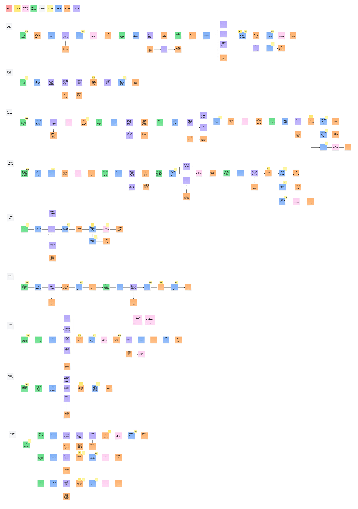

# ES TO-BE BP: Управление профилем клиента и списком ТС

## Оглавление

- [Назначение](#назначение)
- [Контекст и источник](#контекст-и-источник)
- [Диаграмма](#диаграмма)
- [Текстовое описание](#текстовое-описание)
- [Ключевые элементы](#ключевые-элементы)
- [Логика артефакта](#логика-артефакта)
- [Выводы и решения](#выводы-и-решения)
- [Ограничения и открытые вопросы](#ограничения-и-открытые-вопросы)
- [Связанные документы](#связанные-документы)

## Назначение

Артефакт описывает TO-BE подпроцессы управления клиентским профилем, контактными данными и списком транспортных средств, которые используются как основа для цифровой идентификации и допуска.

## Контекст и источник

- Этап проекта: Этап 2. Концептуальное проектирование и детализация TO-BE
- Тип артефакта: Event Storming подпроцесса
- Источник: импортированная актуальная TO-BE диаграмма, User Story Map, проектная проработка ЛК
- Статус: рабочая каноничная текстовая версия по актуальной диаграмме

## Диаграмма

## Текстовое описание

Диаграмма объединяет несколько клиентских сценариев самообслуживания: редактирование профиля, управление каналами связи и работу со списком автомобилей. В каждой из веток процесс начинается с действия пользователя в личном кабинете, проходит через валидацию данных системой и заканчивается сохранением нового состояния профиля или карточки ТС. Для контактных данных показаны дополнительные шаги подтверждения, а для списка автомобилей предусмотрены операции добавления, изменения и удаления.

Смысл этого подпроцесса в том, что он подготавливает достоверные данные для всех остальных сценариев TO-BE. Привязанный к профилю автомобиль с корректным ГРЗ становится ключом для автоматической идентификации на КПП. Актуальные телефон и e-mail нужны для регистрации, уведомлений, подтверждения подписи договора и сопровождения оплаты. Для представителей ЮЛ диаграмма также важна как основа для самостоятельного администрирования списка ТС без постоянного участия управляющего.

## Ключевые элементы

- Профиль клиента и контактные данные
- Подтверждение изменений телефона или e-mail
- Карточка транспортного средства и ГРЗ
- Добавление, изменение и удаление ТС
- Валидация пользовательских данных
- Подготовка данных для сценариев доступа, договора и уведомлений

## Логика артефакта

В TO-BE профиль и список ТС перестают быть вспомогательной справочной информацией и становятся критическим операционным контуром. Именно здесь формируется связка `клиент -> ТС -> ГРЗ`, от которой зависит автоматическая идентификация на въезде и выезде. Поэтому диаграмма не просто описывает CRUD-операции в ЛК, а показывает источник данных для контуров доступа, договора, уведомлений и аналитики.

Эта логика напрямую поддерживает целевую ситуацию из Project Charter: уменьшить ручную работу охраны и дать клиентам самообслуживание. Без самостоятельного редактирования ТС и контактов клиентский путь снова зависел бы от управляющего или КПП. Поэтому подпроцесс профиля следует рассматривать как один из базовых enablement-процессов для всего TO-BE решения.

## Выводы и решения

- Управление профилем и списком ТС должно входить в MVP как часть самообслуживания клиентов.
- ГРЗ из карточки ТС является одним из ключевых идентификаторов для сценариев доступа.
- Изменения контактов и автомобилей должны проходить системную валидацию и, при необходимости, подтверждение.
- Самообслуживание по списку ТС особенно важно для ЮЛ и снижает нагрузку на управляющего.

## Ограничения и открытые вопросы

- На текущем изображении ветки подтверждения и некоторые исключения читаются как рабочая проработка и могут потребовать дополнительной формализации.
- Нужно отдельно определить политику истории изменений по ТС и ограничения на удаление машины, если с ней связаны активные договоры, бронирования или сессии.
- Права делегирования и управление несколькими представителями ЮЛ стоит вынести в отдельную детализацию.

## Связанные документы

- [ES TO-BE SD: Предоставление парковочного места и проверка права доступа](es-tobe-sd-access-and-parking-flow.md) — показывает, как клиентский профиль влияет на сценарии доступа.
- [Карточка проекта](../project-charter.md) — задает рамки и цели, для которых проектируется клиентский контур.
- [User Story Map](../user-story-map.md) — связывает управление профилем и ТС с пользовательскими историями.
- [Контекстная диаграмма](../context-diagram.md) — задает место клиентского профиля в границах системы.
- [NFR UI Quality](../../specs/nonfunctional-requirements/nfr-ui-quality.md) — фиксирует требования к качеству интерфейсов клиентского контура.
