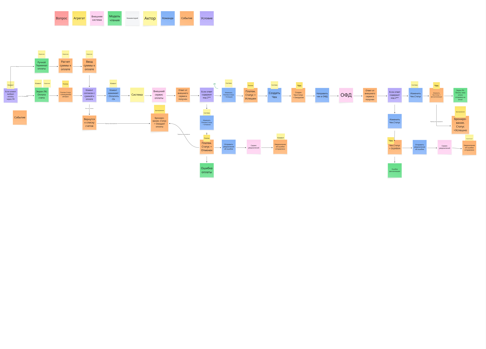

# ES TO-BE BP: Оплата

## Оглавление

- [Назначение](#назначение)
- [Контекст и источник](#контекст-и-источник)
- [Диаграмма](#диаграмма)
- [Текстовое описание](#текстовое-описание)
- [Ключевые элементы](#ключевые-элементы)
- [Логика артефакта](#логика-артефакта)
- [Выводы и решения](#выводы-и-решения)
- [Ограничения и открытые вопросы](#ограничения-и-открытые-вопросы)
- [Связанные документы](#связанные-документы)

## Назначение

Артефакт фиксирует TO-BE подпроцесс оплаты парковки: от запроса суммы к оплате до подтверждения статуса платежа, фискализации и обновления связанных сущностей.

## Контекст и источник

- Этап проекта: Этап 2. Концептуальное проектирование и детализация TO-BE
- Тип артефакта: Event Storming подпроцесса
- Источник: импортированная актуальная TO-BE диаграмма, интервью №6, FR по платежам
- Статус: рабочая каноничная текстовая версия по актуальной диаграмме

## Диаграмма

## Текстовое описание

Диаграмма отражает сценарий, в котором клиент или сотрудник инициирует оплату по парковочной сессии или бронированию, система рассчитывает сумму, создает платеж и переводит его в промежуточный статус ожидания внешнего подтверждения. Дальше платеж проходит через внешний сервис эквайринга, после чего система получает итог операции и синхронизирует внутренний статус платежа.

При успешной оплате формируется чек, данные отправляются в ОФД, а связанные бизнес-объекты обновляются: задолженность по сессии или бронированию закрывается, статус платежа становится успешным, а сценарий допуска или завершения выезда может продолжиться без ручного вмешательства. На диаграмме также выделена ветка отказа или отмены: платеж помечается как неуспешный или отмененный, клиенту показывается ошибка, а процесс возвращается к повторной попытке оплаты.

## Ключевые элементы

- Клиент, система, внешний сервис оплаты, ОФД
- Расчет суммы и создание платежа
- Промежуточные статусы ожидания подтверждения
- Успешный, неуспешный и отмененный платеж
- Формирование чека и фискализация
- Синхронизация статуса задолженности по сессии или бронированию

## Логика артефакта

Подпроцесс построен вокруг двух обязательных переходов: финансового и учетного. Финансовый переход проходит через внешнего провайдера и подтверждает сам факт списания. Учетный переход происходит внутри платформы и переводит бизнес-сущности в новое состояние: долг погашен, оплата зафиксирована, дальнейшие проверки права доступа или выезда могут завершиться успешно. Благодаря этому оплата в TO-BE не является изолированным модулем, а непосредственно влияет на доступ, статусы клиента и возможность выезда.

Диаграмма хорошо согласуется с концепцией постоплаты, принятой на интервью №6. Система должна уметь поддерживать оплату до выезда и в точке выезда, не ломая общую модель сессии. Для этого статусы платежа, чека и задолженности должны быть формализованы отдельно и синхронизироваться через события, а не через неявные ручные договоренности сотрудников.

## Выводы и решения

- Платеж проходит через внешний провайдер, но доменное решение о закрытии долга остается внутри платформы.
- Успешная оплата должна автоматически разблокировать следующий шаг бизнес-процесса, например выезд.
- Фискализация и чек являются обязательной частью целевого сценария, а не послепроцессом "вручную потом".
- Ошибки и отмены должны быть выделены отдельными статусами и поддерживать повторную попытку оплаты.

## Ограничения и открытые вопросы

- На текущем изображении не детализированы возвраты, частичные оплаты, идемпотентность и таймауты ответа провайдера.
- Нужно отдельно зафиксировать разницу между онлайн-оплатой, оплатой через терминал и оплатой через сотрудника КПП.
- Формат взаимодействия с ОФД и жизненный цикл чека потребуют дополнительной интеграционной спецификации.

## Связанные документы

- [es-tobe-sd-access-and-parking-flow.md](es-tobe-sd-access-and-parking-flow.md)
- [../algorithms/drakon-parking-payment.md](../algorithms/drakon-parking-payment.md)
- [../use-case/use-case-registry.md](../use-case/use-case-registry.md)
- [../../specs/functional-requirements/fr-payment.md](../../specs/functional-requirements/fr-payment.md)
- [../../interviews/protocols/interview-protocol-6-2026-02-25-v01.md](../../interviews/protocols/interview-protocol-6-2026-02-25-v01.md)
