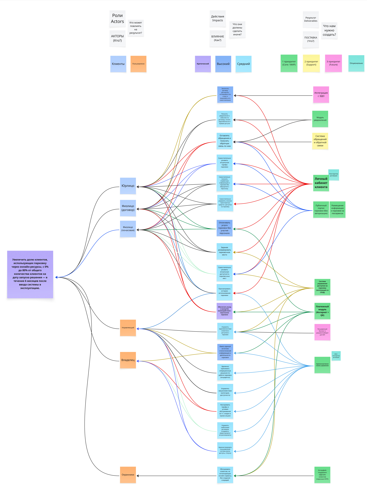

# Impact Map — автоматизация парковки

## Оглавление

- [Назначение](#назначение)
- [Контекст и источник](#контекст-и-источник)
- [Диаграмма](#диаграмма)
- [Текстовое описание](#текстовое-описание)
- [Ключевые элементы](#ключевые-элементы)
- [Логика артефакта](#логика-артефакта)
- [Детализация содержания](#детализация-содержания)
- [Выводы и решения](#выводы-и-решения)
- [Ограничения и открытые вопросы](#ограничения-и-открытые-вопросы)
- [Связанные документы](#связанные-документы)

## Назначение

Impact Map фиксирует цель проекта, участников, ожидаемое поведение и продуктовые поставки, которые должны привести к измеримому бизнес-результату.

## Контекст и источник

- Этап проекта: Этап 2. Концептуальное проектирование IT-решений
- Тип артефакта: Impact Map
- Источник: workshop команды, диаграмма в Miro, протокол №3
- Статус: согласованная рабочая версия

## Диаграмма

## Текстовое описание

Артефакт строится от целевого бизнес-результата к ролям, влияниям и поставкам. В центре внимания находится цель перевести основную долю клиентов в онлайн-контур обслуживания. От нее декомпозированы группы актеров, изменения в их поведении и конкретные решения, которые команда должна реализовать: личный кабинет, платежный модуль, СКУД-интеграцию, административный контур, уведомления и сопутствующие сервисы.

## Ключевые элементы

- Цель проекта с измеримым бизнес-показателем
- Актеры: клиенты, пользователи, владелец, управляющий, охранники
- Влияния: самообслуживание, автоматизация доступа, снижение зависимости от персонала
- Поставки: клиентский, административный, платежный и интеграционный контуры
- Приоритеты поставок относительно MVP и следующих релизов

## Логика артефакта

Impact Map связывает ответ на вопрос "зачем" с ответами "кто", "как" и "что". Сначала фиксируется бизнес-цель, затем определяются участники, способные на нее повлиять, после чего описываются нужные изменения в их действиях. Только после этого перечисляются продуктовые поставки, которые должны обеспечить такие изменения. Это помогает удерживать связь между функциональностью и бизнес-ценностью.

## Детализация содержания

## 1. Цель (Goal)

**Увеличить долю клиентов, использующих парковку через онлайн-ресурсы, с 0% до 80%** от общего количества клиентов на дату запуска решения — в течение **6 месяцев** после ввода системы в эксплуатацию.

---

## 2. Роли / Акторы (Actors)

**Вопрос на диаграмме:** «Кто может повлиять на результат?»  
**Подпись:** Роли · Actors · **АКТОРЫ (Кто?)**

| Актор                   | Описание                                                        |
| ----------------------- | --------------------------------------------------------------- |
| **Клиенты**             | Общая категория (на диаграмме — светло-голубая карточка)        |
| **Пользователи**        | Пользователи системы (на диаграмме — светло-оранжевая карточка) |
| **Юрлицо**              | Корпоративные клиенты (светло-голубой блок)                     |
| **Физлицо (договор)**   | Физлица с долгосрочным договором (светло-голубой блок)          |
| **Физлицо (почасовая)** | Почасовые клиенты (светло-голубой блок)                         |
| **Управляющий**         | Операционное управление парковкой (оранжевый блок)              |
| **Владелец**            | Владелец парковки (оранжевый блок)                              |
| **Охранники**           | Персонал КПП (оранжевый блок)                                   |

---

## 3. Действия / Влияние (Impacts)

**Вопрос на диаграмме:** «Что они должны сделать иначе?»  
**Подпись:** Действия · Impacts · **ВЛИЯНИЕ (Как?)**

Приоритеты на диаграмме: **Критический** (фиолетовый) | **Высокий** (синий) | **Средний** (светло-синий).

### Действия клиентов и пользователей

- Заключать договор, расторгать, отслеживать его статус и продлевать его **самостоятельно**.
- Получать **уведомления** о событиях по договору, оплате, задолженности и правам доступа.
- Оставлять **обращения** и получать обратную связь по ним.
- **Самостоятельно** узнавать актуальные тарифы парковки.
- **Самостоятельно** получать справочную информацию о парковке без обращения к персоналу.
- **Самостоятельно** управлять списком транспортных средств с доступом на парковку.
- Оплачивать услуги парковки **без участия персонала**.
- **Заранее** бронировать/оплачивать.
- Резервировать парковочное место.
- Самостоятельно узнавать актуальную **доступность парковочных мест**.
- Просматривать **историю использования** парковки.

### Ключевой приоритет (на диаграмме выделен отдельно)

- **Обеспечить въезд и выезд без взаимодействия с персоналом парковки.**

### Действия управляющего / владельца

- Управлять **задолженностями** клиентов и **доступом** к парковке.
- Иметь **единый источник** статистической информации о деятельности парковки.
- Удалённо принимать операционные [решения] _(на диаграмме текст обрезан: «Удаленно принимать операционные»)_.

### Охранники

- Обслуживать клиентов, **не использующих онлайн-сервисы**, без создания очередей.

---

## 4. Результат / Поставка (Deliverables)

**Вопрос на диаграмме:** «Что нам нужно создать?»  
**Подпись:** Результат · Deliverables · **ПОСТАВКА (Что?)**

Приоритеты на диаграмме: **1 приоритет (Core / MVP)** (зелёный) | **2 приоритет (Support)** (жёлтый) | **3 приоритет (Future)** (розовый) | **Опционально** (светло-синий).

### Для клиентов (авторизация и самообслуживание)

- **Личный кабинет клиента**
- **Конструктор договоров**
- **Публичный портал парковки (без авторизации)**
- **Размещение информации о парковке на геосервисах**
- **Модуль уведомлений** — 1 приоритет (Core / MVP)
- **Система обращений и обратной связи**

### Оплата и доступ

- **Платежный модуль (Интернет + QR)**
- **Система управления доступом на парковку (интеграция со СКУД)**

### Для управляющего и владельца

- **Административная панель управления**
- **CRM + конструктор договоров**
- **Управлять машиноместами** (категория, доступность)
- **Настраивать тарифы и условия обслуживания** (в т.ч. скидки и промо-акции)
- **Управлять шаблонами договоров** (создавать / редактировать / актуализировать)
- **Администрировать пользователей системы** (роли, доступы, статусы)
- **Решения по работе парковки (инциденты)**

### Для офлайн-клиентов и персонала

- **Интерфейс поддержки офлайн-клиентов (персонал КПП)**

### Интеграции и расширенный функционал

- **Расширенный биллинг и документооборот для ЮЛ** (на диаграмме — отдельная карточка, розовый)
- **Интеграция с ЭДО** — 3 приоритет (Future)

---

## Сводка по приоритетам (с диаграммы)

| Уровень                      | Цвет на диаграмме | Примеры с карточек |
| ---------------------------- | ----------------- | ------------------ |
| **1 приоритет (Core / MVP)** | Зелёный           | Модуль уведомлений |
| **2 приоритет (Support)**    | Жёлтый            | —                  |
| **3 приоритет (Future)**     | Розовый           | Интеграция с ЭДО   |
| **Опционально**              | Светло-синий      | —                  |

_Остальные поставки (личный кабинет, СКУД, платежи, админ-панель, CRM и т.д.) соединены линиями с акторами и влияниями; привязка к 1/2/3 приоритету на тайлах явно указана только для модуля уведомлений и ЭДО._

---

_Источник: полное чтение 16 тайлов Impact Map (impact_map_tiles/). Протокол №3 (04.02.2026) — согласованная версия формулировок._

## Выводы и решения

- Главный вектор проекта связан не с одной функцией, а с переводом клиентского опыта в онлайн-самообслуживание.
- Наивысший эффект дают автоматизация доступа, цифровые договоры, онлайн-оплата и уведомления.
- Артефакт задает рамку приоритизации для User Story Map, use case и проектной карточки.

## Ограничения и открытые вопросы

- Диаграмма показывает стратегическую декомпозицию, но не заменяет детальные требования и проектные сценарии.
- Часть поставок зафиксирована на высоком уровне и требует дальнейшей детализации в архитектуре, UX и интеграциях.

## Связанные документы

- [Opportunity Canvas](opportunity-canvas.md) — задает проблемную ситуацию и ценность, из которой вырастает карта влияния.
- [User Story Map](user-story-map.md) — показывает, как влияния переходят в пользовательские сценарии и MVP.
- [Карточка проекта](project-charter.md) — фиксирует цель и рамки проекта, которые декомпозируются на Impact Map.
- [История развития проекта](../process/project-journey.md) — помещает Impact Map в последовательность проектных этапов.
