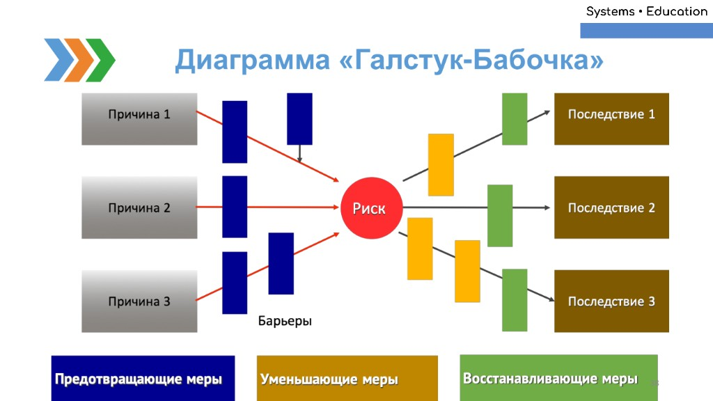
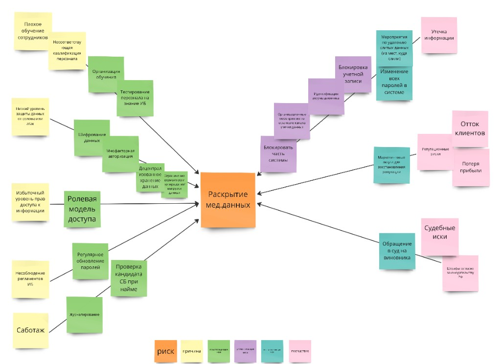
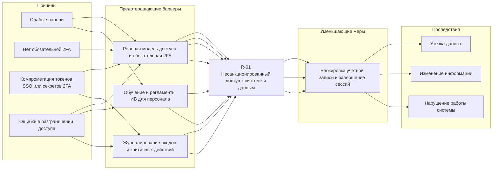
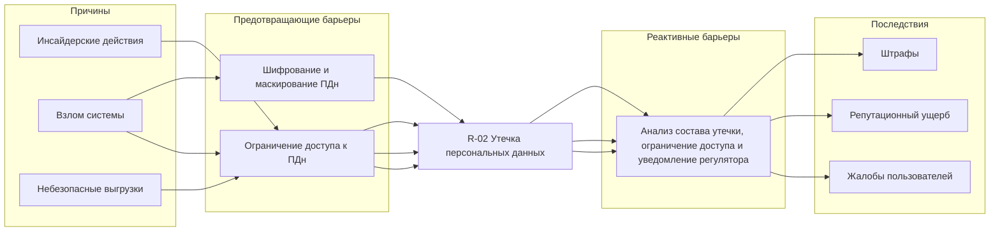

# Примеры диаграммы "Галстук-бабочка" (Bow-Tie)

Эта страница подготовлена по приложенным изображениям и служит **примером формы** для наших Bow-Tie диаграмм по рискам из ИБ-артефакта (`docs/artifacts/infosec/infosec-analyze-parking.md`).

## Шаблон (общая логика)

### Расшифровка элементов шаблона

- **Слева (Причины)**: источники угроз и уязвимости, которые могут привести к реализации риска.
- **Барьеры (слева от центра)**: предотвращающие меры (preventive barriers), снижают вероятность наступления центрального события.
- **Центр (Риск / Top Event)**: центральное событие, которое описывает "что именно пошло не так" (одна фраза, максимально конкретно).
- **Барьеры (справа от центра)**:
  - уменьшающие меры (mitigative barriers), снижают тяжесть последствий;
  - восстанавливающие меры (recovery barriers), ускоряют восстановление и возврат в нормальный режим.
- **Справа (Последствия)**: последствия для бизнеса/ИБ (конфиденциальность, целостность, доступность, финансы, репутация и т.п.).

Рекомендуемый порядок работы:

1. Выбрать риск (`R-xx`) и сформулировать **центральное событие** (Top Event).
2. Слева перечислить 3–7 причин (угроза + уязвимость), которые реально актуальны для проекта.
3. Для каждой причины указать 1–3 предотвращающих барьера (контрмеры).
4. Справа перечислить последствия (3–7 пунктов).
5. Для каждого последствия указать уменьшающие/восстанавливающие барьеры.

## Пример (раскрытие медданных)

> В изображении показан пример на другой предметной области ("раскрытие мед.данных"). Мы используем его только как пример структуры: причины → барьеры → риск → барьеры → последствия.

### Транскрипция основных узлов (как прочитано с изображения)

#### Центральное событие (риск)

- **Раскрытие мед.данных**

#### Причины (слева)

- **Плохое обучение сотрудников**
- **Несоответствие квалификации персонала**
- **Избыточный уровень доступа к информации**
- **Несоблюдение регламентов ИБ**
- **Саботаж**

#### Предотвращающие меры (слева, зеленые стикеры)

- **Организация обучения**
- **Тестирование персонала на знание ИБ**
- **Шифрование данных**
- **Многофакторная авторизация**
- **Ролевая модель доступа**
- **Регулярное обновление паролей**
- **Проверка кандидата СБ при найме**
- **Журналирование**

#### Реакция/восстановление и уменьшающие меры (справа, фиолетовые/бирюзовые стикеры)

- **Блокировка учетной записи**
- **Изменение всех паролей в системе**
- **Мероприятия по устранению уязвимостей (из мат. куда?)** (формулировка на изображении частично неразборчива)
- **Маркетинговые меры по восстановлению репутации**
- **Обращение в суд на виновника**

#### Последствия (справа, розовые стикеры)

- **Утечка информации**
- **Регуляторные риски**
- **Отток клиентов**
- **Потеря прибыли**
- **Судебные иски**
- **Штрафы по закону об обработке ПД** (формулировка на изображении частично неразборчива)

## Как использовать это как пример для парковки

Для наших рисков (например, `R-02 Утечка персональных данных`, `R-07 Потеря доступности системы`, `R-08 Компрометация системы через загрузку файлов`) аналогично:

- центр: одно центральное событие;
- слева: источники угроз + уязвимости из `infosec-analyze-parking.md`;
- справа: последствия из реестра рисков;
- барьеры: контрмеры из раздела "Контрмеры по рискам".

## Bow-Tie для парковки: R-01 "Несанкционированный доступ к системе и данным"

Ниже приведен пример Bow-Tie для риска **R-01** с формулировками, которые соответствуют `docs/artifacts/infosec/infosec-analyze-parking.md`.

### Текстовая диаграмма

**Центральное событие (риск)**:

- **R-01 Несанкционированный доступ к системе и данным**

**Причины (слева)**:

- **Слабые пароли**
- **Нет обязательной 2FA**
- **Компрометация токенов SSO или секретов 2FA**
- **Ошибки в разграничении доступа**

**Предотвращающие барьеры (слева от центра)**:

- **Ролевая модель доступа и обязательная 2FA**
  - Настроить права по ролям.
  - Включить 2FA по TOTP для сотрудников.
  - Защитить хранение секретов аутентификации.
- **Обучение и регламенты ИБ для персонала**
  - Провести вводный инструктаж по учетным записям и работе с ПДн.
  - Ежегодно обновлять краткий регламент.
- **Журналирование входов и критичных действий**
  - Логировать входы.
  - Логировать изменение ролей.
  - Логировать ручное открытие шлагбаума и критичные операции.

**Группировка по веткам слева (причина → предотвращающая мера)**:

- **Слабые пароли**
  - Ролевая модель доступа и обязательная 2FA.
  - Обучение и регламенты ИБ для персонала.
- **Нет обязательной 2FA**
  - Ролевая модель доступа и обязательная 2FA.
- **Компрометация токенов SSO или секретов 2FA**
  - Ролевая модель доступа и обязательная 2FA.
  - Журналирование входов и критичных действий.
- **Ошибки в разграничении доступа**
  - Ролевая модель доступа и обязательная 2FA.
  - Обучение и регламенты ИБ для персонала.
  - Журналирование входов и критичных действий.

**Последствия (справа)**:

- Утечка данных.
- Изменение информации.
- Нарушение работы системы.

**Уменьшающие меры (справа от центра)**:

- **Блокировка учетной записи и завершение сессий**
  - Блокировать подозрительную учетную запись.
  - Завершать активные сессии.

**Группировка по веткам справа (последствие → уменьшающая мера)**:

- **Утечка данных**
  - Уменьшающая мера: блокировка учетной записи и завершение сессий.
- **Изменение информации**
  - Уменьшающая мера: блокировка учетной записи и завершение сессий.
- **Нарушение работы системы**
  - Уменьшающая мера: блокировка учетной записи и завершение сессий.

### Mermaid

## Bow-Tie для парковки: R-02 "Утечка персональных данных"

Ниже приведен пример Bow-Tie для риска **R-02** с формулировками, которые соответствуют `docs/artifacts/infosec/infosec-analyze-parking.md`.

### Текстовая диаграмма

**Центральное событие (риск)**:

- **R-02 Утечка персональных данных**

**Причины (слева)**:

- **Взлом системы**
- **Инсайдерские действия**
- **Небезопасные выгрузки**

**Предотвращающие барьеры (слева от центра)**:

- **Шифрование и маскирование ПДн**
  - Защитить ПДн в БД.
  - Ограничить отображение чувствительных полей.
- **Ограничение доступа к ПДн**
  - Ограничить просмотр, поиск и массовые выгрузки по ролям.

**Группировка барьеров по веткам (для размещения на стрелках)**:

- **Взлом системы**
  - Шифрование и маскирование ПДн.
  - Ограничение доступа к ПДн.
- **Инсайдерские действия**
  - Ограничение доступа к ПДн.
- **Небезопасные выгрузки**
  - Ограничение доступа к ПДн.

**Последствия (справа)**:

- Штрафы.
- Репутационный ущерб.
- Жалобы пользователей.

**Реактивные барьеры (справа от центра)**:

- **Анализ состава утечки, ограничение доступа и уведомление регулятора**
  - Провести разбор инцидента.
  - Определить объем затронутых ПДн.
  - Закрыть источник утечки.
  - При наличии оснований уведомить Роскомнадзор: в течение 24 часов — об инциденте, в течение 72 часов — о результатах внутреннего расследования.

### Mermaid

