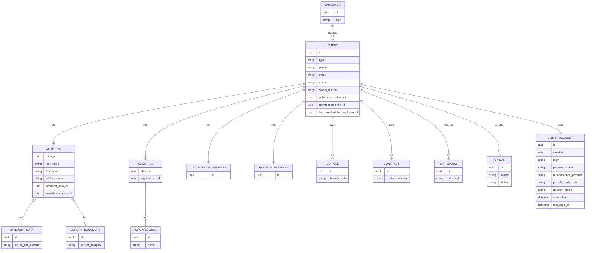

# Временное предложение по нормализации сущности «Клиент»

## Назначение

Этот временный документ фиксирует предложение по уточнению концептуальной модели в части сущности `Клиент`.

Цель:

- отделить общие данные клиента от специфики `ФЛ` и `ЮЛ`;
- отделить бизнес-сущность клиента от данных аутентификации;
- подготовить основу для дальнейшего перехода от концептуальной модели к логической модели данных.

Документ является рабочим черновиком и не заменяет [Концептуальную модель с атрибутами](./conceptual-model-with-attributes.md).

---

## Предлагаемые сущности

### `Клиент`

**Назначение.** Общая бизнес-сущность клиента как получателя услуг парковки, независимо от того, является он физическим или юридическим лицом.

| Атрибут | Атрибут (camelCase, рус.) | Атрибут (camelCase) | Описание | Тип / домен | Ограничение | Обязателен | Источник |
| -----------------------| ---------------------------| ---------------------| ----------------------------------------------- | ------------------------------------| ----------- | ---------- | --------------------------------|
| Идентификатор | идентификатор | id | Уникальный идентификатор клиента | *число* | Формат UUID | Да | Предложение по логической нормализации |
| Тип | тип | type | Тип клиента: ФЛ или ЮЛ | <ФЛ, ЮЛ> | Значение из справочника `Тип клиента` | Да | Текущая концептуальная модель |
| Телефон | телефон | phone | Основной контактный телефон клиента | *текст* | Длина ≤ 20 | Да | Текущая концептуальная модель |
| E-mail | email | email | Основной контактный e-mail клиента | *текст* | Формат email; длина 5–255 | Нет | Текущая концептуальная модель |
| Статус | статус | status | Текущее состояние клиента | <активен, архив, заблокирован> | Значение из Enum: Статус контрагента | Да | Текущая концептуальная модель |
| Причина статуса | причинаСтатуса | statusReason | Причина текущего статуса клиента | *текст* | Длина ≤ 500 | Нет | Текущая концептуальная модель |
| Настройки уведомлений | настройкиУведомленийИд | notificationSettingsId | Ссылка на настройки уведомлений клиента | <Ссылка на Настройки уведомлений> | внешний ключ на существующую запись | Да | Текущая концептуальная модель |
| Настройки оплаты | настройкиОплатыИд | paymentSettingsId | Ссылка на настройки оплаты клиента | <Ссылка на Настройки оплаты> | внешний ключ на существующую запись | Да | Текущая концептуальная модель |
| Сотрудник | последнееИзменениеСотрудникомИд | lastModifiedByEmployeeId | Сотрудник, последним изменивший статус клиента | <Ссылка на Сотрудник> | внешний ключ или null | Нет | Текущая концептуальная модель |

**Комментарий.**
В сущности `Клиент` остаются только атрибуты, общие для всех клиентов. Связи с `ТС`, `Договор`, `Уведомление`, `Обращение`, `Настройки уведомлений`, `Настройки оплаты` рекомендуется сохранять на уровне этой сущности.

---

### `КлиентФЛ`

**Назначение.** Профиль клиента, если клиент является физическим лицом.

| Атрибут | Атрибут (camelCase, рус.) | Атрибут (camelCase) | Описание | Тип / домен | Ограничение | Обязателен | Источник |
| -----------------------| ---------------------------| ---------------------| ----------------------------------------------- | ------------------------------------| ----------- | ---------- | --------------------------------|
| Клиент | клиентИд | clientId | Ссылка на общую сущность `Клиент` | <Ссылка на Клиент> | PK, FK на `Клиент`; запись допустима только для клиента типа `ФЛ` | Да | Предложение по логической нормализации |
| Фамилия | фамилия | lastName | Фамилия физического лица | *текст* | Длина ≤ 100 | Да | Текущая концептуальная модель |
| Имя | имя | firstName | Имя физического лица | *текст* | Длина ≤ 100 | Да | Текущая концептуальная модель |
| Отчество | отчество | middleName | Отчество физического лица | *текст* | Длина ≤ 100 | Нет | Текущая концептуальная модель |
| Паспортные данные | паспортныеДанныеИд | passportDataId | Ссылка на паспортные данные клиента ФЛ | <Ссылка на Паспортные данные> | внешний ключ или null | Нет | Текущая концептуальная модель |
| Льготный документ | льготныйДокументИд | benefitDocumentId | Ссылка на льготный документ клиента ФЛ | <Ссылка на Льготный документ> | внешний ключ или null | Нет | Текущая концептуальная модель |

**Комментарий.**
В `КлиентФЛ` выносятся атрибуты, применимые только к физическим лицам. Это устраняет условную обязательность полей ФИО и паспортных данных в общей сущности `Клиент`.

---

### `КлиентЮЛ`

**Назначение.** Профиль клиента, если клиент является юридическим лицом.

| Атрибут | Атрибут (camelCase, рус.) | Атрибут (camelCase) | Описание | Тип / домен | Ограничение | Обязателен | Источник |
| -----------------------| ---------------------------| ---------------------| ----------------------------------------------- | ------------------------------------| ----------- | ---------- | --------------------------------|
| Клиент | клиентИд | clientId | Ссылка на общую сущность `Клиент` | <Ссылка на Клиент> | PK, FK на `Клиент`; запись допустима только для клиента типа `ЮЛ` | Да | Предложение по логической нормализации |
| Организация | организацияИд | organizationId | Ссылка на организацию клиента ЮЛ | <Ссылка на Организация> | внешний ключ на существующую запись | Да | Текущая концептуальная модель |

**Комментарий.**
В `КлиентЮЛ` выносится ссылка на `Организация`. Если позже появятся дополнительные атрибуты, специфичные только для клиентов-ЮЛ, их рекомендуется добавлять сюда, а не в общую сущность `Клиент`.

---

### `Учетная запись клиента`

**Назначение.** Данные аутентификации и идентификации клиента в каналах входа в систему.

| Атрибут | Атрибут (camelCase, рус.) | Атрибут (camelCase) | Описание | Тип / домен | Ограничение | Обязателен | Источник |
| -----------------------| ---------------------------| ---------------------| ----------------------------------------------- | ------------------------------------| ----------- | ---------- | --------------------------------|
| Идентификатор | идентификатор | id | Уникальный идентификатор учетной записи клиента | *число* | Формат UUID | Да | Предложение по логической нормализации |
| Клиент | клиентИд | clientId | Клиент, которому принадлежит учетная запись | <Ссылка на Клиент> | внешний ключ на существующую запись | Да | Предложение по логической нормализации |
| Логин | логин | login | Имя пользователя для входа, если используется локальная аутентификация | *текст* | Длина 3–255, уникальность при заполнении | Нет | Предложение по логической нормализации |
| Пароль (хэш) | парольХэш | passwordHash | Хэш пароля для локальной аутентификации | *текст* | Длина хэша по алгоритму | Нет | Текущая концептуальная модель |
| Провайдер аутентификации | провайдерАутентификации | authenticationProvider | Код провайдера входа: локальный, Яндекс ID, VK ID и т.п. | <справочник> | Значение из справочника | Да | Предложение по логической нормализации |
| Идентификатор субъекта у провайдера | идентификаторСубъектаУПровайдера | providerSubjectId | Внешний идентификатор пользователя у провайдера аутентификации | *текст* | Длина ≤ 255 | Нет | Текущая концептуальная модель |
| Статус учетной записи | статусУчетнойЗаписи | accountStatus | Активна, заблокирована, архивирована и т.п. | <справочник> | Значение из справочника | Да | Предложение по логической нормализации |
| Дата создания | датаСоздания | createdAt | Дата и время создания учетной записи | *дата*, *время* | Не в будущем | Да | Предложение по логической нормализации |
| Дата последнего входа | датаПоследнегоВхода | lastLoginAt | Дата и время последнего успешного входа | *дата*, *время* | ≥ дата создания при заполнении | Нет | Предложение по логической нормализации |

**Комментарий.**
Вынесение учетных данных из `Клиент` позволяет не смешивать бизнес-сущность и механизмы входа в систему. Это также упрощает поддержку нескольких способов аутентификации для одного клиента.

---

## Связи

- `Клиент` —(1:0..1)→ `КлиентФЛ`
- `Клиент` —(1:0..1)→ `КлиентЮЛ`
- `КлиентФЛ` —(0..1:1)→ `Паспортные данные`
- `КлиентФЛ` —(0..1:1)→ `Льготный документ`
- `КлиентЮЛ` —(1:1)→ `Организация`
- `Клиент` —(1:1)→ `Настройки уведомлений`
- `Клиент` —(1:1)→ `Настройки оплаты`
- `Клиент` —(1:0..N)→ `ТС`
- `Клиент` —(1:0..N)→ `Договор`
- `Клиент` —(1:0..N)→ `Уведомление`
- `Клиент` —(1:0..N)→ `Обращение`
- `Клиент` —(1:1..N)→ `Учетная запись клиента` или `Клиент` —(1:0..1)→ `Учетная запись клиента`

## Mermaid-диаграмма

Легенда атрибутов на диаграмме:

- `CLIENT.id` — `идентификатор`
- `CLIENT.type` — `тип`
- `CLIENT.phone` — `телефон`
- `CLIENT.email` — `email`
- `CLIENT.status` — `статус`
- `CLIENT.status_reason` — `причинаСтатуса`
- `CLIENT.notification_settings_id` — `настройкиУведомленийИд`
- `CLIENT.payment_settings_id` — `настройкиОплатыИд`
- `CLIENT.last_modified_by_employee_id` — `последнееИзменениеСотрудникомИд`
- `CLIENT_FL.client_id` — `клиентИд`
- `CLIENT_FL.last_name` — `фамилия`
- `CLIENT_FL.first_name` — `имя`
- `CLIENT_FL.middle_name` — `отчество`
- `CLIENT_FL.passport_data_id` — `паспортныеДанныеИд`
- `CLIENT_FL.benefit_document_id` — `льготныйДокументИд`
- `CLIENT_UL.client_id` — `клиентИд`
- `CLIENT_UL.organization_id` — `организацияИд`
- `CLIENT_ACCOUNT.id` — `идентификатор`
- `CLIENT_ACCOUNT.client_id` — `клиентИд`
- `CLIENT_ACCOUNT.login` — `логин`
- `CLIENT_ACCOUNT.password_hash` — `парольХэш`
- `CLIENT_ACCOUNT.authentication_provider` — `провайдерАутентификации`
- `CLIENT_ACCOUNT.provider_subject_id` — `идентификаторСубъектаУПровайдера`
- `CLIENT_ACCOUNT.account_status` — `статусУчетнойЗаписи`
- `CLIENT_ACCOUNT.created_at` — `датаСоздания`
- `CLIENT_ACCOUNT.last_login_at` — `датаПоследнегоВхода`

## Рекомендация по выбору кратности для учетной записи

Возможны два варианта:

- если у клиента допускается только один способ входа, достаточно связи `Клиент` —(1:0..1)→ `Учетная запись клиента`;
- если клиент может входить несколькими способами (например, пароль и SSO), лучше использовать связь `Клиент` —(1:1..N)→ `Учетная запись клиента`.

Для проекта парковочной платформы более гибким выглядит второй вариант.

## Что это улучшает

- убирает смешение атрибутов ФЛ и ЮЛ в одной сущности;
- уменьшает количество условно обязательных и взаимоисключающих полей;
- отделяет бизнес-данные клиента от данных аутентификации;
- упрощает переход к логической и физической модели данных.

## Статус документа

Временный рабочий черновик рядом с основной концептуальной моделью.
