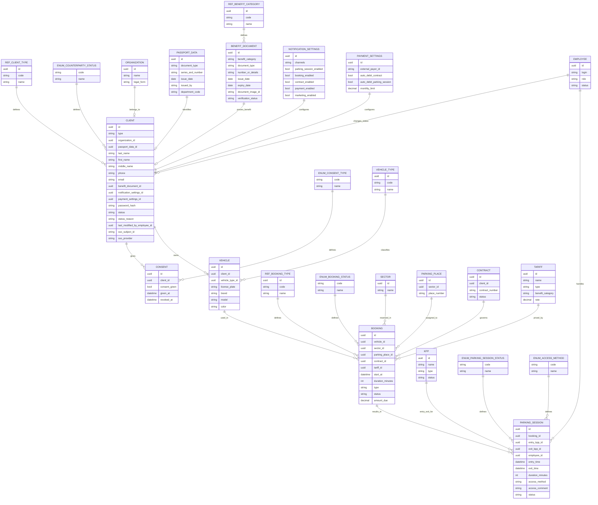

# Упрощенная ER-модель для лекции: клиент до нормализации

## Назначение

Это учебная сокращенная ER-модель для лекции, построенная **по текущей концептуальной модели до нормализации клиента**.

Здесь сохранена логика исходного артефакта:

- `Клиент` — одна общая сущность для ФЛ и ЮЛ;
- данные ФЛ, auth-данные и настройки все еще сосредоточены вокруг одной сущности `Клиент`;
- для лекции оставлена основная цепочка:
  - `Клиент`
  - `ТС`
  - `Бронирование`
  - `Парковочная сессия`

И добавлены нужные вспомогательные таблицы:

- `Организация`
- `Паспортные данные`
- `Льготный документ`
- `Настройки уведомлений`
- `Настройки оплаты`
- `Согласие`
- `Сектор`
- `Парковочное место`
- `Договор`
- `Тариф`
- `КПП`
- `Сотрудник`
- `Тип ТС`
- enum / справочники для статусов и типов

## Почему эта версия называется "до нормализации"

Потому что в ней сохранены признаки исходной концептуальной модели:

- `Клиент` одновременно хранит:
  - данные ФЛ;
  - ссылки на документы;
  - настройки;
  - данные аутентификации;
  - тип клиента;
  - статус клиента;
- подтипы `КлиентФЛ` и `КлиентЮЛ` еще не выделены;
- `Профиль` как отдельная сущность еще не выделен.

Именно такую модель удобно показывать на лекции как **исходную точку перед нормализацией**.

---

## Сущности

### `CLIENT` — Клиент

Назначение: субъект, получающий услуги парковки, ФЛ или ЮЛ.

Основные поля:

- `id: uuid` — идентификатор клиента;
- `type: string` — тип клиента;
- `organization_id: uuid` — организация, если клиент ЮЛ;
- `passport_data_id: uuid` — паспортные данные, если клиент ФЛ;
- `last_name: string` — фамилия;
- `first_name: string` — имя;
- `middle_name: string` — отчество;
- `phone: string` — контактный телефон;
- `email: string` — e-mail;
- `benefit_document_id: uuid` — льготный документ;
- `notification_settings_id: uuid` — настройки уведомлений;
- `payment_settings_id: uuid` — настройки оплаты;
- `password_hash: string` — пароль для входа;
- `status: string` — статус клиента;
- `status_reason: string` — причина статуса;
- `last_modified_by_employee_id: uuid` — сотрудник, изменивший статус;
- `sso_subject_id: string` — идентификатор пользователя у SSO-провайдера;
- `sso_provider: string` — провайдер SSO.

Комментарий:

- в этой версии намеренно оставлено смешение разных типов данных в одной сущности, как в текущей концептуальной модели.

### `PASSPORT_DATA` — Паспортные данные

Назначение: реквизиты документа, удостоверяющего личность клиента-ФЛ.

Основные поля:

- `id: uuid`;
- `document_type: string`;
- `series_and_number: string`;
- `issue_date: date`;
- `issued_by: string`;
- `department_code: string`.

### `BENEFIT_DOCUMENT` — Льготный документ

Назначение: документ, подтверждающий право клиента на льготу.

Основные поля:

- `id: uuid`;
- `benefit_category: string`;
- `document_type: string`;
- `number_or_details: string`;
- `issue_date: date`;
- `expiry_date: date`;
- `document_image_id: string`;
- `verification_status: string`.

### `ORGANIZATION` — Организация

Назначение: организация клиента, если клиент является ЮЛ.

Основные поля:

- `id: uuid`;
- `name: string`;
- `legal_form: string`.

### `NOTIFICATION_SETTINGS` — Настройки уведомлений

Назначение: настройки каналов и типов уведомлений клиента.

Основные поля:

- `id: uuid`;
- `channels: string`;
- `parking_session_enabled: bool`;
- `booking_enabled: bool`;
- `contract_enabled: bool`;
- `payment_enabled: bool`;
- `marketing_enabled: bool`.

Комментарий:

- в лекционной версии `channels` оставлено как одно поле, чтобы показать, что на концептуальном уровне такие атрибуты часто еще не развернуты в отдельные структуры.

### `PAYMENT_SETTINGS` — Настройки оплаты

Назначение: настройки оплаты и автосписания клиента.

Основные поля:

- `id: uuid`;
- `external_payer_id: string`;
- `auto_debit_contract: bool`;
- `auto_debit_parking_session: bool`;
- `monthly_limit: decimal`.

### `CONSENT` — Согласие

Назначение: запись о согласии клиента.

Основные поля:

- `id: uuid`;
- `client_id: uuid`;
- `consent_given: bool`;
- `given_at: datetime`;
- `revoked_at: datetime`.

### `VEHICLE_TYPE` — Тип ТС

Назначение: справочник категорий транспортных средств.

Основные поля:

- `id: uuid`;
- `code: string`;
- `name: string`.

### `VEHICLE` — ТС

Назначение: транспортное средство клиента.

Основные поля:

- `id: uuid`;
- `client_id: uuid`;
- `vehicle_type_id: uuid`;
- `license_plate: string`;
- `brand: string`;
- `model: string`;
- `color: string`.

### `SECTOR` — Сектор

Назначение: сектор парковки, на который может ссылаться бронирование.

Основные поля:

- `id: uuid`;
- `name: string`.

### `PARKING_PLACE` — Парковочное место

Назначение: конкретное парковочное место, которое может быть закреплено за бронированием.

Основные поля:

- `id: uuid`;
- `sector_id: uuid`;
- `place_number: string`.

### `CONTRACT` — Договор

Назначение: договор, в рамках которого оформляется долгосрочное или договорное бронирование.

Основные поля:

- `id: uuid`;
- `client_id: uuid`;
- `contract_number: string`;
- `status: string`.

### `TARIFF` — Тариф

Назначение: тариф, по которому рассчитывается стоимость бронирования.

Основные поля:

- `id: uuid`;
- `name: string`;
- `type: string`;
- `benefit_category: string`;
- `rate: decimal`.

### `BOOKING` — Бронирование

Назначение: план использования парковки на определенный период.

Основные поля:

- `id: uuid`;
- `vehicle_id: uuid`;
- `sector_id: uuid`;
- `parking_place_id: uuid`;
- `contract_id: uuid`;
- `tariff_id: uuid`;
- `start_at: datetime`;
- `duration_minutes: int`;
- `type: string`;
- `status: string`;
- `amount_due: decimal`.

Комментарий:

- эта версия остаётся учебной, но уже сохраняет ключевые атрибуты `Бронирование` из концептуальной модели.

### `PARKING_SESSION` — Парковочная сессия

Назначение: факт нахождения автомобиля на парковке.

Основные поля:

- `id: uuid`;
- `booking_id: uuid`;
- `entry_kpp_id: uuid`;
- `exit_kpp_id: uuid`;
- `employee_id: uuid`;
- `entry_time: datetime`;
- `exit_time: datetime`;
- `duration_minutes: int`;
- `access_method: string`;
- `access_comment: string`;
- `status: string`.

### `KPP` — КПП

Назначение: точка въезда или выезда, фиксируемая в парковочной сессии.

Основные поля:

- `id: uuid`;
- `name: string`;
- `type: string`;
- `status: string`.

### `EMPLOYEE` — Сотрудник

Назначение: сотрудник, который может изменить статус клиента или вручную оформить допуск в сессии.

Основные поля:

- `id: uuid`;
- `login: string`;
- `role: string`;
- `status: string`.

---

## Enum и справочники

Правило в этой учебной схеме:

- для `enum` используется ключ `code`;
- для справочников используется пара `id + code`.

### `REF_CLIENT_TYPE` — Справочник типа клиента

Значения:

- `ФЛ`
- `ЮЛ`

Используется для `CLIENT.type`.

Поля:

- `id` — внутренний идентификатор записи справочника;
- `code` — машинно-стабильный код значения;
- `name` — человекочитаемое название.

### `ENUM_COUNTERPARTY_STATUS` — Enum статуса контрагента

Значения:

- `активен`
- `архив`
- `заблокирован`

Используется для `CLIENT.status`.

### `REF_BENEFIT_CATEGORY` — Справочник льготной категории

Примеры значений:

- `ОВЗ`
- `пенсионер`
- `ветеран`
- `многодетная семья`
- `сотрудник оператора`
- `иная льгота`

Используется для `BENEFIT_DOCUMENT`.

Поля:

- `id` — внутренний идентификатор записи справочника;
- `code` — машинно-стабильный код значения;
- `name` — человекочитаемое название.

### `ENUM_CONSENT_TYPE` — Enum типа согласия

Значения:

- `согласие с офертой`
- `обработка ПДн`
- `маркетинг`

Используется для `CONSENT`.

### `REF_BOOKING_TYPE` — Справочник типа бронирования

Значения:

- `автоматическое`
- `краткосрочное`
- `долгосрочное`

Используется для `BOOKING.type`.

Поля:

- `id` — внутренний идентификатор записи справочника;
- `code` — машинно-стабильный код значения;
- `name` — человекочитаемое название.

### `ENUM_BOOKING_STATUS` — Enum статуса бронирования

Значения:

- `черновик`
- `ожидает оплаты`
- `подтверждено`
- `активно`
- `завершено`
- `отменено`
- `просрочено`

Используется для `BOOKING.status`.

### `ENUM_PARKING_SESSION_STATUS` — Enum статуса парковочной сессии

Значения:

- `активна`
- `завершена`

Используется для `PARKING_SESSION.status`.

### `ENUM_ACCESS_METHOD` — Enum способа допуска

Значения:

- `автоматически`
- `вручную`

Используется для `PARKING_SESSION.access_method`.

---

## Связи

### Клиентский блок

- `REF_CLIENT_TYPE -> CLIENT` — определяет тип клиента;
- `ENUM_COUNTERPARTY_STATUS -> CLIENT` — определяет статус клиента;
- `ORGANIZATION -> CLIENT` — организация клиента-ЮЛ;
- `PASSPORT_DATA -> CLIENT` — паспортные данные клиента-ФЛ;
- `BENEFIT_DOCUMENT -> CLIENT` — льготный документ клиента;
- `NOTIFICATION_SETTINGS -> CLIENT` — настройки уведомлений клиента;
- `PAYMENT_SETTINGS -> CLIENT` — настройки оплаты клиента;
- `EMPLOYEE -> CLIENT` — сотрудник может менять статус клиента;
- `CLIENT -> CONSENT` — клиент может иметь несколько согласий;
- `ENUM_CONSENT_TYPE -> CONSENT` — определяет вид согласия.

### Блок транспортного средства

- `CLIENT -> VEHICLE` — один клиент может иметь несколько ТС;
- `VEHICLE_TYPE -> VEHICLE` — каждое ТС имеет один тип.

### Блок эксплуатации парковки

- `VEHICLE -> BOOKING` — одно ТС может участвовать во многих бронированиях;
- `SECTOR -> BOOKING` — бронирование всегда относится к сектору;
- `PARKING_PLACE -> BOOKING` — бронирование может ссылаться на конкретное место;
- `CONTRACT -> BOOKING` — долгосрочное бронирование может быть связано с договором;
- `TARIFF -> BOOKING` — тариф определяет стоимость бронирования;
- `REF_BOOKING_TYPE -> BOOKING` — определяет тип бронирования;
- `ENUM_BOOKING_STATUS -> BOOKING` — определяет статус бронирования;
- `BOOKING -> PARKING_SESSION` — одно бронирование может породить одну или несколько парковочных сессий;
- `KPP -> PARKING_SESSION` — сессия хранит точки въезда и выезда;
- `EMPLOYEE -> PARKING_SESSION` — сотрудник может оформить ручной допуск;
- `ENUM_ACCESS_METHOD -> PARKING_SESSION` — определяет способ допуска;
- `ENUM_PARKING_SESSION_STATUS -> PARKING_SESSION` — определяет статус парковочной сессии.

---

## Главная идея для лекции

Эта версия удобна, если вы хотите показать:

1. как выглядит **исходная концептуальная модель до нормализации**;
2. как в одной сущности `Клиент` смешиваются:
   - данные ФЛ;
   - данные ЮЛ;
   - auth-данные;
   - настройки;
   - ссылки на документы;
3. как от клиента строится сквозная предметная цепочка:
   - `Клиент -> ТС -> Бронирование -> Парковочная сессия`;
4. как даже в учебной версии вокруг этой цепочки уже нужны связанные сущности:
   - `Организация`
   - `Договор`
   - `Тариф`
   - `КПП`
   - `Сотрудник`;
5. как рядом с сущностями живут enum и справочники.

## Что можно обсуждать на лекции после этой схемы

- почему `Клиент` перегружен;
- зачем потом выделять `КлиентФЛ`, `КлиентЮЛ` и `Профиль`;
- почему enum и справочники лучше фиксировать явно;
- где в модели появляются признаки будущей нормализации.

## Статус документа

Временный учебный черновик для разбора на лекции.
