# Временная ER-модель с нормализацией

## Table of Contents

- [Related Documents](#related-documents)
- [Назначение документа](#назначение-документа)
- [Легенда имен](#легенда-имен)
- [Соглашения по типам данных (PostgreSQL)](#соглашения-по-типам-данных-postgresql)
- [Атрибуты по сущностям (PostgreSQL)](#атрибуты-по-сущностям-postgresql)
- [Таблицы](#таблицы)
- [Сводка ключевых связей](#сводка-ключевых-связей)
- [Замечания по реализации](#замечания-по-реализации)
- [Статус документа](#статус-документа)

## Related Documents

- [Концептуальная модель с атрибутами](conceptual-model-with-attributes.md)
- [Нормализация сущности Клиент (предложение)](temp-client-entity-normalization-proposal.md)
- [ADR-002: бронирование и парковочная сессия](../architecture/adr/adr-002-booking-vs-session.md)
- [Глоссарий проекта](project-glossary.md)
- [ФТ: парковочная сессия](../specs/functional-requirements/fr-parking-session.md)

```mermaid
erDiagram
    PARKING ||--o{ PARKING_SCHEDULE : has
    PARKING ||--o{ SECTOR : contains
    PARKING ||--o{ KPP : has

    ZONE_TYPE ||--o{ SECTOR : classifies
    ZONE_TYPE ||--o{ ZONE_TYPE_VEHICLE_TYPE : allows
    VEHICLE_TYPE ||--o{ ZONE_TYPE_VEHICLE_TYPE : allowed_for
    ZONE_TYPE ||--o{ ZONE_TYPE_TARIFF : supports
    TARIFF ||--o{ ZONE_TYPE_TARIFF : applies_to

    SECTOR ||--o{ PARKING_PLACE : contains
    TARIFF ||--o{ PARKING_PLACE : overrides

    CLIENT ||--o| CLIENT_FL : has
    CLIENT ||--o| CLIENT_UL : has
    CLIENT ||--|| NOTIFICATION_SETTINGS : has
    CLIENT ||--|| PAYMENT_SETTINGS : has
    CLIENT ||--o{ CLIENT_ACCOUNT : authenticates
    CLIENT ||--o{ VEHICLE : owns
    CLIENT ||--o{ CONSENT : gives
    CLIENT ||--o{ CONTRACT : signs
    CLIENT ||--o{ NOTIFICATION : receives
    CLIENT ||--o{ APPEAL : creates
    EMPLOYEE ||--o{ CLIENT : updates_status

    CLIENT_FL o|--|| PASSPORT_DATA : uses
    CLIENT_FL o|--o| BENEFIT_DOCUMENT : has
    CLIENT_UL ||--|| ORGANIZATION : represents
    ORGANIZATION ||--o{ ORGANIZATION_BANK_ACCOUNT : has

    CONTRACT_TEMPLATE ||--o{ CONTRACT : generates
    CLIENT ||--o{ CONTRACT : owns

    VEHICLE_TYPE ||--o{ VEHICLE : classifies

    CONTRACT ||--o{ BOOKING : governs
    VEHICLE ||--o{ BOOKING : booked_for
    SECTOR ||--o{ BOOKING : reserved_in
    PARKING_PLACE ||--o{ BOOKING : reserved_as
    TARIFF ||--o{ BOOKING : priced_by

    BOOKING ||--o{ PARKING_SESSION : results_in
    KPP ||--o{ PARKING_SESSION : entry_exit_for
    EMPLOYEE ||--o{ PARKING_SESSION : handles

    BOOKING ||--o{ INVOICE : billed_as
    INVOICE ||--o{ PAYMENT : paid_by
    PAYMENT ||--o| RECEIPT : fiscalized_as

    EMPLOYEE ||--o{ NOTIFICATION : initiates
    NOTIFICATION_TEMPLATE ||--o{ NOTIFICATION : generates

    EMPLOYEE ||--o{ APPEAL : handles
    BOOKING ||--o{ APPEAL : related_to
    PARKING_SESSION ||--o{ APPEAL : related_to
    PAYMENT ||--o{ APPEAL : related_to
    RECEIPT ||--o{ APPEAL : related_to
    CONTRACT ||--o{ APPEAL : related_to

    PARKING {
        uuid id
        string name
        string address
        string type
        string description
        string operational_status
    }

    PARKING_SCHEDULE {
        uuid id
        uuid parking_id
        int day_of_week
        time open_time
        time close_time
        bool is_closed
        date effective_from
        date effective_to
    }

    SECTOR {
        uuid id
        uuid parking_id
        uuid zone_type_id
        string name
        string operational_status
    }

    ZONE_TYPE {
        uuid id
        string code
        string name
        string description
    }

    VEHICLE_TYPE {
        uuid id
        string code
        string name
        string description
    }

    ZONE_TYPE_VEHICLE_TYPE {
        uuid zone_type_id
        uuid vehicle_type_id
    }

    ZONE_TYPE_TARIFF {
        uuid zone_type_id
        uuid tariff_id
    }

    PARKING_PLACE {
        uuid id
        uuid sector_id
        uuid override_tariff_id
        string place_number
        string operational_status
    }

    CLIENT {
        uuid id
        string type
        string phone
        string email
        string status
        string status_reason
        uuid notification_settings_id
        uuid payment_settings_id
        uuid last_modified_by_employee_id
    }

    CLIENT_FL {
        uuid client_id
        string last_name
        string first_name
        string middle_name
        uuid passport_data_id
        uuid benefit_document_id
    }

    CLIENT_UL {
        uuid client_id
        uuid organization_id
    }

    CLIENT_ACCOUNT {
        uuid id
        uuid client_id
        string auth_provider
        string login
        string password_hash
        string provider_subject_id
        string account_status
        datetime created_at
        datetime last_login_at
    }

    NOTIFICATION_SETTINGS {
        uuid id
        string channels
        bool parking_session_enabled
        bool booking_enabled
        bool contract_enabled
        bool payment_enabled
        bool marketing_enabled
    }

    PAYMENT_SETTINGS {
        uuid id
        string external_payer_id
        bool auto_debit_contract
        bool auto_debit_parking_session
        decimal monthly_limit
    }

    PASSPORT_DATA {
        uuid id
        string document_type
        string series_and_number
        date issue_date
        string issued_by
        string department_code
    }

    BENEFIT_DOCUMENT {
        uuid id
        string benefit_category
        string document_type
        string document_number
        date issue_date
        date expiry_date
        string document_image_ref
        string verification_status
    }

    ORGANIZATION {
        uuid id
        string name
        string legal_form
        string legal_address
        string actual_address
        string inn
        string kpp
        string ogrn
        string email
        string phone
        string status
    }

    ORGANIZATION_BANK_ACCOUNT {
        uuid id
        uuid organization_id
        string bank_name
        string bik
        string account_number
        string correspondent_account
        bool is_primary
    }

    CONSENT {
        uuid id
        uuid client_id
        string consent_type
        bool consent_given
        datetime given_at
        datetime revoked_at
    }

    EMPLOYEE {
        uuid id
        string login
        string password_hash
        string role
        string last_name
        string first_name
        string middle_name
        string phone
        string email
        string status
        string totp_secret_encrypted
    }

    VEHICLE {
        uuid id
        uuid client_id
        uuid vehicle_type_id
        string license_plate
        string brand
        string model
        string color
    }

    KPP {
        uuid id
        uuid parking_id
        string name
        string type
        string status
    }

    TARIFF {
        uuid id
        string name
        string type
        string benefit_category
        decimal rate
        string billing_step
        decimal max_amount
        int grace_period_minutes
    }

    CONTRACT_TEMPLATE {
        uuid id
        string code
        string name
        string version
        string type
        string body
        date effective_from
        date effective_to
    }

    CONTRACT {
        uuid id
        uuid client_id
        uuid contract_template_id
        string contract_number
        date start_date
        date end_date
        string status
        string document_file_ref
    }

    BOOKING {
        uuid id
        string booking_number
        uuid vehicle_id
        uuid sector_id
        uuid parking_place_id
        uuid contract_id
        uuid tariff_id
        datetime start_at
        int duration_minutes
        string type
        string status
        decimal amount_due
    }

    INVOICE {
        uuid id
        uuid booking_id
        uuid contract_id
        string invoice_number
        string type
        string status
        decimal amount_due
        decimal amount_paid
        date issued_at
        date due_at
        datetime paid_at
    }

    PARKING_SESSION {
        uuid id
        uuid booking_id
        uuid entry_kpp_id
        uuid exit_kpp_id
        uuid employee_id
        datetime entry_time
        datetime exit_time
        int duration_minutes
        string access_method
        string access_comment
        string status
    }

    PAYMENT {
        uuid id
        uuid invoice_id
        decimal amount
        string currency
        string payment_method
        string status
        datetime initiated_at
        datetime completed_at
        string provider_id
    }

    RECEIPT {
        uuid id
        uuid payment_id
        string fiscal_number
        datetime receipt_at
        string fiscal_status
        decimal amount
    }

    NOTIFICATION_TEMPLATE {
        uuid id
        string code
        string name
        string type
        string subject
        string body
    }

    NOTIFICATION {
        uuid id
        uuid notification_template_id
        uuid client_id
        uuid employee_id
        string channel
        string delivery_status
    }

    APPEAL {
        uuid id
        uuid client_id
        uuid employee_id
        uuid booking_id
        uuid parking_session_id
        uuid payment_id
        uuid receipt_id
        uuid contract_id
        string type
        string channel
        string subject
        string description
        string status
    }
```

> В блоке `erDiagram` выше типы атрибутов условные (`uuid`, `string`, …) и не задают физическую схему. Полный перечень атрибутов с целевыми типами PostgreSQL — в разделе [Атрибуты по сущностям (PostgreSQL)](#атрибуты-по-сущностям-postgresql); политика PK, деньги и время — в [Соглашения по типам данных (PostgreSQL)](#соглашения-по-типам-данных-postgresql).

## Назначение документа

Этот документ фиксирует **временную нормализованную ER-модель** на основе текущей концептуальной модели предметной области парковочной платформы.

Связь «бронирование — парковочная сессия» и отсутствие парковочной сессии без бронирования согласованы с решением **Option D** в [ADR-002](../architecture/adr/adr-002-booking-vs-session.md) (сессия опирается на `BOOKING`).

Цель модели:

- показать, как концептуальные сущности могут быть преобразованы в более строгую логическую схему;
- устранить основные замечания по 1НФ, 3НФ и 4НФ;
- зафиксировать кандидатов в будущие таблицы и связи между ними.

Основные отличия от исходной концептуальной модели:

- `Клиент` разделен на общую сущность, подтипы `КлиентФЛ` и `КлиентЮЛ`, а также `Учетная запись клиента`;
- `Организация.банковскиеРеквизиты` вынесены в отдельную таблицу `ORGANIZATION_BANK_ACCOUNT`;
- `Парковка.временнойРежим` вынесен в отдельную таблицу `PARKING_SCHEDULE`;
- `Счет` (`INVOICE`) выделен как отдельная сущность финансового требования между основанием начисления и фактом оплаты;
- полиморфная ссылка в `Обращение` заменена набором явных nullable-FK на допустимые предметы обращения;
- `M:N` связи оформлены отдельными таблицами.

## Легенда имен

В Mermaid используются ASCII-имена сущностей и атрибутов для совместимости с редакторами и рендерерами; в тексте ниже пояснения по-русски. Две линии `CLIENT` — `CONTRACT` (`signs` и `owns`) отражают одну доменную связь «клиент — договор» в разных группах связей на диаграмме; при необходимости диаграмму можно упростить до одной линии.

## Соглашения по типам данных (PostgreSQL)

Раздел согласован с целевыми практиками производительности и эксплуатации (индексы под FK, компактные ключи, денежная точность) в духе ролей **database-optimizer** и **backend-architect**: не подменяет физическую миграцию и может уточняться при реализации.

### Идентификаторы: не везде `BIGINT`

В PostgreSQL разница — **4 байта** у `INTEGER` против **8 байт** у `BIGINT` на значение в PK/FK и в индексах; на больших объемах это заметно, но для большинства одной установки парковочной платформы узкое место чаще в запросах и индексах, а не в типе int. Имеет смысл **разделять по смыслу нагрузки и роста**, а не ставить `BIGINT` всем подряд.

| Уровень | Тип PK/FK | Когда применять |
|---------|-----------|-----------------|
| **Справочники и инфраструктура** | **`INTEGER`** (`GENERATED … AS IDENTITY` / `SERIAL`) | Кардинальность в одной БД ожидается далеко ниже **2·10^9** строк: типы зон и ТС, тариф как строка справочника, парковки, сектора, КПП, места, шаблоны договоров и уведомлений, сотрудники, организации, клиенты, ТС, договоры, паспорт/льгота как документы, настройки клиента, график парковки. |
| **Потоки событий и денег** | **`BIGINT`** | Непрерывные вставки и длинный горизонт хранения без риска исчерпания диапазона: **бронирования, счета, платежи, парковочные сессии, чеки**, экземпляры **уведомлений**, **обращения**; при необходимости — **согласия** и **учетные записи клиента**, если политика хранения предполагает очень большие объемы. |
| **Узкие числовые домены** | **`SMALLINT`** | Только где диапазон гарантированно мал: например **день недели** 1–7 (с `CHECK`), редко — иные малые коды. |
| **Публичный / внешний id** | **`UUID`** | Точечно: публичный API, сквозные ключи между системами; опционально **`public_id UUID UNIQUE`** рядом с внутренним **`INTEGER` или `BIGINT`**. |

- **Тип FK** всегда совпадает с типом целевого PK (включая `NULL` для опциональных связей). Смешивать в одной схеме `INTEGER` и `BIGINT` для разных таблиц — нормально; главное — **согласованность в связке родитель–потомок**.
- Справочники с полем **`code`** — по-прежнему `VARCHAR` + `UNIQUE`; PK остается числовым (`INTEGER` или `BIGINT` по строке таблицы ниже), если не принято решение о текстовом PK для крошечного справочника.

### Деньги, время, текст, булевы

- Суммы в валюте (тарифы, бронь, счет, платеж, чек, лимиты) — **`NUMERIC(19, 4)`** (или уже согласованная точность домена); тип `money` в PostgreSQL для целевой схемы не использовать как дефолт.
- Моменты событий (въезд, выезд, оплата, уведомления, согласия) — **`TIMESTAMPTZ`**; календарные даты без времени суток — **`DATE`**.
- Длительность в минутах (`duration_minutes`, льготные/тарифные интервалы) — **`INTEGER`**: диапазона `SMALLINT` может не хватить (например сутки = 1440 минут; длинные периоды — больше).
- Для **минут льготы/тарифа** (`grace_period_minutes` и т.п.) — тоже **`INTEGER`**, если домен допускает значения больше ~32767; иначе — `SMALLINT` + `CHECK`.
- Строки: осмысленные лимиты — **`VARCHAR(n)`**; длинный неструктурированный текст — **`TEXT`** (`CONTRACT_TEMPLATE.body`, описания, комментарии).
- Флаги — **`BOOLEAN`**.

### Идемпотентность и внешние платежные ссылки

- Идентификатор операции у провайдера и ключи идемпотентности — **`TEXT`** или **`VARCHAR(512)`** с **`UNIQUE`** по канонической строке от PSP, без принудительного приведения к UUID, если формат в контракте не фиксирован как UUID.
- Поле вроде `provider_subject_id` у учетной записи — **`VARCHAR(255)`** или **`TEXT`** по фактической длине у IdP.

### Сводка: сущность — PK и типы ключевых полей

В таблице ниже **PK/FK** — целочисленные; **`INT`** = `INTEGER`. Тип FK в дочерней таблице совпадает с типом PK родителя.

| Сущность | PK | Ключевые атрибуты (целевой PostgreSQL) |
|----------|-----|----------------------------------------|
| `PARKING` | INT | `name` VARCHAR, `address` TEXT, прочие строки VARCHAR/TEXT по смыслу |
| `PARKING_SCHEDULE` | INT | FK **INT** на парковку; `day_of_week` **SMALLINT** + `CHECK` 1–7; `open_time`/`close_time` TIME; даты DATE |
| `SECTOR` | INT | FK **INT** на парковку и на тип зоны |
| `ZONE_TYPE`, `VEHICLE_TYPE` | INT | `code` VARCHAR UNIQUE; наименования VARCHAR/TEXT |
| `ZONE_TYPE_VEHICLE_TYPE`, `ZONE_TYPE_TARIFF` | составной PK (INT, INT) | FK типов совпадают с PK `ZONE_TYPE` / `VEHICLE_TYPE` / `TARIFF` |
| `PARKING_PLACE` | INT | `place_number` VARCHAR; FK **INT** на сектор и опционально на тариф |
| `CLIENT` | INT | `phone` VARCHAR(32), `email` VARCHAR(320); статусы VARCHAR + CHECK или домен |
| `CLIENT_FL`, `CLIENT_UL` | PK = FK **INT** (`client_id`) | как в разделе таблиц |
| `CLIENT_ACCOUNT` | **BIGINT** (или INT при умеренном объеме) | `password_hash` VARCHAR(255); `login` VARCHAR; `auth_provider` VARCHAR |
| `NOTIFICATION_SETTINGS`, `PAYMENT_SETTINGS` | INT | булевы BOOLEAN; `monthly_limit` NUMERIC(19,4) |
| `PASSPORT_DATA`, `BENEFIT_DOCUMENT` | INT | даты DATE; ссылки на файлы TEXT или VARCHAR |
| `ORGANIZATION` | INT | ИНН/КПП/ОГРН VARCHAR; адреса TEXT |
| `ORGANIZATION_BANK_ACCOUNT` | INT | FK **INT** на организацию; реквизиты VARCHAR; `is_primary` BOOLEAN |
| `CONSENT` | **BIGINT** (или INT) | FK **INT** на клиента; `given_at`/`revoked_at` TIMESTAMPTZ — при очень большом числе строк предпочтительнее **BIGINT** PK |
| `EMPLOYEE` | INT | контакты VARCHAR; `totp_secret_encrypted` TEXT или BYTEA по политике ИБ |
| `VEHICLE` | INT | FK **INT** на клиента и тип ТС; `license_plate` VARCHAR UNIQUE (с нормализацией) |
| `KPP` | INT | FK **INT** на парковку |
| `TARIFF` | INT | ставки NUMERIC(19,4); `grace_period_minutes` **INTEGER** |
| `CONTRACT_TEMPLATE` | INT | `body` TEXT; период DATE |
| `CONTRACT` | INT | FK **INT** на клиента; номер VARCHAR; файл VARCHAR/TEXT ref |
| `BOOKING` | **BIGINT** | PK брони — **BIGINT**; FK на ТС, сектор, место, договор, тариф — **`INTEGER`**, как PK родителей; `start_at` TIMESTAMPTZ; `amount_due` NUMERIC(19,4); `duration_minutes` INTEGER |
| `INVOICE` | **BIGINT** | FK **BIGINT** на бронирование (`BOOKING.id`); суммы NUMERIC(19,4); даты DATE; `paid_at` TIMESTAMPTZ |
| `PARKING_SESSION` | **BIGINT** | FK **BIGINT** на бронирование; FK **INT** на КПП и сотрудника; времена TIMESTAMPTZ; `duration_minutes` INTEGER |
| `PAYMENT` | **BIGINT** | FK **BIGINT** на счет; `amount` NUMERIC(19,4); время TIMESTAMPTZ; идемпотентность/внешний id — TEXT/VARCHAR UNIQUE |
| `RECEIPT` | **BIGINT** | FK **BIGINT** на платеж; сумма NUMERIC(19,4); `receipt_at` TIMESTAMPTZ |
| `NOTIFICATION_TEMPLATE` | INT | `body` TEXT; `subject` VARCHAR |
| `NOTIFICATION` | **BIGINT** | FK **INT** на шаблон, клиента, сотрудника (типы как у их PK) |
| `APPEAL` | **BIGINT** | предметные FK: `booking_id` **BIGINT**, `parking_session_id` **BIGINT**, `payment_id` **BIGINT**, `receipt_id` **BIGINT**, `contract_id` **INT** — как у целевых таблиц |

**Смешение `INT` и `BIGINT`:** у таблицы с **`BIGINT` PK** столбцы FK на родителей с **`INTEGER` PK** остаются типа **`INTEGER`** — в PostgreSQL так и задают (PK шире, чем FK-ссылка на «толстый» корень не нужна). Унификация «везде `BIGINT` для PK» упрощает правила ценой размера индексов на справочниках; «везде `INT`» экономит место, но для **BOOKING/PAYMENT/SESSION** запас по диапазону меньше — для потоковых таблиц разумнее **`BIGINT` PK**.

Индексы: на каждом столбце FK на стороне «многие» — B-tree (и частичные индексы под типовые `WHERE`, когда появятся профили нагрузки).

## Атрибуты по сущностям (PostgreSQL)

Ниже — **целевой тип PostgreSQL для каждого атрибута** из диаграммы. **`INT`** = `INTEGER`. `NULL` допускается там, где в модели связь опциональна или поле необязательно по смыслу; иначе `NOT NULL` (в миграциях уточнять по ФТ).

### `PARKING`

| Атрибут | Тип PostgreSQL |
|---------|------------------|
| `id` | `INTEGER` `GENERATED BY DEFAULT AS IDENTITY` `PRIMARY KEY` |
| `name` | `VARCHAR(200)` `NOT NULL` |
| `address` | `TEXT` `NOT NULL` |
| `type` | `VARCHAR(64)` `NOT NULL` |
| `description` | `TEXT` |
| `operational_status` | `VARCHAR(32)` `NOT NULL` |

### `PARKING_SCHEDULE`

| Атрибут | Тип PostgreSQL |
|---------|------------------|
| `id` | `INTEGER` `GENERATED BY DEFAULT AS IDENTITY` `PRIMARY KEY` |
| `parking_id` | `INTEGER` `NOT NULL` `REFERENCES parking(id)` |
| `day_of_week` | `SMALLINT` `NOT NULL` |
| `open_time` | `TIME` |
| `close_time` | `TIME` |
| `is_closed` | `BOOLEAN` `NOT NULL` `DEFAULT false` |
| `effective_from` | `DATE` `NOT NULL` |
| `effective_to` | `DATE` |

### `SECTOR`

| Атрибут | Тип PostgreSQL |
|---------|------------------|
| `id` | `INTEGER` `GENERATED BY DEFAULT AS IDENTITY` `PRIMARY KEY` |
| `parking_id` | `INTEGER` `NOT NULL` `REFERENCES parking(id)` |
| `zone_type_id` | `INTEGER` `NOT NULL` `REFERENCES zone_type(id)` |
| `name` | `VARCHAR(200)` `NOT NULL` |
| `operational_status` | `VARCHAR(32)` `NOT NULL` |

### `ZONE_TYPE`

| Атрибут | Тип PostgreSQL |
|---------|------------------|
| `id` | `INTEGER` `GENERATED BY DEFAULT AS IDENTITY` `PRIMARY KEY` |
| `code` | `VARCHAR(64)` `NOT NULL` `UNIQUE` |
| `name` | `VARCHAR(200)` `NOT NULL` |
| `description` | `TEXT` |

### `VEHICLE_TYPE`

| Атрибут | Тип PostgreSQL |
|---------|------------------|
| `id` | `INTEGER` `GENERATED BY DEFAULT AS IDENTITY` `PRIMARY KEY` |
| `code` | `VARCHAR(64)` `NOT NULL` `UNIQUE` |
| `name` | `VARCHAR(200)` `NOT NULL` |
| `description` | `TEXT` |

### `ZONE_TYPE_VEHICLE_TYPE`

| Атрибут | Тип PostgreSQL |
|---------|------------------|
| `zone_type_id` | `INTEGER` `NOT NULL` `REFERENCES zone_type(id)` |
| `vehicle_type_id` | `INTEGER` `NOT NULL` `REFERENCES vehicle_type(id)` |

Составной первичный ключ: `PRIMARY KEY (zone_type_id, vehicle_type_id)`.

### `ZONE_TYPE_TARIFF`

| Атрибут | Тип PostgreSQL |
|---------|------------------|
| `zone_type_id` | `INTEGER` `NOT NULL` `REFERENCES zone_type(id)` |
| `tariff_id` | `INTEGER` `NOT NULL` `REFERENCES tariff(id)` |

Составной первичный ключ: `PRIMARY KEY (zone_type_id, tariff_id)`.

### `PARKING_PLACE`

| Атрибут | Тип PostgreSQL |
|---------|------------------|
| `id` | `INTEGER` `GENERATED BY DEFAULT AS IDENTITY` `PRIMARY KEY` |
| `sector_id` | `INTEGER` `NOT NULL` `REFERENCES sector(id)` |
| `override_tariff_id` | `INTEGER` `REFERENCES tariff(id)` |
| `place_number` | `VARCHAR(32)` `NOT NULL` |
| `operational_status` | `VARCHAR(32)` `NOT NULL` |

### `CLIENT`

| Атрибут | Тип PostgreSQL |
|---------|------------------|
| `id` | `INTEGER` `GENERATED BY DEFAULT AS IDENTITY` `PRIMARY KEY` |
| `type` | `VARCHAR(32)` `NOT NULL` |
| `phone` | `VARCHAR(32)` |
| `email` | `VARCHAR(320)` |
| `status` | `VARCHAR(32)` `NOT NULL` |
| `status_reason` | `TEXT` |
| `notification_settings_id` | `INTEGER` `REFERENCES notification_settings(id)` |
| `payment_settings_id` | `INTEGER` `REFERENCES payment_settings(id)` |
| `last_modified_by_employee_id` | `INTEGER` `REFERENCES employee(id)` |

### `CLIENT_FL`

| Атрибут | Тип PostgreSQL |
|---------|------------------|
| `client_id` | `INTEGER` `PRIMARY KEY` `REFERENCES client(id)` |
| `last_name` | `VARCHAR(100)` `NOT NULL` |
| `first_name` | `VARCHAR(100)` `NOT NULL` |
| `middle_name` | `VARCHAR(100)` |
| `passport_data_id` | `INTEGER` `REFERENCES passport_data(id)` |
| `benefit_document_id` | `INTEGER` `REFERENCES benefit_document(id)` |

### `CLIENT_UL`

| Атрибут | Тип PostgreSQL |
|---------|------------------|
| `client_id` | `INTEGER` `PRIMARY KEY` `REFERENCES client(id)` |
| `organization_id` | `INTEGER` `NOT NULL` `UNIQUE` `REFERENCES organization(id)` |

### `CLIENT_ACCOUNT`

| Атрибут | Тип PostgreSQL |
|---------|------------------|
| `id` | `BIGINT` `GENERATED BY DEFAULT AS IDENTITY` `PRIMARY KEY` |
| `client_id` | `INTEGER` `NOT NULL` `REFERENCES client(id)` |
| `auth_provider` | `VARCHAR(64)` `NOT NULL` |
| `login` | `VARCHAR(255)` `NOT NULL` |
| `password_hash` | `VARCHAR(255)` `NOT NULL` |
| `provider_subject_id` | `VARCHAR(255)` |
| `account_status` | `VARCHAR(32)` `NOT NULL` |
| `created_at` | `TIMESTAMPTZ` `NOT NULL` `DEFAULT now()` |
| `last_login_at` | `TIMESTAMPTZ` |

### `NOTIFICATION_SETTINGS`

| Атрибут | Тип PostgreSQL |
|---------|------------------|
| `id` | `INTEGER` `GENERATED BY DEFAULT AS IDENTITY` `PRIMARY KEY` |
| `channels` | `TEXT` |
| `parking_session_enabled` | `BOOLEAN` `NOT NULL` `DEFAULT false` |
| `booking_enabled` | `BOOLEAN` `NOT NULL` `DEFAULT false` |
| `contract_enabled` | `BOOLEAN` `NOT NULL` `DEFAULT false` |
| `payment_enabled` | `BOOLEAN` `NOT NULL` `DEFAULT false` |
| `marketing_enabled` | `BOOLEAN` `NOT NULL` `DEFAULT false` |

### `PAYMENT_SETTINGS`

| Атрибут | Тип PostgreSQL |
|---------|------------------|
| `id` | `INTEGER` `GENERATED BY DEFAULT AS IDENTITY` `PRIMARY KEY` |
| `external_payer_id` | `VARCHAR(100)` |
| `auto_debit_contract` | `BOOLEAN` `NOT NULL` `DEFAULT false` |
| `auto_debit_parking_session` | `BOOLEAN` `NOT NULL` `DEFAULT false` |
| `monthly_limit` | `NUMERIC(19, 4)` |

### `PASSPORT_DATA`

| Атрибут | Тип PostgreSQL |
|---------|------------------|
| `id` | `INTEGER` `GENERATED BY DEFAULT AS IDENTITY` `PRIMARY KEY` |
| `document_type` | `VARCHAR(32)` `NOT NULL` |
| `series_and_number` | `VARCHAR(32)` `NOT NULL` |
| `issue_date` | `DATE` `NOT NULL` |
| `issued_by` | `VARCHAR(500)` |
| `department_code` | `VARCHAR(32)` |

### `BENEFIT_DOCUMENT`

| Атрибут | Тип PostgreSQL |
|---------|------------------|
| `id` | `INTEGER` `GENERATED BY DEFAULT AS IDENTITY` `PRIMARY KEY` |
| `benefit_category` | `VARCHAR(64)` `NOT NULL` |
| `document_type` | `VARCHAR(32)` `NOT NULL` |
| `document_number` | `VARCHAR(64)` `NOT NULL` |
| `issue_date` | `DATE` `NOT NULL` |
| `expiry_date` | `DATE` |
| `document_image_ref` | `VARCHAR(512)` |
| `verification_status` | `VARCHAR(32)` `NOT NULL` |

### `ORGANIZATION`

| Атрибут | Тип PostgreSQL |
|---------|------------------|
| `id` | `INTEGER` `GENERATED BY DEFAULT AS IDENTITY` `PRIMARY KEY` |
| `name` | `VARCHAR(500)` `NOT NULL` |
| `legal_form` | `VARCHAR(64)` |
| `legal_address` | `TEXT` |
| `actual_address` | `TEXT` |
| `inn` | `VARCHAR(12)` |
| `kpp` | `VARCHAR(9)` |
| `ogrn` | `VARCHAR(13)` |
| `email` | `VARCHAR(320)` |
| `phone` | `VARCHAR(32)` |
| `status` | `VARCHAR(32)` `NOT NULL` |

### `ORGANIZATION_BANK_ACCOUNT`

| Атрибут | Тип PostgreSQL |
|---------|------------------|
| `id` | `INTEGER` `GENERATED BY DEFAULT AS IDENTITY` `PRIMARY KEY` |
| `organization_id` | `INTEGER` `NOT NULL` `REFERENCES organization(id)` |
| `bank_name` | `VARCHAR(255)` `NOT NULL` |
| `bik` | `VARCHAR(9)` `NOT NULL` |
| `account_number` | `VARCHAR(32)` `NOT NULL` |
| `correspondent_account` | `VARCHAR(32)` |
| `is_primary` | `BOOLEAN` `NOT NULL` `DEFAULT false` |

### `CONSENT`

| Атрибут | Тип PostgreSQL |
|---------|------------------|
| `id` | `BIGINT` `GENERATED BY DEFAULT AS IDENTITY` `PRIMARY KEY` |
| `client_id` | `INTEGER` `NOT NULL` `REFERENCES client(id)` |
| `consent_type` | `VARCHAR(64)` `NOT NULL` |
| `consent_given` | `BOOLEAN` `NOT NULL` |
| `given_at` | `TIMESTAMPTZ` `NOT NULL` |
| `revoked_at` | `TIMESTAMPTZ` |

### `EMPLOYEE`

| Атрибут | Тип PostgreSQL |
|---------|------------------|
| `id` | `INTEGER` `GENERATED BY DEFAULT AS IDENTITY` `PRIMARY KEY` |
| `login` | `VARCHAR(64)` `NOT NULL` `UNIQUE` |
| `password_hash` | `VARCHAR(255)` `NOT NULL` |
| `role` | `VARCHAR(64)` `NOT NULL` |
| `last_name` | `VARCHAR(100)` `NOT NULL` |
| `first_name` | `VARCHAR(100)` `NOT NULL` |
| `middle_name` | `VARCHAR(100)` |
| `phone` | `VARCHAR(32)` |
| `email` | `VARCHAR(320)` |
| `status` | `VARCHAR(32)` `NOT NULL` |
| `totp_secret_encrypted` | `TEXT` |

### `VEHICLE`

| Атрибут | Тип PostgreSQL |
|---------|------------------|
| `id` | `INTEGER` `GENERATED BY DEFAULT AS IDENTITY` `PRIMARY KEY` |
| `client_id` | `INTEGER` `NOT NULL` `REFERENCES client(id)` |
| `vehicle_type_id` | `INTEGER` `NOT NULL` `REFERENCES vehicle_type(id)` |
| `license_plate` | `VARCHAR(32)` `NOT NULL` |
| `brand` | `VARCHAR(100)` |
| `model` | `VARCHAR(100)` |
| `color` | `VARCHAR(64)` |

### `KPP`

| Атрибут | Тип PostgreSQL |
|---------|------------------|
| `id` | `INTEGER` `GENERATED BY DEFAULT AS IDENTITY` `PRIMARY KEY` |
| `parking_id` | `INTEGER` `NOT NULL` `REFERENCES parking(id)` |
| `name` | `VARCHAR(200)` `NOT NULL` |
| `type` | `VARCHAR(32)` `NOT NULL` |
| `status` | `VARCHAR(32)` `NOT NULL` |

### `TARIFF`

| Атрибут | Тип PostgreSQL |
|---------|------------------|
| `id` | `INTEGER` `GENERATED BY DEFAULT AS IDENTITY` `PRIMARY KEY` |
| `name` | `VARCHAR(200)` `NOT NULL` |
| `type` | `VARCHAR(32)` `NOT NULL` |
| `benefit_category` | `VARCHAR(64)` |
| `rate` | `NUMERIC(19, 4)` `NOT NULL` |
| `billing_step` | `VARCHAR(32)` |
| `max_amount` | `NUMERIC(19, 4)` |
| `grace_period_minutes` | `INTEGER` `NOT NULL` `DEFAULT 0` |

### `CONTRACT_TEMPLATE`

| Атрибут | Тип PostgreSQL |
|---------|------------------|
| `id` | `INTEGER` `GENERATED BY DEFAULT AS IDENTITY` `PRIMARY KEY` |
| `code` | `VARCHAR(64)` `NOT NULL` `UNIQUE` |
| `name` | `VARCHAR(200)` `NOT NULL` |
| `version` | `VARCHAR(32)` `NOT NULL` |
| `type` | `VARCHAR(32)` `NOT NULL` |
| `body` | `TEXT` `NOT NULL` |
| `effective_from` | `DATE` `NOT NULL` |
| `effective_to` | `DATE` |

### `CONTRACT`

| Атрибут | Тип PostgreSQL |
|---------|------------------|
| `id` | `INTEGER` `GENERATED BY DEFAULT AS IDENTITY` `PRIMARY KEY` |
| `client_id` | `INTEGER` `NOT NULL` `REFERENCES client(id)` |
| `contract_template_id` | `INTEGER` `REFERENCES contract_template(id)` |
| `contract_number` | `VARCHAR(64)` `NOT NULL` |
| `start_date` | `DATE` `NOT NULL` |
| `end_date` | `DATE` |
| `status` | `VARCHAR(32)` `NOT NULL` |
| `document_file_ref` | `VARCHAR(512)` |

### `BOOKING`

| Атрибут | Тип PostgreSQL |
|---------|------------------|
| `id` | `BIGINT` `GENERATED BY DEFAULT AS IDENTITY` `PRIMARY KEY` |
| `booking_number` | `VARCHAR(64)` `NOT NULL` `UNIQUE` |
| `vehicle_id` | `INTEGER` `NOT NULL` `REFERENCES vehicle(id)` |
| `sector_id` | `INTEGER` `NOT NULL` `REFERENCES sector(id)` |
| `parking_place_id` | `INTEGER` `REFERENCES parking_place(id)` |
| `contract_id` | `INTEGER` `REFERENCES contract(id)` |
| `tariff_id` | `INTEGER` `NOT NULL` `REFERENCES tariff(id)` |
| `start_at` | `TIMESTAMPTZ` `NOT NULL` |
| `duration_minutes` | `INTEGER` `NOT NULL` |
| `type` | `VARCHAR(32)` `NOT NULL` |
| `status` | `VARCHAR(32)` `NOT NULL` |
| `amount_due` | `NUMERIC(19, 4)` `NOT NULL` |

### `INVOICE`

| Атрибут | Тип PostgreSQL |
|---------|------------------|
| `id` | `BIGINT` `GENERATED BY DEFAULT AS IDENTITY` `PRIMARY KEY` |
| `booking_id` | `BIGINT` `NOT NULL` `REFERENCES booking(id)` |
| `contract_id` | `INTEGER` `REFERENCES contract(id)` |
| `invoice_number` | `VARCHAR(64)` `NOT NULL` |
| `type` | `VARCHAR(32)` `NOT NULL` |
| `status` | `VARCHAR(32)` `NOT NULL` |
| `amount_due` | `NUMERIC(19, 4)` `NOT NULL` |
| `amount_paid` | `NUMERIC(19, 4)` |
| `issued_at` | `DATE` `NOT NULL` |
| `due_at` | `DATE` |
| `paid_at` | `TIMESTAMPTZ` |

### `PARKING_SESSION`

| Атрибут | Тип PostgreSQL |
|---------|------------------|
| `id` | `BIGINT` `GENERATED BY DEFAULT AS IDENTITY` `PRIMARY KEY` |
| `booking_id` | `BIGINT` `NOT NULL` `REFERENCES booking(id)` |
| `entry_kpp_id` | `INTEGER` `REFERENCES kpp(id)` |
| `exit_kpp_id` | `INTEGER` `REFERENCES kpp(id)` |
| `employee_id` | `INTEGER` `REFERENCES employee(id)` |
| `entry_time` | `TIMESTAMPTZ` `NOT NULL` |
| `exit_time` | `TIMESTAMPTZ` |
| `duration_minutes` | `INTEGER` |
| `access_method` | `VARCHAR(32)` `NOT NULL` |
| `access_comment` | `TEXT` |
| `status` | `VARCHAR(32)` `NOT NULL` |

### `PAYMENT`

| Атрибут | Тип PostgreSQL |
|---------|------------------|
| `id` | `BIGINT` `GENERATED BY DEFAULT AS IDENTITY` `PRIMARY KEY` |
| `invoice_id` | `BIGINT` `NOT NULL` `REFERENCES invoice(id)` |
| `amount` | `NUMERIC(19, 4)` `NOT NULL` |
| `currency` | `CHAR(3)` `NOT NULL` |
| `payment_method` | `VARCHAR(32)` `NOT NULL` |
| `status` | `VARCHAR(32)` `NOT NULL` |
| `initiated_at` | `TIMESTAMPTZ` `NOT NULL` |
| `completed_at` | `TIMESTAMPTZ` |
| `provider_id` | `VARCHAR(512)` |

### `RECEIPT`

| Атрибут | Тип PostgreSQL |
|---------|------------------|
| `id` | `BIGINT` `GENERATED BY DEFAULT AS IDENTITY` `PRIMARY KEY` |
| `payment_id` | `BIGINT` `NOT NULL` `REFERENCES payment(id)` |
| `fiscal_number` | `VARCHAR(64)` `NOT NULL` |
| `receipt_at` | `TIMESTAMPTZ` `NOT NULL` |
| `fiscal_status` | `VARCHAR(32)` `NOT NULL` |
| `amount` | `NUMERIC(19, 4)` `NOT NULL` |

### `NOTIFICATION_TEMPLATE`

| Атрибут | Тип PostgreSQL |
|---------|------------------|
| `id` | `INTEGER` `GENERATED BY DEFAULT AS IDENTITY` `PRIMARY KEY` |
| `code` | `VARCHAR(64)` `NOT NULL` `UNIQUE` |
| `name` | `VARCHAR(200)` `NOT NULL` |
| `type` | `VARCHAR(32)` `NOT NULL` |
| `subject` | `VARCHAR(500)` |
| `body` | `TEXT` `NOT NULL` |

### `NOTIFICATION`

| Атрибут | Тип PostgreSQL |
|---------|------------------|
| `id` | `BIGINT` `GENERATED BY DEFAULT AS IDENTITY` `PRIMARY KEY` |
| `notification_template_id` | `INTEGER` `REFERENCES notification_template(id)` |
| `client_id` | `INTEGER` `NOT NULL` `REFERENCES client(id)` |
| `employee_id` | `INTEGER` `REFERENCES employee(id)` |
| `channel` | `VARCHAR(32)` `NOT NULL` |
| `delivery_status` | `VARCHAR(32)` `NOT NULL` |

### `APPEAL`

| Атрибут | Тип PostgreSQL |
|---------|------------------|
| `id` | `BIGINT` `GENERATED BY DEFAULT AS IDENTITY` `PRIMARY KEY` |
| `client_id` | `INTEGER` `NOT NULL` `REFERENCES client(id)` |
| `employee_id` | `INTEGER` `REFERENCES employee(id)` |
| `booking_id` | `BIGINT` `REFERENCES booking(id)` |
| `parking_session_id` | `BIGINT` `REFERENCES parking_session(id)` |
| `payment_id` | `BIGINT` `REFERENCES payment(id)` |
| `receipt_id` | `BIGINT` `REFERENCES receipt(id)` |
| `contract_id` | `INTEGER` `REFERENCES contract(id)` |
| `type` | `VARCHAR(32)` `NOT NULL` |
| `channel` | `VARCHAR(32)` `NOT NULL` |
| `subject` | `VARCHAR(500)` `NOT NULL` |
| `description` | `TEXT` |
| `status` | `VARCHAR(32)` `NOT NULL` |

Имена таблиц в `REFERENCES` приведены в нижнем регистре как условные; в миграции использовать фактические имена схемы.

---

## Таблицы

### 1. `PARKING` — Парковка

Назначение: парковочный объект, в рамках которого определяются сектора, КПП и график работы.

Ключевые поля:

- `id` — идентификатор парковки;
- `name` — наименование;
- `address` — адрес;
- `type` — тип парковки;
- `description` — описание;
- `operational_status` — статус эксплуатации.

Связи:

- одна парковка имеет много записей графика работы;
- одна парковка имеет много секторов;
- одна парковка имеет много КПП.

### 2. `PARKING_SCHEDULE` — График работы парковки

Назначение: нормализованное представление режима работы парковки по дням недели и периодам действия.

Ключевые поля:

- `id`;
- `parking_id`;
- `day_of_week`;
- `open_time`;
- `close_time`;
- `is_closed`;
- `effective_from`;
- `effective_to`.

Связи:

- каждая запись графика относится к одной парковке.

### 3. `SECTOR` — Сектор

Назначение: логически или физически выделенная часть парковки.

Ключевые поля:

- `id`;
- `parking_id`;
- `zone_type_id`;
- `name`;
- `operational_status`.

Связи:

- каждый сектор принадлежит одной парковке;
- каждый сектор относится к одному типу зоны;
- один сектор содержит много парковочных мест;
- один сектор может фигурировать во многих бронированиях.

### 4. `ZONE_TYPE` — Тип зоны

Назначение: справочник бизнес-режимов зон парковки.

Ключевые поля:

- `id`;
- `code`;
- `name`;
- `description`.

Связи:

- один тип зоны назначается многим секторам;
- один тип зоны может допускать много типов ТС через таблицу связи;
- один тип зоны может поддерживать много тарифов через таблицу связи.

### 5. `VEHICLE_TYPE` — Тип ТС

Назначение: справочник категорий транспортных средств.

Ключевые поля:

- `id`;
- `code`;
- `name`;
- `description`.

Связи:

- один тип ТС назначается многим транспортным средствам;
- один тип ТС может быть разрешен во многих типах зон через таблицу связи.

### 6. `ZONE_TYPE_VEHICLE_TYPE` — Разрешенный тип ТС в типе зоны

Назначение: нормализованная таблица `M:N` между `ZONE_TYPE` и `VEHICLE_TYPE`.

Ключевые поля:

- `zone_type_id`;
- `vehicle_type_id`.

Связи:

- каждая запись связывает один тип зоны с одним типом ТС.

Рекомендация:

- использовать составной первичный ключ `(zone_type_id, vehicle_type_id)`.

### 7. `ZONE_TYPE_TARIFF` — Применимость тарифа к типу зоны

Назначение: нормализованная таблица `M:N` между `ZONE_TYPE` и `TARIFF`.

Ключевые поля:

- `zone_type_id`;
- `tariff_id`.

Связи:

- каждая запись связывает один тип зоны с одним тарифом.

Рекомендация:

- использовать составной первичный ключ `(zone_type_id, tariff_id)`.

### 8. `PARKING_PLACE` — Парковочное место

Назначение: конкретное физическое место в секторе.

Ключевые поля:

- `id`;
- `sector_id`;
- `override_tariff_id`;
- `place_number`;
- `operational_status`.

Связи:

- каждое место принадлежит одному сектору;
- место может иметь опциональный индивидуальный тариф;
- место может фигурировать во многих бронированиях.

Комментарий:

- производные поля вроде `reserved`, `physically_occupied`, `current_booking_id` намеренно не включены в базовую таблицу, так как их лучше рассчитывать или материализовывать отдельно.

### 9. `CLIENT` — Клиент

Назначение: общая сущность клиента как получателя услуг парковки.

Ключевые поля:

- `id`;
- `type`;
- `phone`;
- `email`;
- `status`;
- `status_reason`;
- `notification_settings_id`;
- `payment_settings_id`;
- `last_modified_by_employee_id`.

Связи:

- один клиент может иметь один профиль ФЛ или один профиль ЮЛ;
- один клиент имеет одни настройки уведомлений;
- один клиент имеет одни настройки оплаты;
- один клиент может иметь много учетных записей;
- один клиент может иметь много ТС;
- один клиент может иметь много согласий;
- один клиент может иметь много договоров, уведомлений и обращений.

### 10. `CLIENT_FL` — Клиент ФЛ

Назначение: профиль клиента-физического лица.

Ключевые поля:

- `client_id`;
- `last_name`;
- `first_name`;
- `middle_name`;
- `passport_data_id`;
- `benefit_document_id`.

Связи:

- запись относится к одному клиенту;
- может ссылаться на паспортные данные;
- может ссылаться на льготный документ.

Рекомендация:

- `client_id` сделать одновременно PK и FK.

### 11. `CLIENT_UL` — Клиент ЮЛ

Назначение: профиль клиента-юридического лица.

Ключевые поля:

- `client_id`;
- `organization_id`.

Связи:

- запись относится к одному клиенту;
- запись ссылается на одну организацию.

Рекомендация:

- `client_id` сделать одновременно PK и FK.

### 12. `CLIENT_ACCOUNT` — Учетная запись клиента

Назначение: данные аутентификации клиента и его способов входа.

Ключевые поля:

- `id`;
- `client_id`;
- `auth_provider`;
- `login`;
- `password_hash`;
- `provider_subject_id`;
- `account_status`;
- `created_at`;
- `last_login_at`.

Связи:

- одна учетная запись принадлежит одному клиенту;
- один клиент может иметь одну или несколько учетных записей.

Комментарий:

- именно сюда вынесены локальная аутентификация и SSO-идентичности.

### 13. `NOTIFICATION_SETTINGS` — Настройки уведомлений

Назначение: предпочтения клиента по типам уведомлений.

Ключевые поля:

- `id`;
- `channels`;
- `parking_session_enabled`;
- `booking_enabled`;
- `contract_enabled`;
- `payment_enabled`;
- `marketing_enabled`.

Связи:

- одна запись настроек принадлежит одному клиенту.

Комментарий:

- атрибут `channels` сохранён из исходной концептуальной модели как список допустимых каналов доставки;
- при необходимости дальнейшей нормализации его можно вынести в отдельную таблицу связи `notification_settings_channel`.

### 14. `PAYMENT_SETTINGS` — Настройки оплаты

Назначение: настройки автосписания и лимитов клиента.

Ключевые поля:

- `id`;
- `external_payer_id`;
- `auto_debit_contract`;
- `auto_debit_parking_session`;
- `monthly_limit`.

Связи:

- одна запись настроек оплаты принадлежит одному клиенту.

### 15. `PASSPORT_DATA` — Паспортные данные

Назначение: отдельное хранение реквизитов удостоверяющего документа клиента-ФЛ.

Ключевые поля:

- `id`;
- `document_type`;
- `series_and_number`;
- `issue_date`;
- `issued_by`;
- `department_code`.

Связи:

- может использоваться одним профилем `CLIENT_FL`.

### 16. `BENEFIT_DOCUMENT` — Льготный документ

Назначение: документ, подтверждающий право на льготу.

Ключевые поля:

- `id`;
- `benefit_category`;
- `document_type`;
- `document_number`;
- `issue_date`;
- `expiry_date`;
- `document_image_ref`;
- `verification_status`.

Связи:

- может использоваться одним профилем `CLIENT_FL`.

### 17. `ORGANIZATION` — Организация

Назначение: юридическое лицо клиента-ЮЛ.

Ключевые поля:

- `id`;
- `name`;
- `legal_form`;
- `legal_address`;
- `actual_address`;
- `inn`;
- `kpp`;
- `ogrn`;
- `email`;
- `phone`;
- `status`.

Связи:

- организация связана с одним профилем `CLIENT_UL`;
- организация может иметь много банковских счетов.

### 18. `ORGANIZATION_BANK_ACCOUNT` — Банковский счет организации

Назначение: нормализованное хранение банковских реквизитов организации.

Ключевые поля:

- `id`;
- `organization_id`;
- `bank_name`;
- `bik`;
- `account_number`;
- `correspondent_account`;
- `is_primary`.

Связи:

- каждый счет принадлежит одной организации;
- одна организация может иметь много счетов.

### 19. `CONSENT` — Согласие

Назначение: история юридически значимых согласий клиента.

Ключевые поля:

- `id`;
- `client_id`;
- `consent_type`;
- `consent_given`;
- `given_at`;
- `revoked_at`.

Связи:

- каждое согласие принадлежит одному клиенту;
- один клиент может иметь много записей согласия.

### 20. `EMPLOYEE` — Сотрудник

Назначение: учетная запись и профиль сотрудника парковки.

Ключевые поля:

- `id`;
- `login`;
- `password_hash`;
- `role`;
- `last_name`;
- `first_name`;
- `middle_name`;
- `phone`;
- `email`;
- `status`;
- `totp_secret_encrypted`.

Связи:

- сотрудник может менять статус клиента;
- сотрудник может обрабатывать парковочные сессии;
- сотрудник может инициировать уведомления;
- сотрудник может обрабатывать обращения.

### 21. `VEHICLE` — Транспортное средство

Назначение: транспортное средство клиента.

Ключевые поля:

- `id`;
- `client_id`;
- `vehicle_type_id`;
- `license_plate`;
- `brand`;
- `model`;
- `color`.

Связи:

- каждое ТС принадлежит одному клиенту;
- каждое ТС относится к одному типу ТС;
- одно ТС может участвовать во многих бронированиях.

### 22. `KPP` — КПП

Назначение: точка въезда, выезда или двустороннего проезда.

Ключевые поля:

- `id`;
- `parking_id`;
- `name`;
- `type`;
- `status`.

Связи:

- каждый КПП принадлежит одной парковке;
- КПП может использоваться как точка въезда или выезда во многих парковочных сессиях.

### 23. `TARIFF` — Тариф

Назначение: правило тарификации парковки.

Ключевые поля:

- `id`;
- `name`;
- `type`;
- `benefit_category`;
- `rate`;
- `billing_step`;
- `max_amount`;
- `grace_period_minutes`.

Связи:

- тариф может быть применим ко многим типам зон через `ZONE_TYPE_TARIFF`;
- тариф может использоваться многими бронированиями;
- тариф может быть опционально назначен конкретному парковочному месту.

### 24. `CONTRACT_TEMPLATE` — Шаблон договора

Назначение: шаблон текста и условий договора.

Ключевые поля:

- `id`;
- `code`;
- `name`;
- `version`;
- `type`;
- `body`;
- `effective_from`;
- `effective_to`.

Связи:

- один шаблон договора может породить много договоров.

### 25. `CONTRACT` — Договор

Назначение: юридическое соглашение между клиентом и оператором парковки.

Ключевые поля:

- `id`;
- `client_id`;
- `contract_template_id` — в целевой физической схеме допускает **NULL**, если договор может существовать без привязки к шаблону (согласование с концептуальной моделью);
- `contract_number`;
- `start_date`;
- `end_date`;
- `status`;
- `document_file_ref`.

Связи:

- договор принадлежит одному клиенту;
- договор может ссылаться на один шаблон;
- договор может использоваться во многих бронированиях;
- договор может фигурировать во многих обращениях.

### 26. `BOOKING` — Бронирование

Назначение: запись о плановом использовании парковочного пространства.

Ключевые поля:

- `id`;
- `booking_number`;
- `vehicle_id`;
- `sector_id`;
- `parking_place_id`;
- `contract_id`;
- `tariff_id`;
- `start_at`;
- `duration_minutes`;
- `type`;
- `status`;
- `amount_due`.

Связи:

- бронирование создается для одного ТС;
- бронирование относится к одному сектору;
- бронирование может ссылаться на конкретное место;
- бронирование может ссылаться на договор;
- бронирование рассчитывается по одному тарифу;
- по одному бронированию может быть много счетов;
- по одному бронированию может быть много парковочных сессий;
- по одному бронированию может быть много обращений.

Комментарий:

- `booking_number` добавлен как внешний человекочитаемый идентификатор бронирования для интерфейсов, уведомлений, поиска и клиентских сценариев;
- `amount_due` на брони — ориентир или снимок расчета до выставления счетов; юридически и для оплаты опираются на суммы в `INVOICE.amount_due` по связанным счетам;
- `amount_due` допустимо хранить как зафиксированный результат расчета на уровне брони для быстрых сценариев;
- `sector_id` сохраняется как явный бизнес-контекст бронирования, даже если `parking_place_id` задан;
- в логической реализации нужно ввести инвариант согласованности между `sector_id` и сектором выбранного места.

### 27. `PARKING_SESSION` — Парковочная сессия

Назначение: фактический период нахождения ТС на парковке.

Ключевые поля:

- `id`;
- `booking_id`;
- `entry_kpp_id`;
- `exit_kpp_id`;
- `employee_id`;
- `entry_time`;
- `exit_time`;
- `duration_minutes`;
- `access_method`;
- `access_comment`;
- `status`.

Связи:

- каждая сессия относится к одному бронированию;
- каждая сессия может ссылаться на КПП въезда и КПП выезда;
- каждая сессия может ссылаться на сотрудника, если допуск был ручным;
- одна сессия может фигурировать во многих обращениях.

Комментарий:

- `duration_minutes` можно хранить как производное поле или вычислять на чтении.

### 28. `INVOICE` — Счет

Назначение: финансовое требование к оплате, выставляемое клиенту до фактического поступления денег.

Ключевые поля:

- `id`;
- `booking_id`;
- `contract_id`;
- `invoice_number`;
- `type`;
- `status`;
- `amount_due` — выставленная к оплате сумма по этому счету;
- `amount_paid` — производное от суммы платежей по счету: хранить как кэш с пересчетом триггером или задачей, либо не хранить и считать в представлении;
- `issued_at`;
- `due_at`;
- `paid_at` — момент полного погашения счета (после последнего платежа, закрывающего остаток); до полной оплаты NULL.

Связи:

- счет относится ровно к одному бронированию;
- счет может опционально ссылаться на договор, если выставлен в рамках договорной или периодической схемы;
- один счет может быть оплачен одним или несколькими платежами;
- счет может существовать без платежей;
- по одному бронированию может быть создано несколько счетов в истории.

Комментарий:

- `INVOICE` отделяет начисление и предъявление суммы от факта поступления денег;
- это особенно полезно для ЮЛ, постоплаты, частичной оплаты и контроля задолженности;
- для простых retail-сценариев счет может создаваться автоматически и жить кратко.

### 29. `PAYMENT` — Платеж

Назначение: факт поступления денег в счет оплаты ранее выставленного счета.

Ключевые поля:

- `id`;
- `invoice_id`;
- `amount`;
- `currency`;
- `payment_method`;
- `status`;
- `initiated_at`;
- `completed_at`;
- `provider_id`.

Связи:

- каждый платеж относится к одному счету;
- один платеж может иметь один чек;
- один платеж может фигурировать во многих обращениях.

Комментарий:

- связь `PAYMENT -> INVOICE` позволяет поддержать частичную оплату и единый учет задолженности;
- бронирование и при необходимости договор доступны по цепочке `PAYMENT -> INVOICE -> BOOKING` (в т.ч. `BOOKING.contract_id`).

### 30. `RECEIPT` — Чек

Назначение: фискальный документ по платежу.

Ключевые поля:

- `id`;
- `payment_id`;
- `fiscal_number`;
- `receipt_at`;
- `fiscal_status`;
- `amount`.

Связи:

- чек относится к одному платежу;
- один чек может фигурировать во многих обращениях.

### 31. `NOTIFICATION_TEMPLATE` — Шаблон уведомления

Назначение: шаблон текста и темы уведомления.

Ключевые поля:

- `id`;
- `code`;
- `name`;
- `type`;
- `subject`;
- `body`.

Связи:

- один шаблон может использоваться во многих уведомлениях.

### 32. `NOTIFICATION` — Уведомление

Назначение: сообщение клиенту о событиях системы.

Ключевые поля:

- `id`;
- `notification_template_id`;
- `client_id`;
- `employee_id`;
- `channel`;
- `delivery_status`.

Связи:

- уведомление адресуется одному клиенту;
- уведомление может быть сформировано по одному шаблону;
- уведомление может быть инициировано одним сотрудником.

### 33. `APPEAL` — Обращение

Назначение: вопрос, жалоба или претензия клиента.

Ключевые поля:

- `id`;
- `client_id`;
- `employee_id`;
- `booking_id`;
- `parking_session_id`;
- `payment_id`;
- `receipt_id`;
- `contract_id`;
- `type`;
- `channel`;
- `subject`;
- `description`;
- `status`.

Связи:

- обращение всегда принадлежит одному клиенту;
- обращение может обрабатываться одним сотрудником;
- обращение может относиться к одному из допустимых предметов:
  - бронированию;
  - парковочной сессии;
  - платежу;
  - чеку;
  - договору.

Комментарий:

- в реализации нужен инвариант: из предметных FK должен быть заполнен ноль или ровно один, если обращение связано с конкретным объектом;
- такая схема предпочтительнее полиморфной пары `relatedEntityType + relatedEntityId`.

---

## Сводка ключевых связей

### Структура парковки

- `PARKING` 1:N `PARKING_SCHEDULE`
- `PARKING` 1:N `SECTOR`
- `PARKING` 1:N `KPP`
- `SECTOR` 1:N `PARKING_PLACE`
- `ZONE_TYPE` 1:N `SECTOR`

### Ограничения и тарификация

- `ZONE_TYPE` M:N `VEHICLE_TYPE` через `ZONE_TYPE_VEHICLE_TYPE`
- `ZONE_TYPE` M:N `TARIFF` через `ZONE_TYPE_TARIFF`
- `TARIFF` 1:N `BOOKING`
- `TARIFF` 1:N `PARKING_PLACE` как опциональный override

### Клиенты и идентичность

- `CLIENT` 1:0..1 `CLIENT_FL`
- `CLIENT` 1:0..1 `CLIENT_UL`
- `CLIENT` 1:N `CLIENT_ACCOUNT`
- `CLIENT_FL` 0..1:1 `PASSPORT_DATA`
- `CLIENT_FL` 0..1:1 `BENEFIT_DOCUMENT`
- `CLIENT_UL` 1:1 `ORGANIZATION`
- `ORGANIZATION` 1:N `ORGANIZATION_BANK_ACCOUNT`

### Эксплуатация и договоры

- `CLIENT` 1:N `VEHICLE`
- `CLIENT` 1:N `CONTRACT`
- `VEHICLE` 1:N `BOOKING`
- `CONTRACT` 1:N `BOOKING`
- `BOOKING` 1:N `INVOICE`
- `INVOICE` 1:N `PAYMENT`
- `BOOKING` 1:N `PARKING_SESSION`
- `PAYMENT` 1:0..1 `RECEIPT`

### Коммуникации и поддержка

- `CLIENT` 1:N `NOTIFICATION`
- `NOTIFICATION_TEMPLATE` 1:N `NOTIFICATION`
- `CLIENT` 1:N `APPEAL`
- `EMPLOYEE` 1:N `APPEAL`
- предмет обращения задается через набор nullable-FK на допустимые таблицы

---

## Замечания по реализации

### 1. Что хранить как базовые таблицы

В этой модели в диаграмму включены только базовые нормализованные таблицы.

Не включены как отдельные базовые таблицы:

- кэш статуса занятости места;
- текущая активная сессия места;
- агрегаты аналитики;
- materialized views.

### 2. Что можно денормализовать позже

Если потребуется оптимизация чтения, позже можно добавить:

- проекцию текущего состояния `PARKING_PLACE`;
- проекцию текущей активной парковочной сессии;
- снапшоты расчетных сумм и длительностей.

Но такие структуры лучше делать не первичными таблицами предметной области, а производными представлениями.

### 3. Что требует бизнес-инвариантов

Для корректной реализации этой модели важны инварианты:

- у `CLIENT` должен быть заполнен либо `CLIENT_FL`, либо `CLIENT_UL`, но не оба;
- при наличии `BOOKING.parking_place_id` сектор места должен совпадать с `BOOKING.sector_id`;
- у `APPEAL` должен быть заполнен не более чем один предметный FK;
- у `PARKING_SESSION` каждая запись должна ссылаться на существующее `BOOKING`;
- у `INVOICE` каждая запись должна ссылаться на существующее `BOOKING`;
- у `PAYMENT` каждая запись должна ссылаться на существующее `INVOICE`;
- для `ZONE_TYPE_VEHICLE_TYPE` и `ZONE_TYPE_TARIFF` нужны составные PK или хотя бы `UNIQUE` по паре полей.

### 4. Как закреплять инварианты в PostgreSQL

| Инвариант | CHECK на строке | Триггер / приложение |
|-----------|-----------------|----------------------|
| XOR подтипов клиента | частично (согласованность с `CLIENT.type`) | триггер или доменный слой при невозможности выразить наличие строк в `CLIENT_FL` / `CLIENT_UL` одним `CHECK` |
| Сектор брони и сектор места | нельзя сослаться на другую таблицу в `CHECK` | триггер на `BOOKING`, или убрать дублирование `sector_id` при заданном `parking_place_id` |
| Не более одного предметного FK в `APPEAL` | да: сумма `(столбец IS NOT NULL)::int` по предметным столбцам ≤ 1 | при необходимости согласованности с `client_id` — триггер или транзакция приложения |
| FK на `BOOKING` для `PARKING_SESSION` | обеспечивается FK | — |
| FK `INVOICE.booking_id`, `PAYMENT.invoice_id` | обеспечивается FK; индексы на стороне «многие» | — |
| `INVOICE.amount_paid` согласован с платежами | при хранении кэша | триггер на `PAYMENT` или периодический пересчет; иначе только представление без столбца |
| Уникальность пар в `ZONE_TYPE_*` | да: составной PK или `UNIQUE` | — |

## Статус документа

Временный рабочий черновик нормализованной ER-модели.
